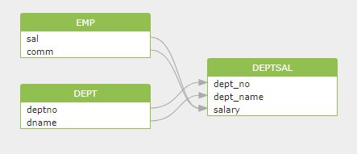

# Getting Started

Let's analyze the following SQL statements to see how to get the data dependencies between tables/views.

> Tips:
>
> * You need to have basic SQL knowledge to understand this doc.
> * No data lineage knowledge is required before you start this doc. You can simply consider data lineage as the data relationship between tables in database.

```sql
INSERT INTO deptsal
            (dept_no,
             dept_name,
             salary)
SELECT d.deptno,
       d.dname,
       SUM(e.sal + Nvl(e.comm, 0)) AS sal
FROM   dept d
       left join (SELECT *
                  FROM   emp
                  WHERE  hiredate > DATE '1980-01-01') e
              ON e.deptno = d.deptno
GROUP  BY d.deptno,
          d.dname; 
```

Data of the table _`deptsal`_ come from the table _`dept`_ and the table _`emp`_. More specifically, following data lineage relationship can be deduced:&#x20;

* _`deptsal.dept_no`_ field comes from _`dept.deptno`_&#x20;
* _`deptsal.dept_name`_ field comes from _`dept.name`_&#x20;
* _`deptsal.salary`_ field comes from _`emp.sal`_ and _`emp.comm`_

Through Gudu SQLFlow, we can visualize the above data lineage as:

<figure><figcaption></figcaption></figure>

### What's next?

* [Sign up a new Gudu account](sign-up-a-new-account/)
* Learn [how to use SQLFlow](how-to-use-sqlflow.md)
* Read more about [Gudu SQLFlow UI ](../ui/)
* Install a [SQLFlow Server](../installation/)
* Use [SQLFlow Java Library](../java-library/)
* Analyze your data through [Rest API ](../../3.-api-docs/using-the-rest-api.md)
* [Understand the format of exported data](../../6.-sqlflow-ingester/understanding-the-format-of-exported-data/) as well as check our sample data:
  * [Oracle Sample](../../6.-sqlflow-ingester/understanding-the-format-of-exported-data/oracle.md)
  * [MSSQL Sample](../../6.-sqlflow-ingester/understanding-the-format-of-exported-data/microsoft-sql-server.md)
  * [MySQL Sample](../../6.-sqlflow-ingester/understanding-the-format-of-exported-data/mysql.md)
  * [PostgreSQL Sample](../../6.-sqlflow-ingester/understanding-the-format-of-exported-data/postgresql.md)
* Get more details about the [data model](../../7.-reference/lineage-model/README.md).
