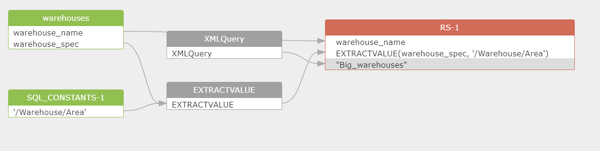

# Colors in SQLFlow Diagram

| Color Code | Color                                    | Meaning in SQLFlow Diagram                                                    |
| ---------- | ---------------------------------------- | ----------------------------------------------------------------------------- |
| #91c051    | .png>) | **table**                                                                     |
| #419a5f    | .png>) | **view**                                                                      |
| #d26b58    | .png>)  | **result set**                                                                |
| #d26b58    | .png>)  | **select\_list**                                                              |
| #b24b78    | .png>)  | **insert-select**                                                             |
| #d29059    | .png>)  | **update-set**                                                                |
| #893a89    | .png>) | **merge-insert**                                                              |
| #e46b0a    | .png>)  | **merge-update**                                                              |
| #357e7e    | .png>)  | **select\_union**                                                             |
| #ff6e97    |         | 
<strong>with_cte</strong> <strong>(with aaa as select xxx)</strong>
 |
| #5583d8    | .png>)  | **update-select**                                                             |
| #a0a0a0    | .png>) | **function**                                                                  |
| #6d30ea    | .png>) | **stage**                                                                     |
| #00a4eb    | .png>) | **variable**                                                                  |
| #1accb3    | .png>) | **schema**                                                                    |
