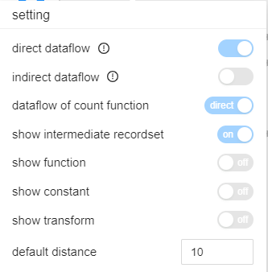

# Job mode

SQLFlow Job mode is dedicated for handling large amounts of SQL Scripts or directly connecting to the target database server for the data linenage analysis. Config parameters for the analysis should be given when creating a new SQLFlow Job and the parameters cannot be changed once submitted.&#x20;

### Job type

There are two job types:

* Simple Job
* Regular Job

&#x20;

<figure><figcaption></figcaption></figure>

Both Simple Job and Regular Job support reading large amounts of SQL files or analysis through DB directly. There are some differences between Simple Job and Regular Job.&#x20;

#### Simple Job

* Possible to add some configs. Once submitted, the configs cannot be changed
* Result will be persisted in the file system as files
* Possible to do the Left Most analysis (Left Most: given a->b->c, show a->c )
* Data lineage result is saved in dataflow.xml file

```
dataflowOfAggregateFunction: direct (Configurable Parameter)
ignoreFunction：true (Configurable Parameter)
ignoreRecordSet：true (Configurable Parameter)
showConstantTable：(Configurable Parameter)
showRelationType：fdd (Configurable Parameter)
showTransform: false (Configurable Parameter)

simpleOutput: false (Not configurable)
hideColumn: false (Frontend UI doesn't support)
normalizeIdentifier：true (Not configurable)
showLinkOnly：true (Not configurable)
```

Configurable Parameter:  The parameters which can be set before the job creation. There's no way to change such parameters once the job is created. You have to create a new job with the new parameter value if needed.

#### Regular Job

* Unable to set any data lineage configs
* Support table level lineage
* Result will be in database
* Support if incremental, possible to anaylze SQL scripts or database in batches
* Possible to do the Left Most analysis (Left Most: given a->b->c, show a->c )
* Possible to do the Upstream and Downstream analysis (given a->b->c, Upstream: a->b, Downstream: b->c)
* Data lineage result is saved in database

```
default distance：(The parameter can be modified even after the job is created)
showConstantTable：(Configurable Parameter)
dataflowOfAggregateFunction: direct (Not configurable)
ignoreFunction：true (Not configurable)
ignoreRecordSet：true (Not configurable)
showRelationType：fdd (Not configurable)
showTransform: false (Not configurable)

hideColumn: false (Frontend UI doesn't support)
normalizeIdentifier：true (Not configurable)
showLinkOnly：true (Not configurable)
simpleOutput: false (Not configurable)
```

Configurable Parameter:  The parameters which can be set before the job creation. There's no way to change such parameters once the job is created. You have to create a new job with the new parameter value if needed.

### Job parameters and UI Settings parameters

Some of the above parameters cover the parameters in [UI Settings section](../../ui/settings.md)

<figure><figcaption></figcaption></figure>

_`showConstantTable`_ has the same effect as _`show constant`_

_`ignoreFunction`_ has the same effect as _`show function`_

_`ignoreRecordSet`_ has the same effect as _`show intermediate recordset`_

_`showTransform`_ has the same effect as _`show transform`_

_`dataflowOfAggregateFunction`_ has the similar effect as _`dataflow of count function`_

### Summary Result

When using [SQLFlow Front UI](../../ui/), all data lineage will be returned if the number of relationship is less than 1,000. However, only database, schema, table, view data and the number of above DB units will be returned if the number is more than 1,000. No relationship data will be returned in the case and this is called **Summary result**.

<figure><figcaption></figcaption></figure>

User can request specific database, schema, table or view but result will be in Summary mode if the result number is more than 1,000.

There's a performance limitation in the frontend page rendering and moreover the graph will be complex to understand so we impose a restriction on the UI endpoint (/sqlflow/generation/sqlflow/graph). However, request to the [/sqlflow/generation/sqlflow](../../../3.-api-docs/sqlflow-rest-api-reference/generation-interface/sqlflow-generation-sqlflow.md) for SQLFLow Rest Api doesn't have such limitation.
