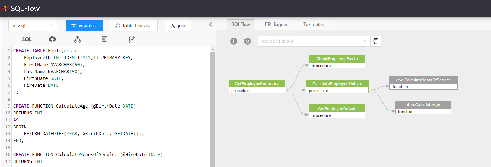

# Show call relationship

The "Show Call Relationship" feature allows users to **automatically generate a detailed SQL procedure invocation relationship diagram**. By visualizing how different procedures call and interact with each other, users can gain deeper insights into complex stored procedures and their dependencies.

* In Editor mode, click the following button to get the call relation

<figure><figcaption></figcaption></figure>

* Under Job mode, right click the data source and choose "show call relationship" to visualize the invocations

<figure><figcaption></figcaption></figure>

**Use Cases:**

1. **Tracking Procedure Dependencies**: Users can now easily track how procedures interact, making it simple to manage complex systems.
2. **Enhancing Data Governance**: This feature is especially valuable for compliance purposes, as it allows data teams to trace how SQL procedures interact across the system.

Let's take following SQL as an example:

```sql
CREATE TABLE Employees (
    EmployeeID INT IDENTITY(1,1) PRIMARY KEY,
    FirstName NVARCHAR(50),
    LastName NVARCHAR(50),
    BirthDate DATE,
    HireDate DATE
);

CREATE FUNCTION CalculateAge (@BirthDate DATE)
RETURNS INT
AS
BEGIN
    RETURN DATEDIFF(YEAR, @BirthDate, GETDATE());
END;

CREATE FUNCTION CalculateYearsOfService (@HireDate DATE)
RETURNS INT
AS
BEGIN
    RETURN DATEDIFF(YEAR, @HireDate, GETDATE());
END;

CREATE PROCEDURE CheckEmployeeExists
    @EmployeeID INT,
    @Exists BIT OUTPUT
AS
BEGIN
    SET @Exists = CASE WHEN EXISTS (SELECT 1 FROM Employees WHERE EmployeeID = @EmployeeID) THEN 1 ELSE 0 END;
END;

CREATE PROCEDURE GetEmployeeDetails
    @EmployeeID INT
AS
BEGIN
    SELECT EmployeeID, FirstName, LastName, BirthDate, HireDate
    FROM Employees
    WHERE EmployeeID = @EmployeeID;
END;

CREATE PROCEDURE CalculateEmployeeMetrics
    @EmployeeID INT,
    @Age INT OUTPUT,
    @YearsOfService INT OUTPUT
AS
BEGIN
    DECLARE @BirthDate DATE, @HireDate DATE;
    
    SELECT @BirthDate = BirthDate, @HireDate = HireDate
    FROM Employees
    WHERE EmployeeID = @EmployeeID;

    SET @Age = dbo.CalculateAge(@BirthDate);
    SET @YearsOfService = dbo.CalculateYearsOfService(@HireDate);
END;

CREATE PROCEDURE GetEmployeeSummary
    @EmployeeID INT
AS
BEGIN
    DECLARE @Exists BIT, @Age INT, @YearsOfService INT;

    EXEC CheckEmployeeExists @EmployeeID, @Exists OUTPUT;

    IF @Exists = 1
    BEGIN
        EXEC GetEmployeeDetails @EmployeeID;
        EXEC CalculateEmployeeMetrics @EmployeeID, @Age OUTPUT, @YearsOfService OUTPUT;

        PRINT 'Employee Age: ' + CAST(@Age AS NVARCHAR(10));
        PRINT 'Years of Service: ' + CAST(@YearsOfService AS NVARCHAR(10));
    END
    ELSE
    BEGIN
        PRINT 'Employee does not exist.';
    END;
END;

EXEC GetEmployeeSummary 2;
```

This SQL contains a relatively complex case which involves different SQL procedure invocations, multiple procedures and functions are get invoked. Using "Show call relationship" brings us the following diagram:

<figure><figcaption></figcaption></figure>

The "Show Call Relationship" feature strengthens SQLFlow’s ability to analyze and manage SQL procedures, giving database administrators and developers more control and visibility into their data environments.
