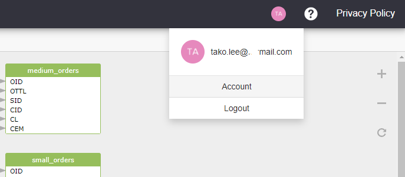

# Sign up a new account

* An **valid email address** is needed and it will be used to activate the user.
* Set a strong password with at least 8 characters.&#x20;
* An confirmation request will be sent to your email **30 mins after your first signup**. You are free to go with SQLFlow after the registration but please click _Confirm_ in the confirmation request to activate your account or the account will not be able to login next time.

### Sign up

<figure><figcaption></figcaption></figure>

### Login

<figure><figcaption></figcaption></figure>

### Gudu SQLFlow Account

There are two different account types:

* Basic Account
* Premium Account

#### Basic Account

* 7 days free trial
* Support more than 20 databases
* Share and export the data lineage result
* Support all configuration settings
* Connect to a database and discover data lineage instantly

#### Premium Account

* All features in the basic account
* Up to 10K SQL queries per month
* Fully Restful API access, up to 10K calls per month
* Support to upload SQL files
* Support Snowflake query history, Redshift log and more

Get a premium account [**here**](https://www.gudusoft.com/purchase-premium-account/)!

### Getting a 3 days Free Premium Account

Visit [this site](https://www.gudusoft.com/request-a-premium-account/) to request for a Premium Account. An email with activation code will be sent within 5 mins. Go to [https://sqlflow.gudusoft.com](https://sqlflow.gudusoft.com), click the icon in the upper right corner and check the following page:

<figure><figcaption></figcaption></figure>

Click the _Account_ menu item, chose "_activate by entering a coupon_" and enter the activation code.
