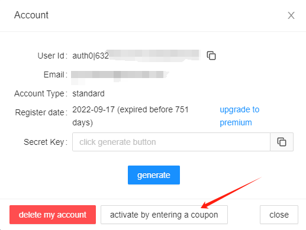
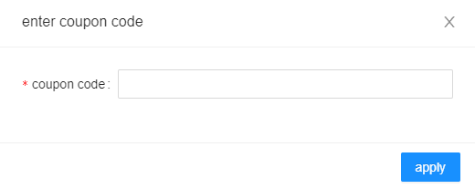

# Activate by entering a coupon

Unlock the full power of SQLFlow by activating a premium account with your coupon. Follow these simple steps to enhance your SQL experience with advanced features like detailed lineage visualization, enhanced query performance insights, and more.

1. Log in to your SQLFlow account and navigate to the account settings page.
2.  Click the "Activate by entering a coupon" button.\
    \

    <figure><figcaption></figcaption></figure>
3.  Enter your coupon code in the provided field.\

    <figure><figcaption></figcaption></figure>
