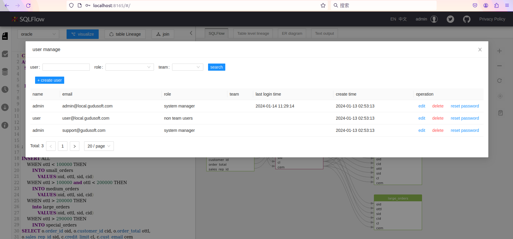
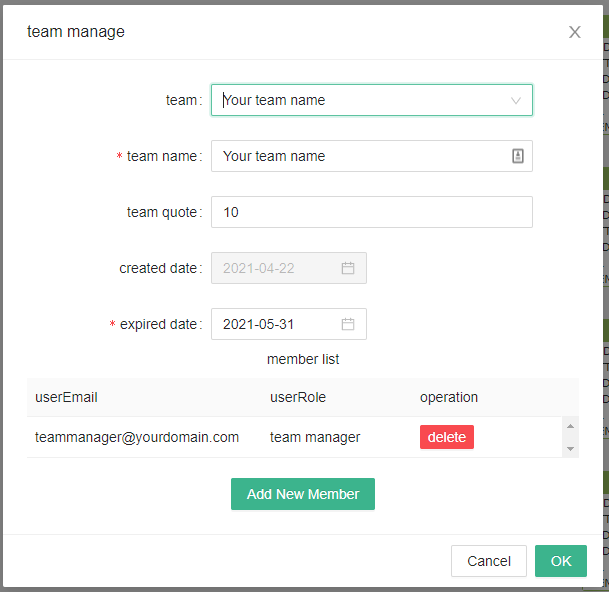

# Team Management

## SQLFlow Team System

SQLFlow supports team working. All team members in the organization can share the data lineage result with each other.

All members who join the team will be automatically upgraded to the premium account and are able to use all features of the SQLFlow.

Members who join the team are not required any additional license but they need to [sign up](https://sqlflow.gudusoft.com) first and login to the SQLFlow.

### Create a team

When you purchase a team version license of SQLFlow. A SQLFlow team account will be created for you by our support team. The email of the first team member will be added to the team and the member becomes the team manager of the team and he/she can add new members later.

A team can have more than one team manager.

### User management

Create and manager user with the user management system:

<figure><figcaption></figcaption></figure>

The number of users created by the administrator cannot exceed the maximum number of users in the license, including the two default accounts of the system.

### Team manager

Team manager can add member to the team. They can change the team name. After [login the SQLFlow](https://sqlflow.gudusoft.com), click the menu icon at the right top:

<figure><figcaption></figcaption></figure>

Adding members:

<figure><figcaption></figcaption></figure>

<figure><figcaption></figcaption></figure>

The team member can be added into the group before they signup [SQLFlow](https://sqlflow.gudusoft.com/#/) or they can signup on the site first but join the group later.  However, team member must use the email registered by the team manager to signup.

#### Team quote

Number of the members which can be added into this team.

#### Expired date

The expiration date for the team license.

#### Team member

Team member have the read access for the jobs submitted by other members in the same team.&#x20;
