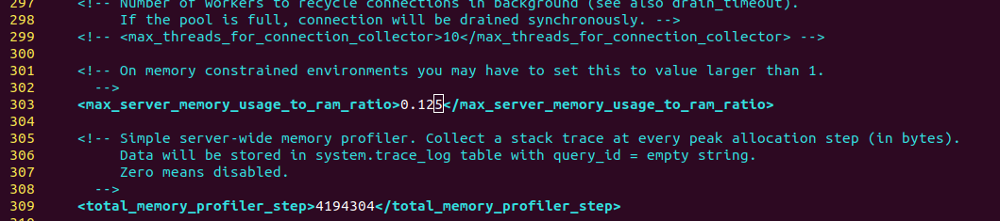
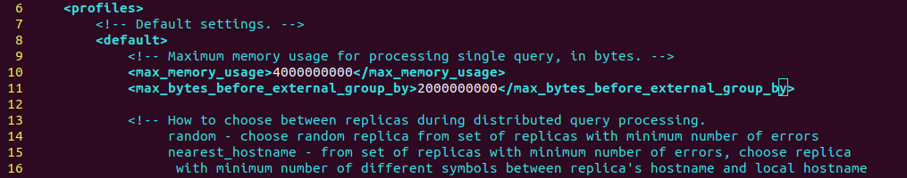

# Clickhouse For Ubuntu/Debian/RHEL

## JDK&#x20;

Using JDK 11 as well as enabling _G1 garbage collector_ is recommended. Comparing to JDK 8, the performance of handling jobs under multi-threads will be improved more than 30%.

## Clickhouse

### 1. Download & Install&#x20;

```bash
sudo apt-get install apt-transport-https ca-certificates dirmngr
sudo apt-key adv --keyserver hkp://keyserver.ubuntu.com:80 --recv 8919F6BD2B48D754

echo "deb https://packages.clickhouse.com/deb stable main" | sudo tee /etc/apt/sources.list.d/clickhouse.list
sudo apt-get update

sudo apt-get install -y clickhouse-server clickhouse-client
```

Please set Clickhouse password to [_**sqlflow@gudu**_](https://gitee.com/link?target=mailto:sqlflow@gudu)__

#### Generate clickhouse-server key & crts

Check your config.xml

```bash
vim /etc/clickhouse-server/config.xml
```

Find the instruction of openSSL

<figure><figcaption></figcaption></figure>

Run the above command, in my case it is:

```bash
sudo openssl req -subj "/CN=localhost" -new -newkey rsa:2048 -days 365 -nodes -x509 -keyout /etc/clickhouse-server/server.key -out /etc/clickhouse-server/server.crt
```

You should have:

<figure><figcaption></figcaption></figure>

If you got

```
Can't load /home/<user>/.rnd into RNG
```

Then you can try removing or commenting `RANDFILE = $ENV::HOME/.rnd` line in `/etc/ssl/openssl.cnf`

#### Replace IPv6 config

If your server is not enabled with IPV6, you will have following errors when trying to start the clickhouse server:

```log
{} <Error> Application: DB::Exception: Listen [::]:8123 failed: Poco::Exception. Code: 1000, e.code() = 0, DNS error: EAI: Address family for hostname not supported (version 22.2.3.1)
```

This is because the clickhouse server uses IPV6 syntax by default. We need to replace the IPV6 syntax by IPV4 compatible syntax.

Edit the `listen.xml`:

```
/etc/clickhouse-server/config.d/listen.xml
```

Replace the line

```xml
<listen_host>::</listen_host>
```

to

```xml
<listen_host>0.0.0.0</listen_host>
```

**Hint**: **Do not** change the same field value in `/etc/clickhouse-server/config.xml`

``

Re-[generate clickhouse-server key & crts](clickhouse-for-ubuntu-debian.md#generate-clickhouse-server-key-and-crts) if you meet the following error after configuring the `listen.xml`:

<figure><figcaption></figcaption></figure>

### 2. Memory Settings

We will need to limit the clickhouse service If the client server has a memory less than 32GB.

#### clickhouse memory settings

In `/etc/clickhouse-server/config.xml` set `max_server_memory_usage_to_ram_ratio` to 0.125 so that 32G\*0.125 will be 4G

<figure><figcaption></figcaption></figure>

Update `/etc/clickhouse-server/users.xml` and set `max_memory_usage` to 4000000000, `max_bytes_before_external_group_by` to 2000000000. You may need to create `max_bytes_before_external_group_by` if it isn't present.

<figure><figcaption></figcaption></figure>

Restart the Clickhouse service: `sudo /etc/init.d/clickhouse-server restart`

#### Sqlservice memory settings

With this config, the Simple mode will use 22G memory and the Rugular mode will be in 18G memory.

```bash
# Update sqlservice.sh, set the heapsize as 18G
elif (( $memory < 32*1024*1024 ));
  then
    heapsize="18g"
```

### 3. Set Clickhouse default password

Set Clickhouse password to [_**sqlflow@gudu**_](https://gitee.com/link?target=mailto:sqlflow@gudu)__

If mistakenly set to another password, you will need:

1. delete `/etc/clickhouse-server/users.d/default-password.xml`
2. update `/etc/clickhouse-server/users.xml`, set password to [_**sqlflow@gudu**_](https://gitee.com/link?target=mailto:sqlflow@gudu)__
3. restart Clickhouse, `sudo /etc/init.d/clickhouse-server restart`

### 4. Init Clickhouse

```bash
cd /wings/sqlflow/backend
sh bin/init_regular.sh
```

If you got any errors related to Clickhouse, you can check `/var/log/clickhouse-sever` for the error logs and please ensure that you have finished the steps of [key generation](clickhouse-for-ubuntu-debian.md#generate-clickhouse-server-key-and-crts) and [IPv6 configuration](clickhouse-for-ubuntu-debian.md#replace-ipv6-config).

### 5. Start SQLFlow

```bash
cd /wings/sqlflow/backend
sh bin/backend.sh
```
