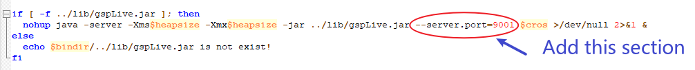
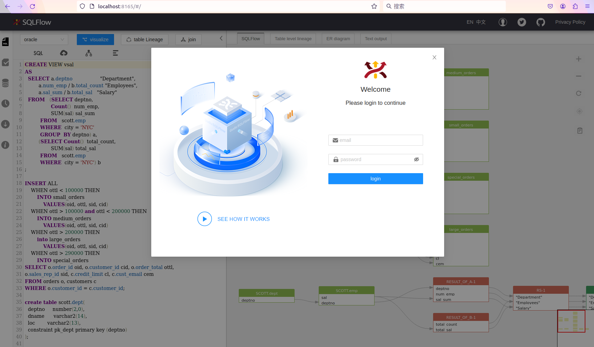
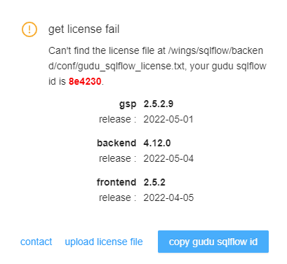
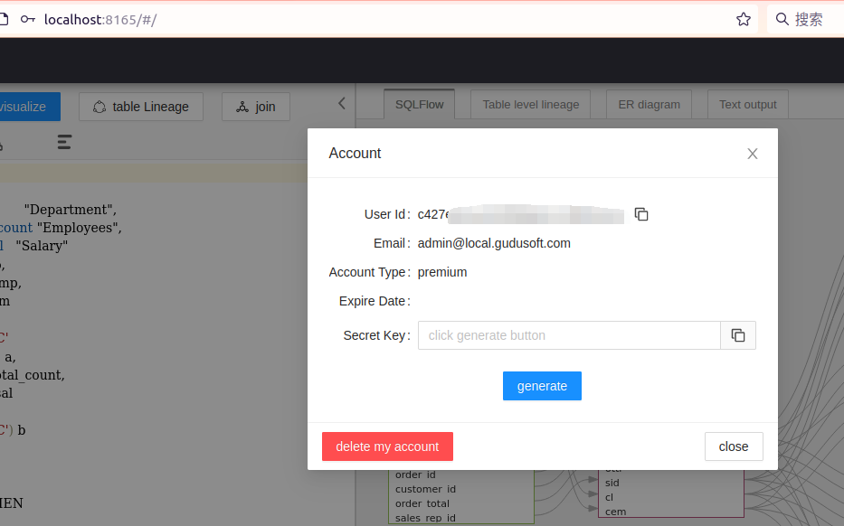

# Linux

Please check the following page for the old SQLFlow installation:


[for-older-version-sqlflow.md](linux/for-older-version-sqlflow.md)


### Prerequisites

* [SQLFlow on-premise version](https://www.gudusoft.com/sqlflow-on-premise-version/)
* A linux server with at least 8GB memory (ubuntu 20.04 is recommended).
* Java 8
* Port needs to be opened. (The default port is 8165 but you can customized this port)

### Setup Environment (Ubuntu for example)

```
sudo apt-get update
sudo apt-get install nginx -y
sudo apt-get install default-jre -y	
```

CentOS

* [How To Install Nginx on CentOS](https://www.digitalocean.com/community/tutorials/how-to-install-nginx-on-centos-7)
* [How To Install Java on CentOS](https://www.digitalocean.com/community/tutorials/how-to-install-java-on-centos-and-fedora)

### Upload Files

create a directory :

```bash
# it must be created start with root path
sudo mkdir -p /wings/sqlflow
```

upload your zip file including backend and frontend file to `sqlflow` folder, and unzip like this :

```bash
unzip sqlflow.zip
```

You should get files organized like this:

```
/wings/
└── sqlflow
    ├── backend
    │   ├── bin
    │   │   ├── backend.bat
    │   │   ├── backend.sh
    │   │   ├── eureka.bat
    │   │   ├── eureka.sh
    │   │   ├── eureka.vbs
    │   │   ├── gspLive.bat
    │   │   ├── gspLive.sh
    │   │   ├── gspLive.vbs
    │   │   ├── init_regular.sh
    │   │   ├── monitor.bat
    │   │   ├── monitor.sh
    │   │   ├── sqlservice.bat
    │   │   ├── sqlservice.sh
    │   │   ├── sqlservice.vbs
    │   │   ├── stop.bat
    │   │   ├── stop.sh
    │   │   ├── taskscheduler.bat
    │   │   ├── taskscheduler.sh
    │   │   └── taskscheduler.vbs
    │   ├── conf
    │   │   └── gudu_sqlflow.conf
    │   └── lib
    │       ├── eureka.jar
    │       ├── gspLive.jar
    │       ├── sqlservice.jar
    │       └── taskscheduler.jar

```

set folder permissions :

```bash
sudo chmod -R 755 /wings/sqlflow
```

### Customize the port

If you don't want to change the default service port you can just ignore this section. Otherwise this section will show you how to customize the port.

#### 1. Default port

1. Web port is `8165`
2. SQLFlow backend service port:

| File           | Port |
| -------------- | ---- |
| eureka.jar     | 8761 |
| gspLive.jar    | 8165 |
| sqlservice.jar | 8083 |

#### 2. **Change the default port in gspLive.sh(gspLive.bat)**&#x20;

You can change the web or backend api port from 8165 to any available port.&#x20;

Add the following section in gspLive.sh(or gspLive.bat in Windows):

```
--server.port=<customized_port>
```

<figure><figcaption></figcaption></figure>

### Start Backend Services

start service in background:

```bash
sudo /wings/sqlflow/backend/bin/backend.sh
```

You can assign the RAM to SQLFlow by specifying the boot parameter when starting the service.

```bash
 backend.sh /m <RAM_VALUE>
```

The RAM\_VALUE could be: **4g 8g 16g 32g or 64g**.&#x20;

SQLFlow will automatically allocate the memory based on the status of the installed server if this parameter is not given. SQLFlow would allocate less than 31 GB memory if that is the case. However, if your total memory is less than 32 GB, SQLFlow would allocate all the remaining memory on your server.

please allow 3-5 minutes to start the service.

use `ps -ef|grep java` to check those 3 processing are running.

```
ubuntu   11047     1  0 Nov02 ?        00:04:44 java -server -jar eureka.jar
ubuntu   11076     1  0 Nov02 ?        00:04:11 java -server -Xmn512m -Xms2g -Xmx2g -Djavax.accessibility.assistive_technologies=  -jar sqlservice.jar
ubuntu   11114     1  0 Nov02 ?        00:05:17 java -server -jar gspLive.jar
```

### Open SQLFlow

open http://yourdomain.com/ to see the SQLFlow.

open `http://yourdomain.com:8165/doc.html?lang=en` or `http://localhost:8165/api/gspLive_backend/doc.html?lang=en` to see the Restful API document.

<figure><figcaption></figcaption></figure>

To login, please check the following default user credentials:


[cloud-and-on-premise-version.md](versions/cloud-and-on-premise-version.md)


### Gudu SQLFlow License file

If this is the first time you setup the Gudu SQLFlow on a new machine, then, you will see this license UI:&#x20;

<figure><figcaption></figcaption></figure>

1. You send us the Gudu SQLFlow Id (6 characters in red).
2. We will generate a license file for you based on this id.
3. You upload the license file by click the "upload license file" link.

### Backend Services Configuration

sqlflow provides several options to control the service analysis logic. Open the sqlservice configuration file(conf/gudu\_sqlflow.conf)

* **relation\_limit**: default value is 1000. When the count of selected object relations is greater than relation\_limit, sqlflow will fallback to the simple mode, ignore all the record sets. If the relations of simple mode are still greater than relation\_limit, sqlflow will only show the summary information.
* **big\_sql\_size**: default value is 4096. If the sql length is greater than big\_sql\_size, sqlflow submit the sql in the work queue and execute it. If the work queue is full, sqlflow throws an exception and return error message "Sorry, the service is busy. Please try again later."

### SQLFlow client api call

See [sqlflow client api call](https://github.com/sqlparser/sqlflow\_public/blob/master/api/sqlflow\_api\_full.md#webapi)

* Get userId from the account profile page and generate the secrete key

<figure><figcaption></figcaption></figure>

* Generate token by invoking the token generate API


[swagger_with_token.yaml](../../.gitbook/assets/swagger_with_token.yaml)


```bash
curl --location --request POST 'http://localhost:8165/api/gspLive_backend/user/generateToken?userId=%3CUSER_ID%3E&secretKey=%3CSECRET_KEY%3E' \
--header 'Accept: application/json;charset=utf-8'
```

*   Test webapi by curl

    * test sql:

    ```sql
      select name from user
    ```

    * curl command:

    ```bash
    curl --location 'http://localhost:8165/api/gspLive_backend/sqlflow/generation/sqlflow' \
    --header 'accept: application/json;charset=utf-8' \
    --form 'userId="<USER ID>"' \
    --form 'dbvendor="dbvoracle"' \
    --form 'sqltext="select name from user"' \
    --form 'token="<TOKEN>"'
    ```

    * response:

    ```json
      {
        "code": 200,
        "data": {
          "dbvendor": "dbvoracle",
          "dbobjs": [
            ...
          ],
          "relations": [
            ...
          ]
        },
        "sessionId": ...
      }
    ```

    * If the code returns **401**, please check the userId is set or the userId is valid.

### Enable Regular Job

If you need to enable regular job feature on your sqlflow on-premiser, you will also need to install Clickhouse on your server. Check here for Clickhouse installation:


[clickhouse-installation](clickhouse-installation/)

