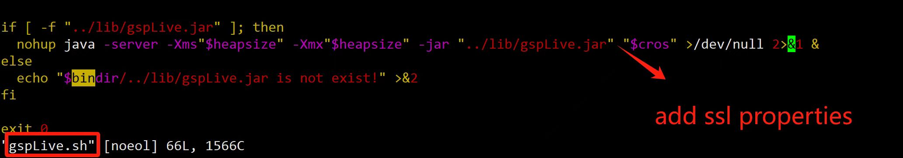
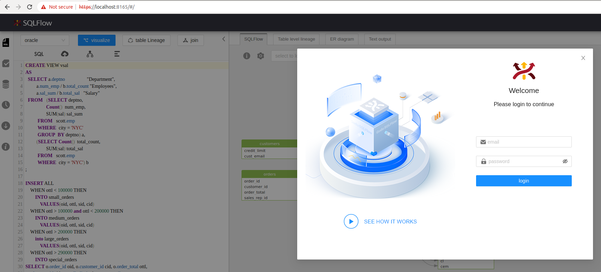

# MacOS

Please check the following page for the old SQLFlow installation:


[for-older-version-sqlflow-under-macos.md](versions/sqlflow-before-version-6/for-older-version-sqlflow-under-macos.md)


If you have SQLFlow 5.x installed on your server and would like to upgrade to SQLFlow 6.x, please refer to this page:


[upgrade.md](upgrade.md)


Starting from **SQLFlow 6.0**, we have integrated web packages into the backend service, **no Frontend installation and nginx configuration is required!**

### Prerequisites

* [SQLFlow on-premise version](https://www.gudusoft.com/sqlflow-on-premise-version/)
* Java 8
* Port needs to be opened. (The default port is 8165 but you can customized this port)
* At least 8GB memory

### Setup Environment

* [Java setup environment link](https://mkyong.com/java/how-to-set-java_home-environment-variable-on-mac-os-x/)

```
# setup java environment
echo export "JAVA_HOME=\$(/usr/libexec/java_home)" >> ~/.bash_profile
source ~/.bash_profile
```

### Upload Files

create a directory :

```
# example you can use other path
sudo mkdir -p /wings/sqlflow
```

upload your backend and frontend file to `sqlflow` folder, like this :

```
/wings/
└── sqlflow
    ├── backend
    │   ├── bin
    │   │   ├── backend.bat
    │   │   ├── backend.sh
    │   │   ├── eureka.bat
    │   │   ├── eureka.sh
    │   │   ├── eureka.vbs
    │   │   ├── gspLive.bat
    │   │   ├── gspLive.sh
    │   │   ├── gspLive.vbs
    │   │   ├── init_regular.sh
    │   │   ├── monitor.bat
    │   │   ├── monitor.sh
    │   │   ├── sqlservice.bat
    │   │   ├── sqlservice.sh
    │   │   ├── sqlservice.vbs
    │   │   ├── stop.bat
    │   │   ├── stop.sh
    │   │   ├── taskscheduler.bat
    │   │   ├── taskscheduler.sh
    │   │   └── taskscheduler.vbs
    │   ├── conf
    │   │   └── gudu_sqlflow.conf
    │   └── lib
    │       ├── eureka.jar
    │       ├── gspLive.jar
    │       ├── sqlservice.jar
    │       └── taskscheduler.jar

```

### Set scripts permissions

```
chmod +x /wings/sqlflow/backend/bin
```

### Backend Services Configuration

sqlflow provides several options to control the service analysis logic. Open the sqlservice configuration file(**conf/gudu\_sqlflow.conf**)

* **user\_token\_expire\_hours**: default value is 24. User can customize the TTL of the token by setting this field. In case user\_token\_expire\_hours less than or equals to 0, the user token would never expire.&#x20;
* **ignore\_user\_token**: default value is false, token auth is skipped in case the value is set to true. When the `ignore_user_token` option is turned on, users are no longer required to login and account icon will disappear. As a result, the system does not enforce team management since any user can access it without authentication.
* **relation\_limit**: default value is 1000. When the count of selected object relations is greater than relation\_limit, sqlflow will fallback to the simple mode, ignore all the record sets. If the relations of simple mode are still greater than relation\_limit, sqlflow will only show the summary information.
* **big\_sql\_size**: default value is 4096. If the sql length is greater than big\_sql\_size, sqlflow submit the sql in the work queue and execute it. If the work queue is full, sqlflow throws an exception and returns error message "Sorry, the service is busy. Please try again later."

### Start Backend Services

You can assign the RAM to SQLFlow by specifying the boot parameter when starting the service.

```bash
 sudo ./backend.sh /m <RAM_VALUE>
```

The RAM\_VALUE could be: **4g 8g 16g 32g or 64g**.&#x20;

SQLFlow will automatically allocate the memory based on the status of the installed server if this parameter is not given. SQLFlow would allocate less than 31 GB memory if that is the case. However, if your total memory is less than 32 GB, SQLFlow would allocate all the remaining memory on your server.

start service in background:

```
sudo sh /wings/sqlflow/backend/bin/backend.sh
```

please allow 1-2 minutes to start the service.

use `jps` to check those 3 processing are running.

```
58497 sqlservice.jar
58516 gspLive.jar
58477 eureka.jar
```

**Java service port**

| File           | Port |
| -------------- | ---- |
| eureka.jar     | 8761 |
| gspLive.jar    | 8165 |
| sqlservice.jar | 8083 |

### Customize the port

If you don't want to change the default service port you can just ignore this section. Otherwise this section will show you how to customize the port.

#### 1. Default port

1. Web port is `8165`
2. SQLFlow backend service port:

| File           | Port |
| -------------- | ---- |
| eureka.jar     | 8761 |
| gspLive.jar    | 8165 |
| sqlservice.jar | 8083 |

#### 2. **Change the default port in gspLive.sh(gspLive.bat)**&#x20;

You can change the web or backend api port from 8165 to any available port.&#x20;

Add the following section in gspLive.sh(or gspLive.bat in Windows):

```
--server.port=<customized_port>
```

<figure><figcaption></figcaption></figure>

### Open SQLFlow

open http://yourdomain.com/ to see the SQLFlow.

open `http://yourdomain.com:8165/doc.html?lang=en` or `http://localhost:8165/api/gspLive_backend/doc.html?lang=en` to see the Restful API document.

<figure><figcaption></figcaption></figure>

To login, please check the following default user credentials:


[cloud-and-on-premise-version.md](versions/cloud-and-on-premise-version.md)


### SQLFlow client api call

See [sqlflow client api call](https://github.com/sqlparser/sqlflow_public/blob/master/api/sqlflow_api_full.md#webapi)

* Get userId from the account profile page and generate the secrete key

<figure><figcaption></figcaption></figure>

* Generate token by invoking the token generate API


[swagger_with_token.yaml](../../.gitbook/assets/swagger_with_token.yaml)


```bash
curl --location --request POST 'http://localhost:8165/api/gspLive_backend/user/generateToken?userId=%3CUSER_ID%3E&secretKey=%3CSECRET_KEY%3E' \
--header 'Accept: application/json;charset=utf-8'
```

*   Test webapi by curl

    * test sql:

    ```
      select name from user
    ```

    * curl command:

    ```bash
    curl --location 'http://localhost:8165/api/gspLive_backend/sqlflow/generation/sqlflow' \
    --header 'accept: application/json;charset=utf-8' \
    --form 'userId="<USER ID>"' \
    --form 'dbvendor="dbvoracle"' \
    --form 'sqltext="select name from user"' \
    --form 'token="<TOKEN>"'
    ```

    * response:

    ```
      {
        "code": 200,
        "data": {
          "dbvendor": "dbvoracle",
          "dbobjs": [
            ...
          ],
          "relations": [
            ...
          ]
        },
        "sessionId": ...
      }
    ```

    * If the code returns **401**, please check the userId is set or the userId is valid.

### Enable HTTPS

To use HTTPS with your domain name, you need a SSL or TLS certificate installed. You can directly buy a certificate from CA. If you don't need a recognized certificate, you can generate one by yourselves.

To generate the certificate files, you can use the following commands:

```bash
openssl req -newkey rsa:2048 -nodes -keyout sqlflow.key -out sqlflow.csr -subj "/CN=127.0.0.1"
openssl x509 -req -days 365 -in sqlflow.csr -signkey sqlflow.key -out sqlflow.crt
openssl pkcs8 -topk8 -inform PEM -outform PEM -in sqlflow.key -out sqlflow-pkcs8.key -nocrypt
openssl pkcs12 -export -in sqlflow.crt -inkey sqlflow-pkcs8.key -out sqlflow_keystore.p12 -name sqlflow
```

You will have **sqlflow\_keystore.p12** and **sqlflow-pkcs8.key** generated with the above commands.

Copy **sqlflow\_keystore.p12** and **sqlflow-pkcs8.key** to `/wings/sqlflow/backend/conf` and add  following configs in `/wings/sqlflow/backend/bin/gspLive.sh`:

```
--server.ssl.enabled=true --server.ssl.key-store-password=<your password> --server.ssl.key-store-type=PKCS12 --server.ssl.key-alias=sqlflow --server.ssl.key-store=file:../conf/sqlflow_keystore.p12
```

<figure><figcaption></figcaption></figure>

Restart the SQLFlow and https is now enabled.

<figure><figcaption></figcaption></figure>
