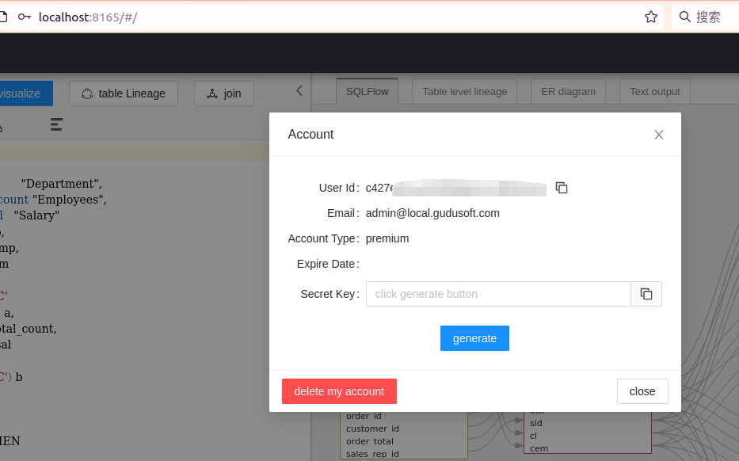

# MacOS

Please check the following page for the old SQLFlow installation:


[for-older-version-sqlflow.md](for-older-version-sqlflow.md)


### Prerequisites

* [SQLFlow on-premise version](https://www.gudusoft.com/sqlflow-on-premise-version/)
* Java 8
* Port needs to be opened. (The default port is 8165 but you can customized this port)
* At least 8GB memory

### Setup Environment

* [Java setup environment link](https://mkyong.com/java/how-to-set-java\_home-environment-variable-on-mac-os-x/)

```
# setup java environment
echo export "JAVA_HOME=\$(/usr/libexec/java_home)" >> ~/.bash_profile
source ~/.bash_profile
```

### Upload Files

create a directory :

```
# example you can use other path
sudo mkdir -p /wings/sqlflow
```

upload your backend and frontend file to `sqlflow` folder, like this :

```
/wings/
└── sqlflow
    ├── backend
    │   ├── bin
    │   │   ├── backend.bat
    │   │   ├── backend.sh
    │   │   ├── eureka.bat
    │   │   ├── eureka.sh
    │   │   ├── eureka.vbs
    │   │   ├── gspLive.bat
    │   │   ├── gspLive.sh
    │   │   ├── gspLive.vbs
    │   │   ├── init_regular.sh
    │   │   ├── monitor.bat
    │   │   ├── monitor.sh
    │   │   ├── sqlservice.bat
    │   │   ├── sqlservice.sh
    │   │   ├── sqlservice.vbs
    │   │   ├── stop.bat
    │   │   ├── stop.sh
    │   │   ├── taskscheduler.bat
    │   │   ├── taskscheduler.sh
    │   │   └── taskscheduler.vbs
    │   ├── conf
    │   │   └── gudu_sqlflow.conf
    │   └── lib
    │       ├── eureka.jar
    │       ├── gspLive.jar
    │       ├── sqlservice.jar
    │       └── taskscheduler.jar

```

### Set scripts permissions

```
chmod +x /wings/sqlflow/backend/bin
```

### Start Backend Services

If your computer has more than 8G of memory, you can change the boot parameters to recommended

Please use the gspLive.sh, eureka.sh and sqlservice.sh under mac directory instead of the original one.

* /wings/sqlflow/backend/bin/gspLive.sh

```
#  defult and less than or equal to 8G recommended
heapsize="2g";
# greater than 8G  recommended
# heapsize="3g"; 
```

* /wings/sqlflow/backend/bin/eureka.sh

```
#  defult and less than or equal to 8G recommended
heapsize="256m";
# greater than 8G  recommended
# heapsize="512m"; 
```

* /wings/sqlflow/backend/bin/sqlservice.sh

```
#  defult and less than or equal to 8G recommended
heapsize="4g";
# greater than 8G  recommended
# heapsize="10g"; 
```

start service in background:

```
sh /wings/sqlflow/backend/bin/backend.sh
```

please allow 1-2 minutes to start the service.

use `jps` to check those 3 processing are running.

```
58497 sqlservice.jar
58516 gspLive.jar
58477 eureka.jar
```

**Java service port**

| File           | Port |
| -------------- | ---- |
| eureka.jar     | 8761 |
| gspLive.jar    | 8165 |
| sqlservice.jar | 8083 |

### Customize the port

If you don't want to change the default service port you can just ignore this section. Otherwise this section will show you how to customize the port.

#### 1. Default port

1. Web port is `8165`
2. SQLFlow backend service port:

| File           | Port |
| -------------- | ---- |
| eureka.jar     | 8761 |
| gspLive.jar    | 8165 |
| sqlservice.jar | 8083 |

#### 2. **Change the default port in gspLive.sh(gspLive.bat)**&#x20;

You can change the web or backend api port from 8165 to any available port.&#x20;

Add the following section in gspLive.sh(or gspLive.bat in Windows):

```
--server.port=<customized_port>
```

<figure><figcaption></figcaption></figure>

### Open SQLFlow

open http://yourdomain.com/ to see the SQLFlow.

open `http://yourdomain.com:8165/doc.html?lang=en` or `http://localhost:8165/api/gspLive_backend/doc.html?lang=en` to see the Restful API document.

<figure><figcaption></figcaption></figure>

To login, please check the following default user credentials:

```
Admin Account
username: admin@local.gudusoft.com
password: admin

Basic Account
username: user@local.gudusoft.com
password: user
```

### SQLFlow client api call

See [sqlflow client api call](https://github.com/sqlparser/sqlflow\_public/blob/master/api/sqlflow\_api\_full.md#webapi)

* Get userId from the account profile page and generate the secrete key

<figure><figcaption></figcaption></figure>

* Generate token by invoking the token generate API


[swagger_with_token.yaml](../../../.gitbook/assets/swagger_with_token.yaml)


*   Test webapi by curl

    * test sql:

    ```
      select name from user
    ```

    * curl command:

    ```bash
    curl --location 'http://localhost:8165/api/gspLive_backend/sqlflow/generation/sqlflow' \
    --header 'accept: application/json;charset=utf-8' \
    --form 'userId="<USER ID>"' \
    --form 'dbvendor="dbvoracle"' \
    --form 'sqltext="select name from user"' \
    --form 'token="<TOKEN>"'
    ```

    * response:

    ```
      {
        "code": 200,
        "data": {
          "dbvendor": "dbvoracle",
          "dbobjs": [
            ...
          ],
          "relations": [
            ...
          ]
        },
        "sessionId": ...
      }
    ```

    * If the code returns **401**, please check the userId is set or the userId is valid.
