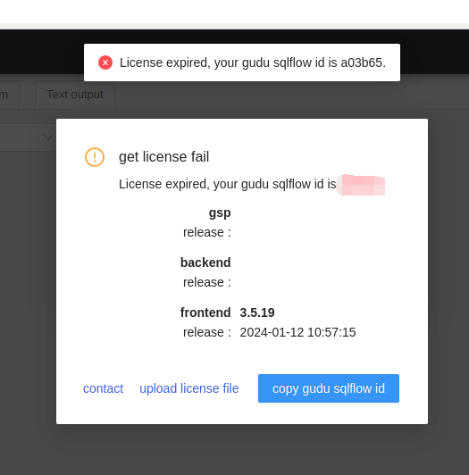

# Renew License File

### License already expired

If your license file is expired, the following error will pop out:

<figure><figcaption></figcaption></figure>

Please send us the Gudu SQLFlow Id (6 characters in red) and we will send you the renewed license file. Upload the renewd license file by click the "upload license file" link.

### Renewing a license before it expires

In case you wish to renew a license before it expires to avoid any impact of use, you can directly update the license file under&#x20;

```
/wings/sqlflow/backend/conf
```

Please make sure the license has the correct access. You can use&#x20;

```bash
sudo chmod 755 gudu_sqlflow_license.txt
```

to grant the access for the license file.

Once updated, please restart the SQLFlow.
