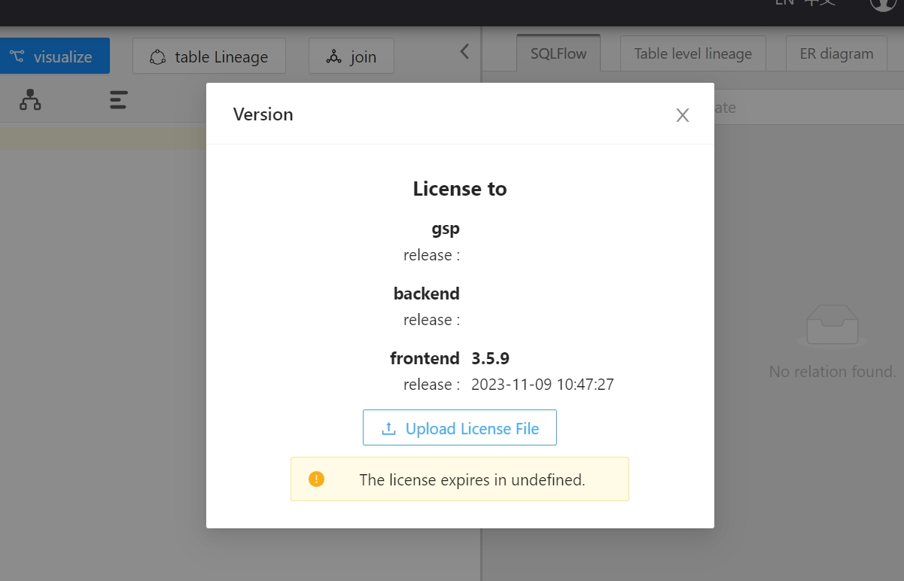

# Troubleshooting

1. [Failed to get license info.](troubleshooting.md#1.-failed-to-get-license-info.)
2. [Config nginx on RHEL: Redhat linux](troubleshooting.md#2.-config-nginx-on-rhel-redhat-linux)
3. [Get license fail: 502 Bad Gateway](troubleshooting.md#3.-get-license-fail-502-bad-gateway)

### 1. Failed to get license info.

If you see this error, just wait another 3-5 minutes to wait the backend service startup successfully and refresh the web page.

This issue may also be caused by the browser cache, just use `Incognito mode` to access the Sqlflow page and clear the cache.

<figure><figcaption></figcaption></figure>

### 2. Config nginx on RHEL: Redhat linux

a. check `/etc/nginx/nginx.conf` and change the server section:

```
server {

        listen       80 default_server;

        listen       [::]:80 default_server;

        server_name  _;

        #root         /usr/share/nginx/html;

        root          /wings/sqlflow/frontend/;

        index index.html

        # Load configuration files for the default server block.

        include /etc/nginx/default.d/*.conf;

 

        location / {

                try_files $uri $uri/ =404;

        }

 

        error_page 404 /404.html;

            location = /40x.html {

        }

 

        error_page 500 502 503 504 /50x.html;

            location = /50x.html {

        }

        location ~* ^/index.html {

                 add_header X-Frame-Options deny; # remove this line if you want to embed SQLFlow in iframe

                 add_header Cache-Control no-store;

        }

         location /api/ {

                 proxy_pass http://127.0.0.1:8081/;

                 proxy_connect_timeout 600s ;

                proxy_read_timeout 600s;

                 proxy_send_timeout 600s;

 

                 proxy_set_header Host $host;

                 proxy_set_header X-Real-IP $remote_addr;

                 proxy_set_header X-Forwarded-For $proxy_add_x_forwarded_for;

                 proxy_set_header User-Agent $http_user_agent;

        }

}
```

b. Configure selinux permission:&#x20;

`vi /etc/selinux/configure`, set _**SELinux status**_ to `permissive`

### 3. Get license fail: 502 Bad Gateway

<figure><figcaption></figcaption></figure>

This error is because the port that is needed by the SQLFlow is already used by another application, please configure the SQLFlow to [use other port](linux.md#customize-the-port).

It could also be caused by the fact that you haven't started the Gudu SQLFlow backend service. Please check [how to start the backend and verify the status](linux.md#start-backend-services).

### 4. Code: 102. DB::NetException: Unexpected packet from server locahost:9000

if you got:

```
Code: 102. DB::NetException: Unexpected packet from server locahost:9000
```

<figure><figcaption></figcaption></figure>

Please check doc [here](clickhouse-installation/clickhouse-for-ubuntu-debian.md#1.-download-and-install).

### 5. Get license failed: 404 Not Found

<figure><figcaption></figcaption></figure>

<figure><figcaption></figcaption></figure>

This is probably caused by the port config error. You might have forgot to config the same cutomized port for nginx/gspLive.

Please check your port in gspLive.sh(gspLive.bat). Ensure it's aligned with the port in the nginx config file.

<figure><figcaption></figcaption></figure>

<figure><figcaption></figcaption></figure>

### 6. org.springframework.beans.factory.BeanCreationException

If you find following error logs after installing SQLFlow

```log
org.springframework.beans.factory.BeanCreationException: Error creating bean with name 'scopedTarget.eurekaClient' defined in class path resource [org/springframework/cloud/netflix/eureka/EurekaClientAutoConfiguration$RefreshableEurekaClientConfiguration.class]: Bean instantiation via factory method failed; nested exception is 
org.springframework.beans.BeanInstantiationException: Failed to instantiate [com.netflix.discovery.EurekaClient]: Factory method 'eurekaClient' threw exception; nested exception is java.lang.RuntimeException: Failed to initialize DiscoveryClient!
```

Please consider to check your java version. SQLFlow only works with JDK 1.8. JDK 17 or JDK 21 is not supported.
