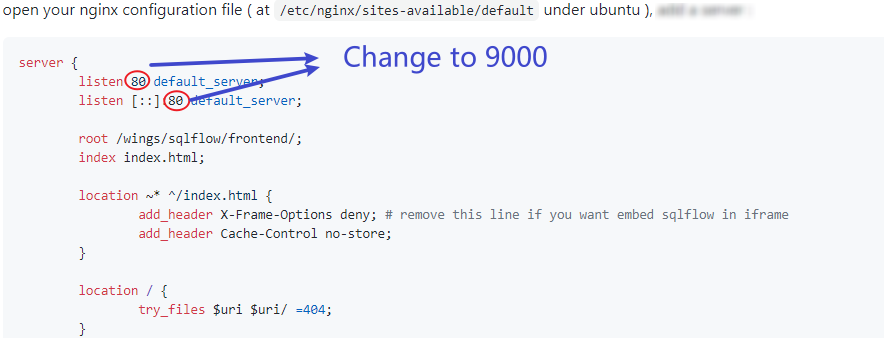
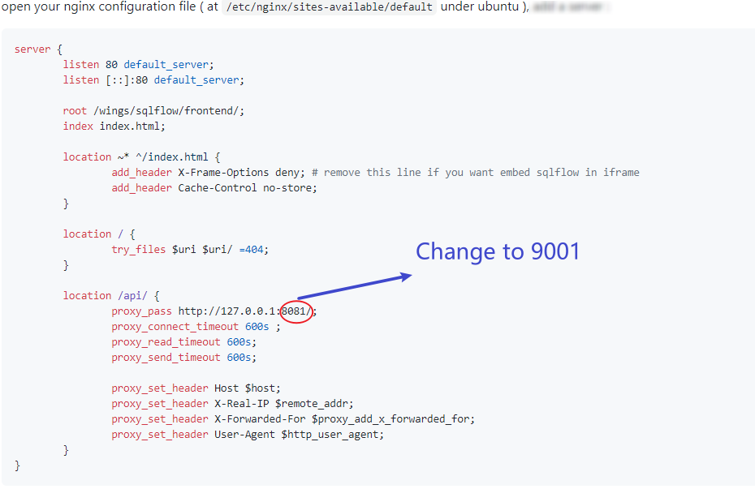

# SQLFlow before Version 6

## SQLFlow v.6 VS SQLFlow v.5

For the SQLFlow after version 6.0.0.0, please refer to [this page](../../linux.md). The installation steps are slightly different.

The SQLFlow 5.x.x.x and 4.x.x.x needs to:&#x20;

* Config a Nginx proxy
* Manually start  the frontend service


Installation Guide - Linux


You should get files organized like this:

```
/wings/
└── sqlflow
    ├── backend
    │   ├── bin
    │   │   ├── backend.bat 
    │   │   ├── backend.sh
    │   │   ├── eureka.bat
    │   │   ├── eureka.sh
    │   │   ├── eureka.vbs
    │   │   ├── gspLive.bat
    │   │   ├── gspLive.sh  
    │   │   ├── gspLive.vbs  
    │   │   ├── monitor.bat
    │   │   ├── monitor.sh 
    │   │   ├── sqlservice.bat
    │   │   ├── sqlservice.sh 
    │   │   ├── sqlservice.vbs
    │   │   ├── stop.bat
    │   │   ├── stop.sh
    │   ├── lib
    │   │   ├── eureka.jar
    │   │   ├── gspLive.jar  
    │   │   ├── sqlservice.jar
    │   ├── conf
    │   │   ├── gudu_sqlflow_license.txt     
    │   │   ├── gudu_sqlflow.conf     
    │   ├── data
    │   │   ├── job  
    │   │   │   ├── task     
    │   │   │   ├── {userid}   
    │   │   ├── schema     
    │   │   ├── session     
    │   │   ├── version     
    │   ├── log
    │   ├── tmp
    │   │   └── cache  
    └── frontend
        ├── config.public.json
        ├── images
        │   ├── check.svg
        │   ├── Join.svg
        │   ├── pic_Not logged in.png
        │   └── visualize.svg
        ├── index.********************.css
        ├── index.********************.css
        ├── index.********************.css
        ├── index.********************.css
        └── index.html
        └── lang
        ├── page.*********************.js
        ├── page.*********************.js
        ├── page.*********************.js
        ├── page.*********************.js
        ├── public.*********************.js
        ├── widget
        │   ├── index.js
        │   ├── sqlflow-library.version.css
        │   └── sqlflow-library.version.js
```

### Nginx Reverse Proxy Configuration

**1. Config Nginx**

open your nginx configuration file ( at `/etc/nginx/sites-available/default` under ubuntu ), add a server :

```nginx
server {
	listen 80 default_server;
	listen [::]:80 default_server;

	root /wings/sqlflow/frontend/;
	index index.html;

	location ~* ^/index.html {
		add_header X-Frame-Options deny; # remove this line if you want embed sqlflow in iframe
		add_header Cache-Control no-store;
	}

	location / {
		try_files $uri $uri/ =404;
	}
	
	location /api/ {
		proxy_pass http://127.0.0.1:8081/;
		proxy_connect_timeout 600s ;
		proxy_read_timeout 600s;
		proxy_send_timeout 600s;
		
		proxy_set_header Host $host;
		proxy_set_header X-Real-IP $remote_addr;
		proxy_set_header X-Forwarded-For $proxy_add_x_forwarded_for;
		proxy_set_header User-Agent $http_user_agent;  
	}
}
```

note that `8081` in `proxy_pass http://127.0.0.1:8081/` should be consistent to gspLive.jar's port.

`/api` is mapped to `http://127.0.0.1:8081` in the above configration. This is useful if you company doesn't allow access `8081` port from the external.

**2. modify frontend configuration file config.private.json**

* Open the configration file "/wings/sqlflow/frontend/config.private.json"
* Modify the **ApiPrefix** attribute

```
  "ApiPrefix": "/api"
```

### Customize the port

If you don't want to change the default service port you can just ignore this section. Otherwise this section will show you how to customize the port.

#### 1. Default port

1. Web port is `80`
2. SQLFlow backend service port:

| File           | Port |
| -------------- | ---- |
| eureka.jar     | 8761 |
| gspLive.jar    | 8081 |
| sqlservice.jar | 8083 |

#### 2. Modify the web port

Change the default web port from `80` to `9000` (or any port you like).

<figure><figcaption></figcaption></figure>

#### 3. Modify java service port

Change the default gspLive port from `8081` to `9001`(or any port you like).&#x20;

**Step 1: Change the port in nginx config file**

<figure><figcaption></figcaption></figure>

**Step 2: Change the port in gspLive.sh(gspLive.bat)**&#x20;

<figure><figcaption></figcaption></figure>

### Start Frontend Services

start your nginx :

```bash
sudo service nginx start
```

or reload :

```bash
sudo nginx -s reload
```

open http://yourdomain.com/ to see the SQLFlow.

open http://yourdomain.com/api/gspLive\_backend/doc.html?lang=en to see the Restful API documention. OR

open http://yourdomain.com:8081/gspLive\_backend/doc.html?lang=en to see the Restful API documention.
