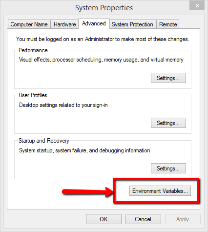
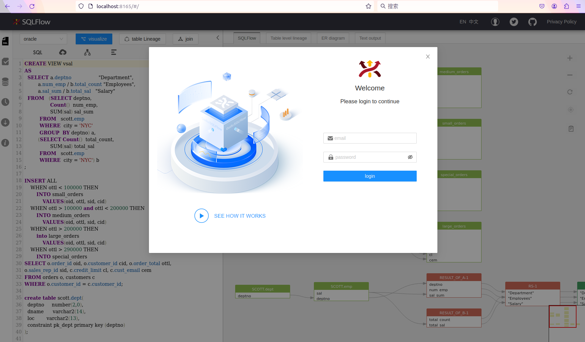

# Windows

Please check the following page for the old SQLFlow installation:


[for-older-version-sqlflow-under-windows.md](versions/sqlflow-before-version-6/for-older-version-sqlflow-under-windows.md)


If you have SQLFlow 5.x installed on your server and would like to upgrade to SQLFlow 6.x, please refer to this page:


[upgrade.md](upgrade.md)


### Prerequisites

* [SQLFlow on-premise version](https://www.gudusoft.com/sqlflow-on-premise-version/)
* Server with at least 8GB memory
* install JDK1.8 \
  SET JAVA\_HOME variable, and then add %JAVA\_HOME%\bin to the path variable

<figure><figcaption></figcaption></figure>

<figure><figcaption></figcaption></figure>

<figure><figcaption></figcaption></figure>

<figure><figcaption></figcaption></figure>

### Unzip SQLFlow file

* create a folder: c:\wings\sqlflow
* unzip SQLFlow install package to c:\wings\sqlflow, you will get c:\wings\sqlflow\backend

### Customize the port

If you don't want to change the default service port you can just ignore this section. Otherwise this section will show you how to customize the port.

#### 1. Default port

1. Web port is `8165`
2. SQLFlow backend service port:

| File           | Port |
| -------------- | ---- |
| eureka.jar     | 8761 |
| gspLive.jar    | 8165 |
| sqlservice.jar | 8083 |

#### 2. **Change the default port in gspLive.sh(gspLive.bat)**&#x20;

You can change the web or backend api port from 8165 to any available port.&#x20;

Add the following section in gspLive.sh(or gspLive.bat in Windows):

```
--server.port=<customized_port>
```

<figure><figcaption></figcaption></figure>

### Backend Services Configuration

sqlflow provides several options to control the service analysis logic. Open the sqlservice configuration file(**conf/gudu\_sqlflow.conf**)

* **user\_token\_expire\_hours**: default value is 24. User can customize the TTL of the token by setting this field. In case user\_token\_expire\_hours less than or equals to 0, the user token would never expire.&#x20;
* **ignore\_user\_token**: default value is false, token auth is skipped in case the value is set to true.
* **relation\_limit**: default value is 1000. When the count of selected object relations is greater than relation\_limit, sqlflow will fallback to the simple mode, ignore all the record sets. If the relations of simple mode are still greater than relation\_limit, sqlflow will only show the summary information.
* **big\_sql\_size**: default value is 4096. If the sql length is greater than big\_sql\_size, sqlflow submit the sql in the work queue and execute it. If the work queue is full, sqlflow throws an exception and returns error message "Sorry, the service is busy. Please try again later."

### Start SQLFlow backend

* Open a dos command windows
* cd c:\wings\sqlflow\backend\bin
* run backend.bat
* please wait 3-5 minutes to allow the SQLFlow service to start completely.

You can assign the RAM to SQLFlow by specifying the boot parameter when starting the service.

```bash
 backend.bat /m <RAM_VALUE>
```

The RAM\_VALUE could be: **4g 8g 16g 32g or 64g**.&#x20;

SQLFlow will automatically allocate the memory based on the status of the installed server if this parameter is not given. SQLFlow would allocate less than 31 GB memory if that is the case. However, if your total memory is less than 32 GB, SQLFlow would allocate all the remaining memory on your server.

### SQLFlow is ready

Open the browser and go to localhost or got to the IP where the SQLFlow is installed.

* Open http://yourIp/ to see the SQLFlow.
* Open http://yourIp/api/gspLive\_backend/doc.html?lang=en to see the Restful API document.

<figure><figcaption></figcaption></figure>

To login, please check the following default user credentials:


[cloud-and-on-premise-version.md](versions/cloud-and-on-premise-version.md)


### Stop the SQLFlow

* close the window where the backend.bat is running.
* cd c:\wings\sqlflow\backend\bin
* run stop.bat

### SQLFlow client api call

See [sqlflow client api call](https://github.com/sqlparser/sqlflow\_public/blob/master/api/sqlflow\_api\_full.md#webapi)

* Get userId from the account profile page and generate the secrete key

<figure><figcaption></figcaption></figure>

* Generate token by invoking the token generate API


[swagger_with_token.yaml](../../.gitbook/assets/swagger_with_token.yaml)


```bash
curl --location --request POST 'http://localhost:8165/api/gspLive_backend/user/generateToken?userId=%3CUSER_ID%3E&secretKey=%3CSECRET_KEY%3E' \
--header 'Accept: application/json;charset=utf-8'
```

*   Test webapi by curl

    * test sql:

    ```sql
      select name from user
    ```

    * curl command:

    ```bash
    curl --location 'http://localhost:8165/api/gspLive_backend/sqlflow/generation/sqlflow' \
    --header 'accept: application/json;charset=utf-8' \
    --form 'userId="<USER ID>"' \
    --form 'dbvendor="dbvoracle"' \
    --form 'sqltext="select name from user"' \
    --form 'token="<TOKEN>"'
    ```

    * response:

    ```json
      {
        "code": 200,
        "data": {
          "dbvendor": "dbvoracle",
          "dbobjs": [
            ...
          ],
          "relations": [
            ...
          ]
        },
        "sessionId": ...
      }
    ```

    * If the code returns **401**, please check the userId is set or the userId is valid.

### troubleshooting

#### Hostname error

Make sure the window hostname **doesn't include the underscore symbol (\_)**, otherwise, the service will not work properly. please change it to minus symbol (-)

#### Cannot start&#x20;

If you have following errors when starting backend.bat

```
'jps' is not recognized as an internal or external command
```

Please check the first section of this page, confirm that your JDK environement variable is successfully set.  You may need to restart your server to enable the change.

This increases the limit to 200M, if needed you may change this number.
