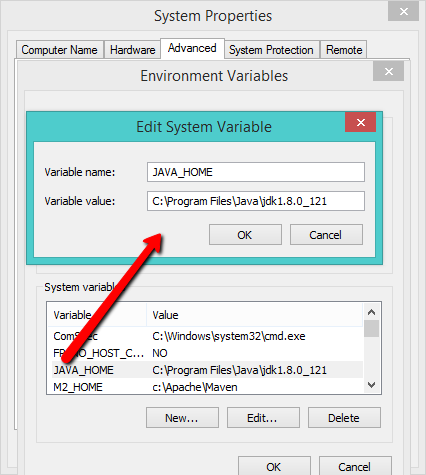
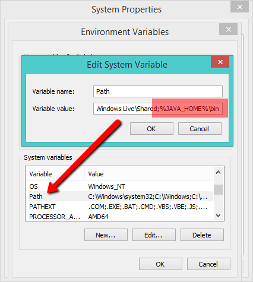
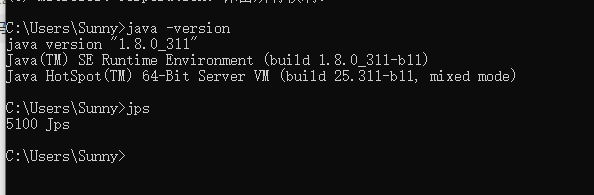
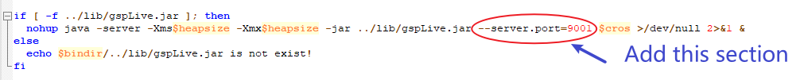

# Windows

### Prerequisites

* [SQLFlow on-premise version](https://www.gudusoft.com/sqlflow-on-premise-version/)
* Server with at least 8GB memory
* install JDK1.8 or higher\
  SET JAVA\_HOME variable, and then add %JAVA\_HOME%\bin to the path variable

<figure><figcaption></figcaption></figure>

<figure><figcaption></figcaption></figure>

<figure><figcaption></figcaption></figure>

<figure><figcaption></figcaption></figure>

### Unzip SQLFlow file

* create a folder: c:\wings\sqlflow
* unzip SQLFlow install package to c:\wings\sqlflow, you will get c:\wings\sqlflow\backend

### Customize the port

If you don't want to change the default service port you can just ignore this section. Otherwise this section will show you how to customize the port.

#### 1. Default port

1. Web port is `8165`
2. SQLFlow backend service port:

| File           | Port |
| -------------- | ---- |
| eureka.jar     | 8761 |
| gspLive.jar    | 8165 |
| sqlservice.jar | 8083 |

#### 2. **Change the default port in gspLive.sh(gspLive.bat)**&#x20;

You can change the web or backend api port from 8165 to any available port.&#x20;

Add the following section in gspLive.sh(or gspLive.bat in Windows):

```
--server.port=<customized_port>
```

<figure><figcaption></figcaption></figure>

### Start SQLFlow backend

* Open a dos command windows
* cd c:\wings\sqlflow\backend\bin
* run backend.bat
* please wait 3-5 minutes to allow the SQLFlow service to start completely.

### SQLFlow is ready

Open the browser and go to localhost or got to the IP where the SQLFlow is installed.

* Open http://yourIp/ to see the SQLFlow.
* Open http://yourIp/api/gspLive\_backend/doc.html?lang=en to see the Restful API documention.

### Stop the SQLFlow

* close the window where the backend.bat is running.
* cd c:\wings\sqlflow\backend\bin
* run stop.bat

### Sqlflow client api call

See[ sqlflow client api call](../../../3.-api-docs/using-the-rest-api.md)

1. Get userId from gudu\_sqlflow.conf

* Open the configration file "c:\wings\sqlflow\backend\conf\gudu\_sqlflow.conf"
* The value of anonymous\_user\_id field is webapi userId

```bash
  anonymous_user_id=xxx
```

* **Note:** on-promise mode, webapi call doesn't need the token parameter

1.  Test webapi by curl

    * test sql:

    ```sql
      select name from user
    ```

    * curl command:

    ```bash
    curl --location 'http://localhost:8165/api/gspLive_backend/sqlflow/generation/sqlflow' \
    --header 'accept: application/json;charset=utf-8' \
    --form 'userId="<USER ID>"' \
    --form 'dbvendor="dbvoracle"' \
    --form 'sqltext="select name from user"' \
    --form 'token="<TOKEN>"'
    ```

    * response:

    ```json
      {
        "code": 200,
        "data": {
          "dbvendor": "dbvoracle",
          "dbobjs": [
            ...
          ],
          "relations": [
            ...
          ]
        },
        "sessionId": ...
      }
    ```

    * If the code returns **401**, please check the userId is set or the userId is valid.

### troubleshooting

#### Hostname error

Make sure the window hostname **doesn't include the underscore symbol (\_)**, otherwise, the service will not work properly. please change it to minus symbol (-)

#### Cannot start&#x20;

If you have following errors when starting backend.bat

```
'jps' is not recognized as an internal or external command
```

Please check the first section of this page, confirm that your JDK environement variable is successfully set.  You may need to restart your server to enable the change.

This increases the limit to 200M, if needed you may change this number.
