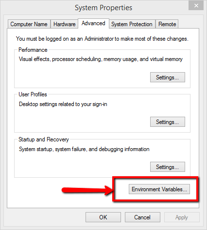
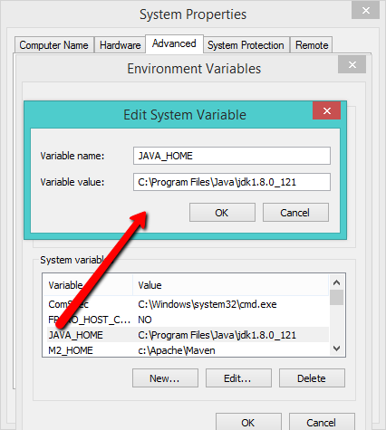
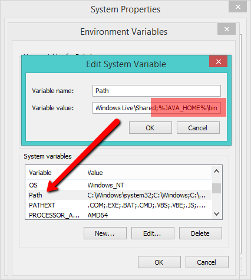
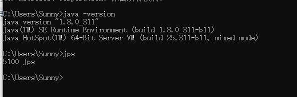
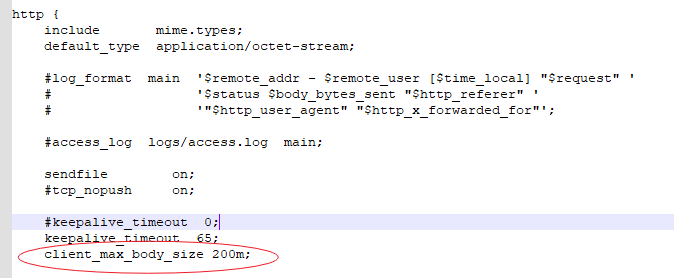

# For older version SQLFlow

## <mark style="color:red;">**This page is for SQLFlow 5.x.x.x**</mark>

Please refer to the latest install manual if you are using the latest SQFlow(version > 6.0.0.0):


[.](./)


You can check this page for the SQLFlow berfore version&#x20;


[sqlflow-before-version-6.md](../versions/sqlflow-before-version-6.md)


***

### Prerequisites

* [SQLFlow on-premise version](https://www.gudusoft.com/sqlflow-on-premise-version/)
* Server with at least 8GB memory
* install JDK1.8 or higher\
  SET JAVA\_HOME variable, and then add %JAVA\_HOME%\bin to the path variable

<figure><figcaption></figcaption></figure>

<figure><figcaption></figcaption></figure>

<figure><figcaption></figcaption></figure>

<figure><figcaption></figcaption></figure>

* install Nginx for windows Download the Nginx Windows version here: http://nginx.org/en/docs/windows.html

### Unzip SQLFlow file

* create a folder: c:\wings\sqlflow
* unzip SQLFlow install package to c:\wings\sqlflow, you will get 2 directories like:
  1. c:\wings\sqlflow\backend
  2. c:\wings\sqlflow\frontend

### Start SQLFlow backend

* Open a dos command windows
* cd c:\wings\sqlflow\backend\bin
* run backend.bat
* please wait 3-5 minutes to allow the SQLFlow service to start completely.

### Nginx Reverse Proxy

If we set the reverse proxy path of gspLive restful service to /api

**1. config Nginx**

* enter conf directory where Nginx is installed such as Nginx-1.19.4\conf
* modify the Nginx.conf, replace the server section in nginx.conf with the following code:

```
	server {

		listen 80 default_server;

		listen [::]:80 default_server;

		root C:\wings\sqlflow\frontend;

		index index.html;
		
		location ~* ^/index.html {
			add_header X-Frame-Options deny;
			add_header Cache-Control no-store;
		}

		location / {
			try_files $uri $uri/ =404;
		}
	
		location /api/ {
			proxy_pass http://127.0.0.1:8081/;
			proxy_connect_timeout 600s ;
			proxy_read_timeout 600s;
			proxy_send_timeout 600s;
		
			proxy_set_header Host $host;
			proxy_set_header X-Real-IP $remote_addr;
			proxy_set_header X-Forwarded-For $proxy_add_x_forwarded_for;
			proxy_set_header User-Agent $http_user_agent;  
		}
	}
	
```

Please make sure `C:\wings\sqlflow\frontend` is where the SQLFlow frontend is installed, otherwise, please change `C:\wings\sqlflow\frontend` to the path where the SQLFlow frontend is located.

**2. modify frontend configuration file config.private.json**

* Open the configration file "C:\wings\sqlflow\frontend\config.private.json"
* Modify the **ApiPrefix** attribute

```
  "ApiPrefix": "/api"
```

### start Nginx

* Open a dos command window
* cd the directory where Nginx is installed
* run just nginx.exe

### SQLFlow is ready

Open the browser and go to localhost or got to the IP where the SQLFlow is installed.

* Open http://yourIp/ to see the SQLFlow.
* Open http://yourIp/api/gspLive\_backend/doc.html?lang=en to see the Restful API documention.

### Stop the SQLFlow

* close the window where the backend.bat is running.
* cd c:\wings\sqlflow\backend\bin
* run stop.bat

### Sqlflow client api call

See[ sqlflow client api call](../../../3.-api-docs/using-the-rest-api.md)

1. Get userId from gudu\_sqlflow.conf

* Open the configration file "c:\wings\sqlflow\backend\conf\gudu\_sqlflow.conf"
* The value of anonymous\_user\_id field is webapi userId

```bash
  anonymous_user_id=xxx
```

* **Note:** on-promise mode, webapi call doesn't need the token parameter

1.  Test webapi by curl

    * test sql:

    ```sql
      select name from user
    ```

    * curl command:

    ```bash
      curl -X POST "http://yourIp/api/gspLive_backend/sqlflow/generation/sqlflow" -H "accept:application/json;charset=utf-8" -F "userId=YOUR USER ID HERE" -F  "dbvendor=dbvoracle" -F "sqltext=select name from user"
    ```

    * response:

    ```json
      {
        "code": 200,
        "data": {
          "dbvendor": "dbvoracle",
          "dbobjs": [
            ...
          ],
          "relations": [
            ...
          ]
        },
        "sessionId": ...
      }
    ```

    * If the code returns **401**, please check the userId is set or the userId is valid.

### troubleshooting

#### Hostname error

Make sure the window hostname **doesn't include the underscore symbol (\_)**, otherwise, the service will not work properly. please change it to minus symbol (-)

#### Cannot start&#x20;

If you have following errors when starting backend.bat

```
'jps' is not recognized as an internal or external command
```

Please check the first section of this page, confirm that your JDK environement variable is successfully set.  You may need to restart your server to enable the change.

#### Error uploading large file

This is due to nginx config. Nginx by default limit the size of the files uploaded. Add the following config in your `http` block of the Nginx config file to change the file upload size in Nginx

```
client_max_body_size 200m;
```

<figure><figcaption></figcaption></figure>

This increases the limit to 200M, if needed you may change this number.
