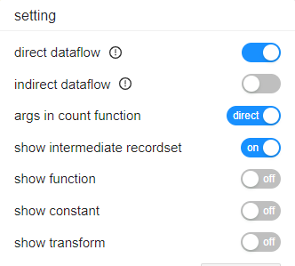

# Map the DataFlowAnalyzer and the settings on SQLFlow UI

<figure><figcaption></figcaption></figure>

#### direct dataflow (fdd), indirect dataflow (fdr)

There is no correspond parameter in DataFlowAnalyzer for fdd and fdr because DataFlowAnalyzer will generate data lineage with all relation types, including fdd, fdr, join, and call.

#### args in count function

`/treatArgumentsInCountFunctionAsDirectDataflow`

#### show intermediate recordset, show function

The settings for "show intermediate recordset" and "show function" have no corresponding arguments in DataFlowAnalyzer. However, you can get the same result by using the following args:

* specify no arg of `/if`, `/i` nor `/topselectlist` will give the same result as if you set `show intermediate recordset = true` and set `show function = true`
* `/if` has the same effect as if you set `show intermediate recordset = true` and set `show function = false`
* `/i` gives the same result as if you set `show intermediate recordset = false` and set `show function = true`
* `/topselectlist` as if you set `show intermediate recordset = false` and set `show function = false`

#### show constant

`/showConstant`

#### show transform

`/transform` and `/coor`
