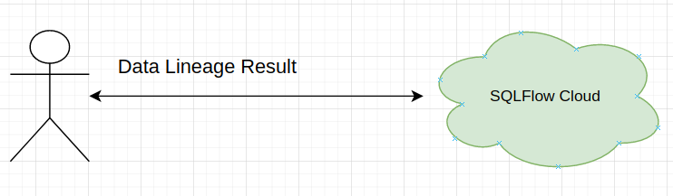
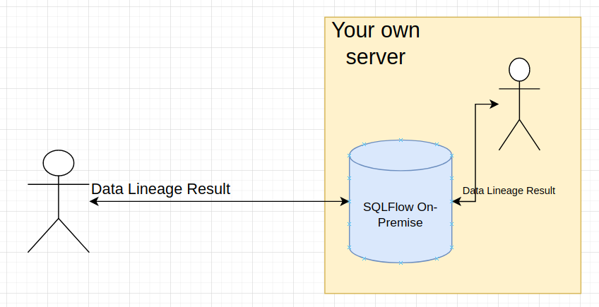

# Cloud and On-Premise version

To obtain the data lineage result from REST call, you have two options.

## Use our cloud server:

<figure><figcaption></figcaption></figure>

Check [this section](../../3.-api-docs/prerequisites.md#sqlflow-cloud-server) to get more details about how to onboard our could server.

## Install a SQLFlow On-Premise version on your own server

<figure><figcaption></figcaption></figure>

Please [check here](../installation/) to see how to install SQLFlow on-premise version on you own server.&#x20;

* User ID
* Secrete Key

Always set userId to `gudu|0123456789` and keep `userSecret` empty when connect to the SQLFlow on-premise version.

Check [here](../../3.-api-docs/prerequisites.md#difference-between-using-sqlflow-cloud-server-and-sqlflow-on-premise-version) to understand the difference between SQLFlow Cloud and SQLFlow On-Premise.
