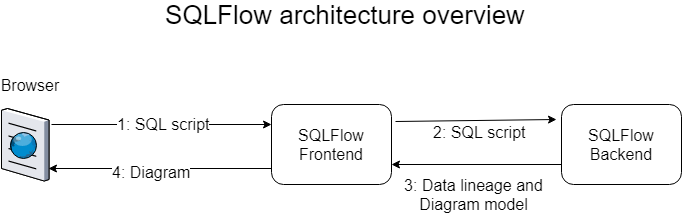
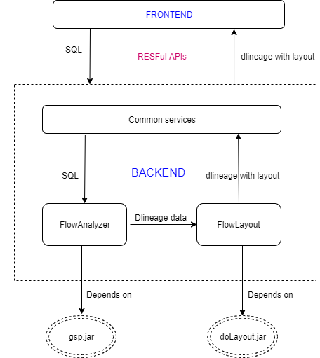

# Architecture Overview

<figure><figcaption></figcaption></figure>

### SQLFlow components

<figure><figcaption></figcaption></figure>

**SQLFlow frontend**

1. Send the SQL script received from the browser to the backend.
2. After receiving the result, visualize the diagram model in the browser and show the data lineage and diagram model generated by the backend.
3. Highlight the dataflow in the diagram when the user clicks on a specific table/column.

**SQLFlow backend**

1.  `SQLFlow-Analyzer`: receiving the SQL script from the frontend and parse the SQL script into parsed tree nodes with [the GSP library](http://www.sqlparser.com), calculating the data lineage by analyzing AST.

    The `SQLFlow-Analyzer` component can be executed as a standalone tool. Take SQL text as input and generate data lineage in JSON format. Check [Java Library](../java-library/usage/) for more Info.
2. `FlowLayout`: Calculating the layout of database objects(table/column) in the dlineage and generate the diagram model with all necessary position data, including nodes and edges. `FlowLayout` depends on `doLayout library` to layout the database objects.
3. Return a JSON snippet including the data lineage and diagram model to the frontend.

#### Relations generated by SQLFlow

[This article](../../2.-concepts/data-lineage/) describes the relationship generated by the SQLFlow between column and column, column and table/view. One relation includes one target column and a relationship type, and one or more source columns.
