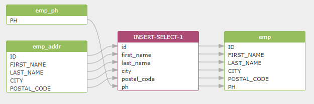

# What SQLFlow can do

* Scan your database and discover the data lineage instantly.
* Automatically collect SQL script from github/bitbucket or local file system.
* Provide a nice and clean diagram to the end-user to understand the data lineage quickly.
* programmatically using [Restful APIs](https://github.com/sqlparser/sqlflow\_public/blob/master/api) or [SDKs](https://www.gudusoft.com/sqlflow-java-library-2/) to get lineage in CSV, JSON, Graphml format.
* Incorporate the lineage metadata decoded from the complex SQL script into your own metadata database for further processing.
* Visualize the metadata already existing in your database to release the power of data.
* Perform impact analysis and root-cause analysis by tracing lineage backwards or forwards with several mouse click.
* Able to process SQL script from more than 20 major database vendors.

## Product Features

* It can be used via browser because it’s cloud-based or it's installed on your own server
* Analyze SQL queries: from a simple SELECT statement to a stored procedure with thousands of lines of code;
* Connect to the database to analyze the data lineage automatically in real-time;
* Analyzes different data sources such as Redshift log, Snowflake query history, DBT scripts, etc., and quickly discover the data lineage relationship in the enterprise data platform;
* Provides a rich Rest API interface to quickly integrate into your data governance platform;
* Provides Java libraries that deploy to the end customers along with your data governance tools;
* Provides front-end UI library to quickly provide interactive data lineage relationship display function for your data governance platform;
* Provides an integrated solution with datahub open source metadata management software;

### A tool that tracks column-level data lineage

Track Column-Level Data Lineage for [more than 20 major databases](https://github.com/sqlparser/sqlflow\_public/blob/master/databases/readme.md) including Snowflake, Hive, SparkSQL, Teradata, Oracle, SQL Server, AWS redshift, BigQuery, etc.

Build and visualize lineage from SQL script from query history, ETL script, Github/Bitbucket, Local filesystem and remote databases.

[Exploring lineage using an interactive diagram](https://sqlflow.gudusoft.com/) or programmatically using [Restful APIs](https://github.com/sqlparser/sqlflow\_public/blob/master/api) or [SDKs](https://www.gudusoft.com/sqlflow-java-library-2/).

Discover data lineage in this query:

```sql
insert into emp (id,first_name,last_name,city,postal_code,ph)
  select a.id,a.first_name,a.last_name,a.city,a.postal_code,b.ph
  from emp_addr a
  inner join emp_ph b on a.id = b.id;
```

SQLFlow presents a nice clean graph to you that tells where the data came from, what transformations it underwent along the way, and what other data items are derived from this data value.

<figure><figcaption></figcaption></figure>
