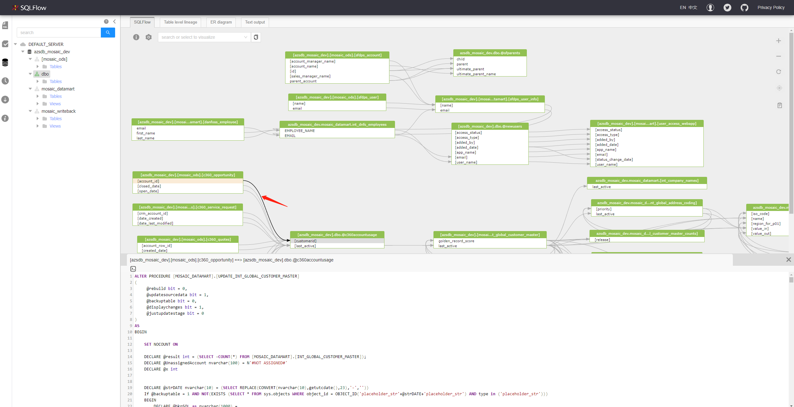
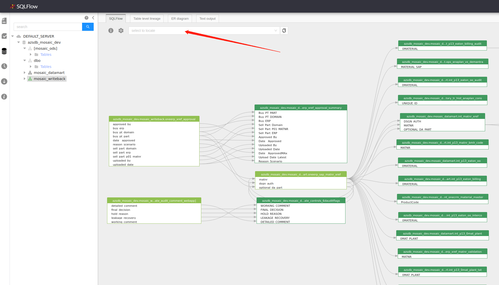

# Diagram Panel

### Check Source SQL

To check the related SQL statements of the data lineage, simply clicking the lineage arrow of the specific field:

<figure><figcaption></figcaption></figure>

<figure><figcaption></figcaption></figure>

**Note**: This feature only works in [Regular Job](../getting-started/different-modes-in-gudu-sqlflow/job-mode.md#regular-job).

### Search Table/View

Use the search bar to locate the table/view in a complex lineage diagram.

<figure><figcaption></figcaption></figure>

Fuzzy query is enabled in the search bar and the table/view found would be highlighted in the diagram.&#x20;

<figure><figcaption></figcaption></figure>

<figure><figcaption></figcaption></figure>
