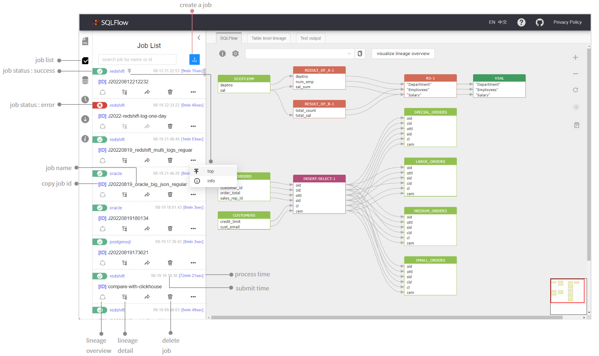
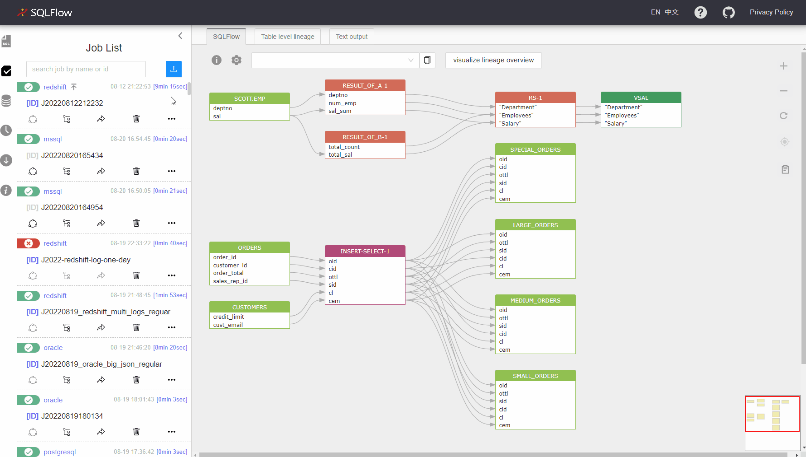
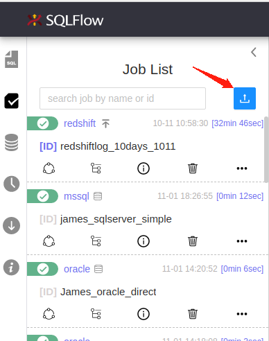
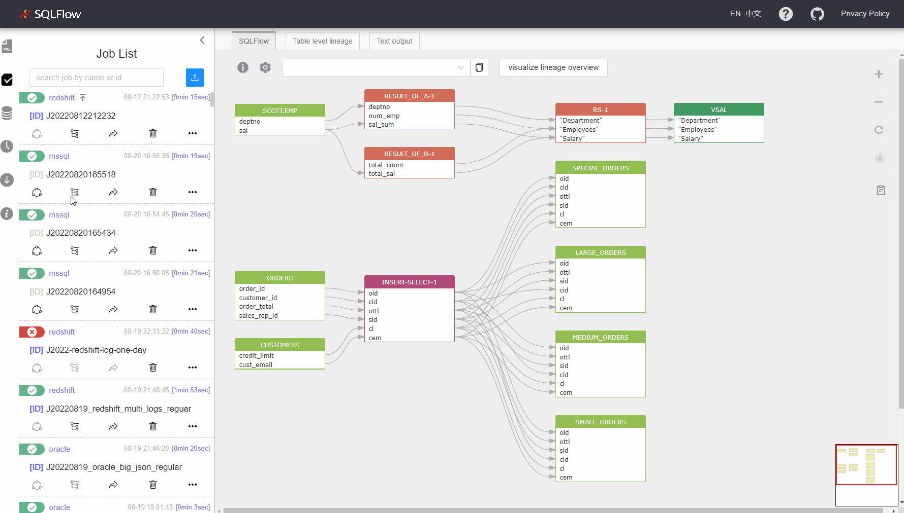

# Job Management

## Job list

<figure><figcaption></figcaption></figure>

<figure><figcaption></figcaption></figure>

Note that `Lineage Overview` can not be applied on[ regular job](../../getting-started/different-modes-in-gudu-sqlflow/job-mode.md#regular-job) cause process data are needed but we don't have that in the database.

## Create a job

<figure><figcaption></figcaption></figure>

### Click the Job Creation button in the Job List Section

<figure><figcaption></figcaption></figure>

### Enter the Job creation parameters&#x20;

<figure><figcaption></figcaption></figure>

### Job sources


[job-sources.md](job-sources.md)


### Default server/database/schema

Give the default value for server/database/schema when there's no related metadata to the database units(such as table,view etc...). If the default values are given here, will use the given values. Otherwise will use `default` as the value for server/database/schema if the default server/database/schema is not set.

<figure><figcaption></figcaption></figure>

### Job Type

Choose the Job type when creating the Job. Read more on the [Job type](../../getting-started/different-modes-in-gudu-sqlflow/job-mode.md).

<figure><figcaption></figcaption></figure>

### Advanced

Customized the extraction/exclusion content under the `advanced` section

<figure><figcaption></figcaption></figure>

**excludedDbsSchemas**: List of databases and schemas to exclude from extraction, separated by commas database1/schema1,database2 or database1.schema1,database2. It supports wildcard characters such as database1/_,_/schema,_/_.

**extractedDbsSchemas**: List of databases and schemas to extract, separated by commas, which are to be provided in the format database/schema; Or blank to extract all databases. database1/schema1,database2/schema2,database3 or database1.schema1,database2.schema2,database3. It supports wildcard characters such as database1/_,_/schema,_/_.

**extractedStoredProcedures**: A list of stored procedures under the specified database and schema to extract, separated by commas, which are to be provided in the format database.schema.procedureName or schema.procedureName; Or blank to extract all databases, support expression. Example:    database1.schema1.procedureName1,database2.schema2.procedureName2,database3.schema3,database4 or database1/schema1/procedureName1,database2/schema2

**extractedViews**: A list of stored views under the specified database and schema to extract, separated by commas, which are to be provided in the format database.schema.viewName or schema.viewName. Or blank to extract all databases. It supports expression. Example: database1.schema1.procedureName1,database2.schema2.procedureName2,database3.schema3,database4 or database1/schema1/procedureName1,database2/schema2

### Configurable parameters

You can give the configurable parameters under the `setting` section. Check [here](../settings.md#configurable-parameters-when-creating-jobs-or-visualizing-the-sql-in-sql-editor) to get more details about these parameters.

<figure><figcaption></figcaption></figure>

## Backwards in code

<figure><figcaption></figcaption></figure>

