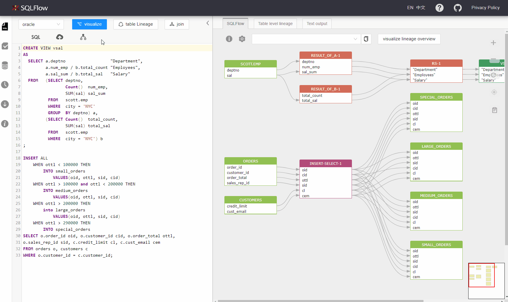
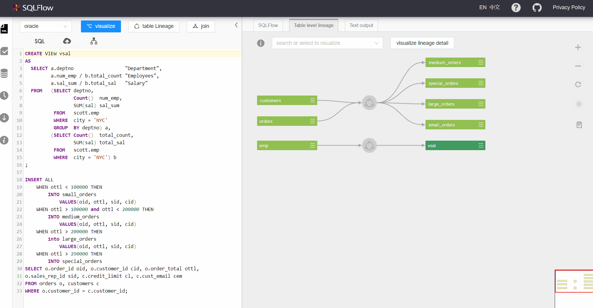
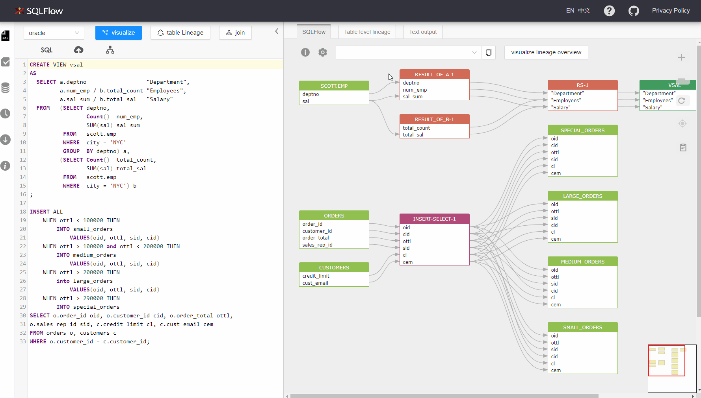
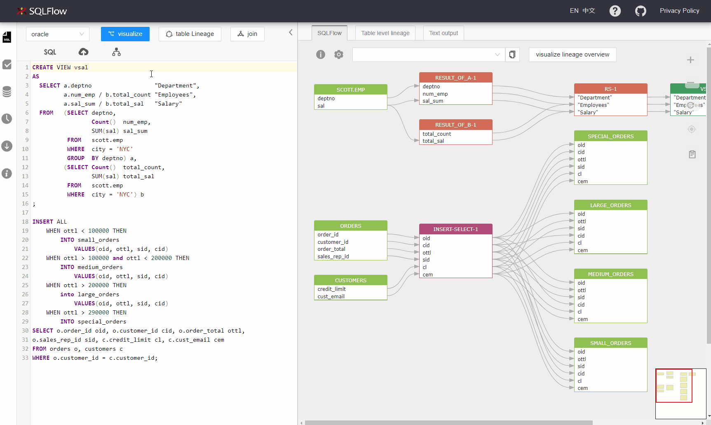
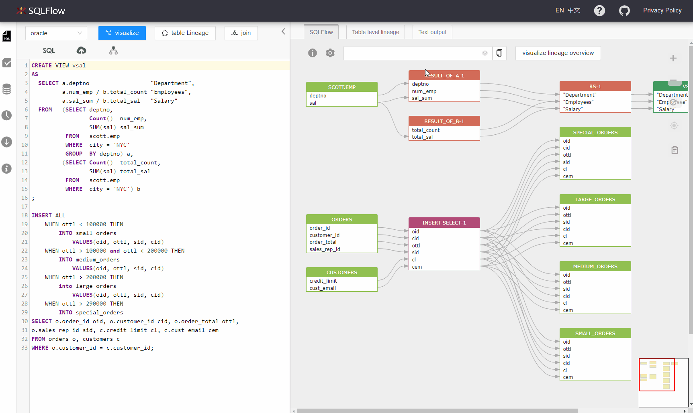
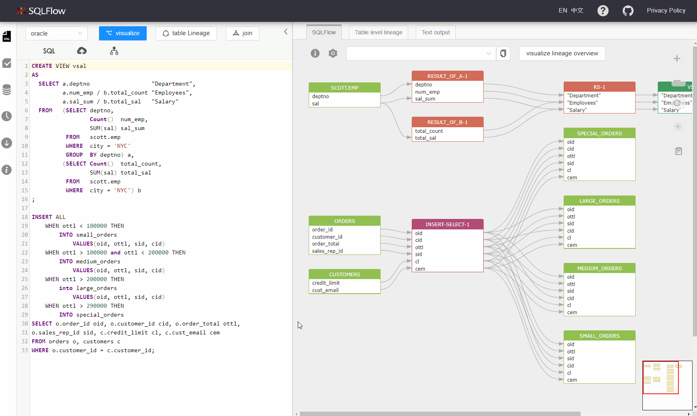
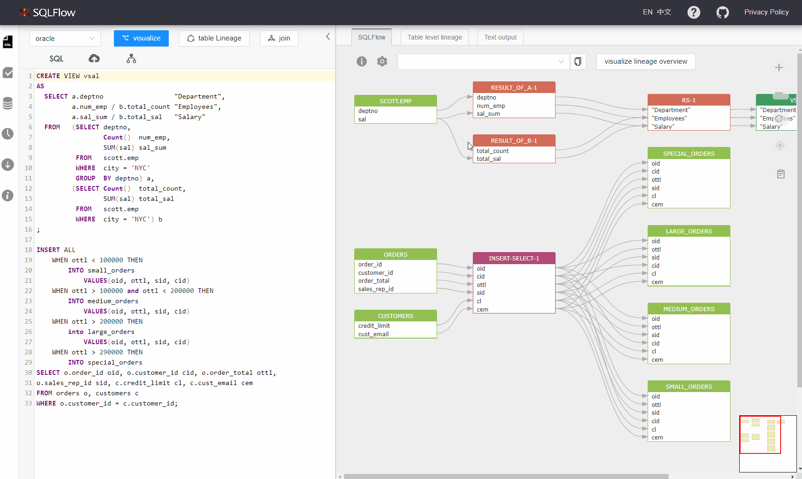

# SQLText Editor

Enter your SQL code in the live editor. You can choose the database under the section of dbvendor. Visualize your data lineage by clicking _`visualize`_ or _`visualize join`_.

<figure><figcaption></figcaption></figure>

### Table level lineage

Click `Table Lineage` to show only table level lineage. UI invokes [/sqlflow/graph/table\_level\_lineage](../../3.-api-docs/sqlflow-rest-api-reference/generation-interface/sqlflow-graph-table\_level\_lineage.md) to get the table level lineage result. The [/sqlflow/graph/table\_level\_lineage](../../3.-api-docs/sqlflow-rest-api-reference/generation-interface/sqlflow-graph-table\_level\_lineage.md) returns the simplified data lineage result with only table level information.&#x20;

Table level lineage has almost the same structure as column level lineage. The only difference is instead of pointing to _table_, the _source_ block or the _target_ block will point to _process_.&#x20;

Example:

```
relation(process E), column A.b --> column C.d
```

will become&#x20;

```
table A ---> process E --> table C
```

You can read more about relationship, source, target [here](../../7.-reference/lineage-model/json-format-lineage-model.md#5.-relationship-payload).

<figure><figcaption><p>table level lineage</p></figcaption></figure>

### Check source sql code under table level lineage

<figure><figcaption></figcaption></figure>

### Visualize join

When clicking _`visualize`_, a sqlflow model will be generated and the UI will display the data lineage based on the sqlflow model response. A request to [/sqlflow/generation/sqlflow/graph](../../3.-api-docs/sqlflow-rest-api-reference/generation-interface/sqlflow-graph.md) will be made with `fdd` as the value of the field `showRelationType` and `true` in `ignoreFunction`.&#x20;

When clicking _`visualize join`_, same endpoint ([/sqlflow/generation/sqlflow/graph](../../3.-api-docs/sqlflow-rest-api-reference/generation-interface/sqlflow-graph.md)) will be invoked as above. We will have `join` as the value of the field `showRelationType` and `true` for `ignoreFunction` in the request.&#x20;

### Switch sample SQL

Click the dbvendor menu and select the database. Click sample _`SQL`_ to get the sample sql corresponding to this dbvendor in the live editing box.

<figure><figcaption></figcaption></figure>

### Visualize a column or table by dropdown menu

<figure><figcaption></figcaption></figure>

### Hover sqltext to highlight graph

Hover over sqltext to find the corresponding graph.

<figure><figcaption></figcaption></figure>

### Hover graph to highlight sqltext

Hover over graph to find the corresponding sqltext.

<figure><figcaption></figcaption></figure>

### Resize left panel width

Hover over the edge of the panel. You can drag and change the width when there is a highlight.

<figure><figcaption></figcaption></figure>

### Pin graph, drag graph, and cancel

Click a column in the graph to fix the upstream and downstream relationships. Press and hold down the left mouse button to move the canvas.

<figure><figcaption></figcaption></figure>
