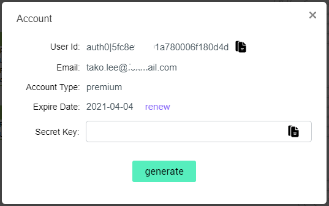

# Prerequisites

This article shows how to use the SQLFlow Rest API to communicate with the SQLFlow server and get the generated metadata and data lineage.

In order to use the SQLFlow rest API, you may connect to the [**SQLFlow Cloud server**](https://sqlflow.gudusoft.com) or setup a [**SQLFlow on-premise version**](https://www.gudusoft.com/sqlflow-on-premise-version/) on your owner server.

### **Generate Account Secret**

If you want to connect to [the SQLFlow Cloud Server](https://sqlflow.gudusoft.com), you may [request a 30 days premium account](https://www.gudusoft.com/request-a-premium-account/) to get the necessary userId and secret code.

Once getting the premium account or if you are using SQLFlow On-Premise, please click the icon at the right top of the screen:

<figure><figcaption></figcaption></figure>

Click the `Account` menu item to see:

<figure><figcaption></figcaption></figure>

Here you can

* Copy the userId
* By default, the Secret key field is empty, please click the `generate` button to create a new secret key and copy this code.

### **SQLFlow on-premise version**

Please [check here](../1.-introduction/installation/) to see how to install SQLFlow on-premise version on you own server.&#x20;

There are two default accounts for SQLFlow On-Premise and you can change the default password by yourselves:

* Admin Account\
  username: admin@local.gudusoft.com\
  password: admin
* Basic Account\
  username: user@local.gudusoft.com\
  password: user

### Difference between using SQLFlow Cloud server and SQLFlow on-premise version

1. The server port is 8081 by default for the SQLFlow on-premise version, and There is no need to specify the port.
2. SQLFlow on-premise is hosted on your own server, your business data are kept in your own domain.

Please [check here](../1.-introduction/installation/linux/#customize-the-port) if you want read more about the server port of the SQLFlow on-premise version.

