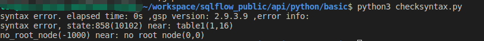

# checkSyntax

This API will help check whether the input SQL has any grammar issues.


[swagger_with_token.yaml](../../.gitbook/assets/swagger_with_token.yaml)


Here's a sample usage of this API: [https://github.com/sqlparser/sqlflow\_public/blob/master/api/python/basic/checksyntax.py](https://github.com/sqlparser/sqlflow\_public/blob/master/api/python/basic/checksyntax.py)

```python
#!/usr/bin/python
# -*- coding: UTF-8 -*-
import requests
import json
import GenerateToken


def check(server, port, sql, dbvendor, userId, token):
    url = "/api/gspLive_backend/demo/syntax/check"
    if 'api.gudusoft.com' in server:
        url = '/gspLive_backend/demo/syntax/check'
    if port != '':
        url = server + ':' + port + url
    else:
        url = server + url

    data = {'sql': sql, 'dbvendor': dbvendor, 'userId': userId, 'token': token}
    header_dict = {"Content-Type": "application/x-www-form-urlencoded;charset=UTF-8"}
    try:
        r = requests.post(url, data=data, headers=header_dict, verify=False)
    except Exception as e:
        print('syntax error.', e)
    result = json.loads(r.text)

    if result['code'] == 200:
        usedTime = result['data']['usedTime']
        version = result['data']['gsp.version']
        print('syntax correct. elapsed time: ' + usedTime+' ,gsp version: ' + version)
    else:
        usedTime = result['data']['usedTime']
        version = result['data']['gsp.version']
        print('syntax error. elapsed time: ' + usedTime + ' ,gsp version: ' + version + ' ,error info:')
        errorInfos = result['data']['errorInfos']
        for error in errorInfos:
            print(error['errorMessage'])

if __name__ == '__main__':
    # the user id of sqlflow web or client, required true
    userId = ''

    # the secret key of sqlflow user for webapi request, required true
    screctKey = ''

    # sqlflow server, For the cloud version, the value is https://api.gudusoft.com
    server = 'https://api.gudusoft.com'


    # sqlflow api port, For the cloud version, the value is 80
    port = ''

    # The token is generated from userid and usersecret. It is used in every Api invocation.
    token = GenerateToken.getToken(userId, server, port, screctKey)

    # sql to be checked
    sql = 'select * fro1m table1'

    # database type, dbvansi,dbvathena,dbvazuresql,dbvbigquery,dbvcouchbase,dbvdb2,dbvgreenplum,dbvgaussdb,dbvhana,dbvhive,dbvimpala,dbvinformix,dbvmdx,dbvmysql,dbvnetezza,dbvopenedge,dbvoracle,dbvpresto,dbvpostgresql,dbvredshift,dbvsnowflake,dbvmssql,dbvsparksql,dbvsybase,dbvteradata,dbvvertica
    dbvendor = 'dbvoracle'

    # check syntax
    check(server, port, sql, dbvendor, userId, token)
```

For the above sample code, in case any error in the SQL:\


<figure><figcaption></figcaption></figure>

Version info and elapsed time will be returned if the SQL is valid:

<figure><figcaption></figcaption></figure>
