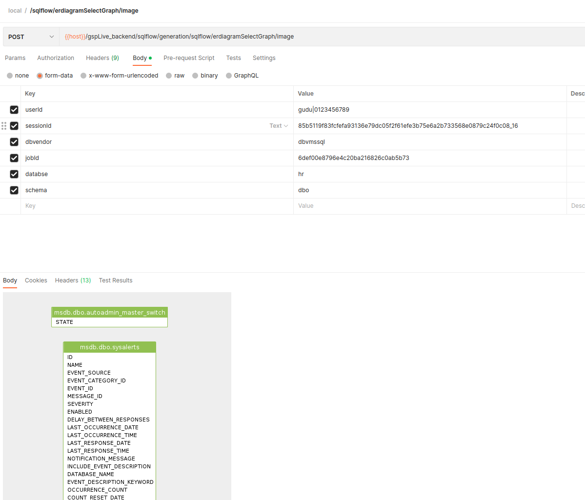

# /sqlflow/erdiagramSelectGraph

Show the E-R Diagram based on the given source (sqltext/sessionId). Check [here](../../../1.-introduction/getting-started/convert-sql-to-e-r-diagram.md) for more information about this feature in SQLFlow UI.

### Retrieve E-R Diagram in Json

```
/sqlflow/generation/sqlflow/erdiagramSelectGraph
```


[swagger.yaml](../../../.gitbook/assets/swagger.yaml)


Sample:

```bash
curl --location 'https://<SQLFLOW URL>/gspLive_backend/sqlflow/generation/sqlflow/erdiagramSelectGraph' \
--header 'accept: application/json' \
--form 'userId="gudu|0123456789"' \
--form 'sessionId="85b5119f83fcfefa93136e79dc05f2f61efe3b75e6a2b733568e0879c24f0c08_1680615728918"' \
--form 'dbvendor="dbvmssql"' \
--form 'jobId="6def00e8796e4c20ba216826c0ab5b73"' \
--form 'databse="hr"' \
--form 'schema="dbo"'
```

### Retrieve E-R Diagram image

```
/sqlflow/generation/sqlflow/erdiagramSelectGraph/image
```


[swagger.yaml](../../../.gitbook/assets/swagger.yaml)


Sample:

```bash
curl --location 'https://<SQLFLOW URL>/gspLive_backend/sqlflow/generation/sqlflow/erdiagramSelectGraph/image' \
--header 'accept: image/*' \
--form 'userId="gudu|0123456789"' \
--form 'sessionId="85b5119f83fcfefa93136e79dc05f2f61efe3b75e6a2b733568e0879c24f0c08_1680615728918"' \
--form 'dbvendor="dbvmssql"' \
--form 'jobId="6def00e8796e4c20ba216826c0ab5b73"' \
--form 'databse="hr"' \
--form 'schema="dbo"'
```

<figure><figcaption></figcaption></figure>
