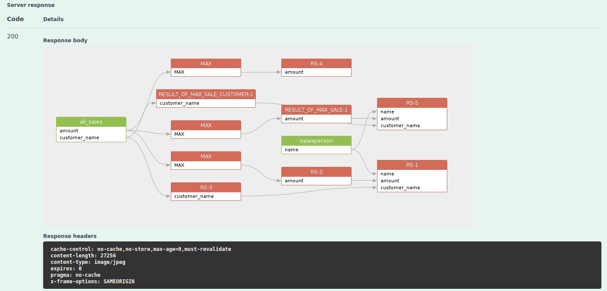

# /sqlflow/generation/sqlflow/graph/image

Return the data lineage image file for the given SQL file.


[swagger.yaml](../../../.gitbook/assets/swagger.yaml)


Sample response:

<figure><figcaption></figcaption></figure>
