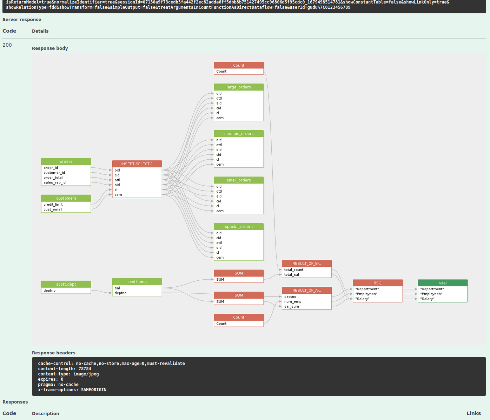

# /sqlflow/generation/sqlflow/selectedgraph/image

Retrieve the data lineage image file for the selected dbobject graph


[swagger.yaml](../../../.gitbook/assets/swagger.yaml)


Sample response:

<figure><figcaption></figcaption></figure>
