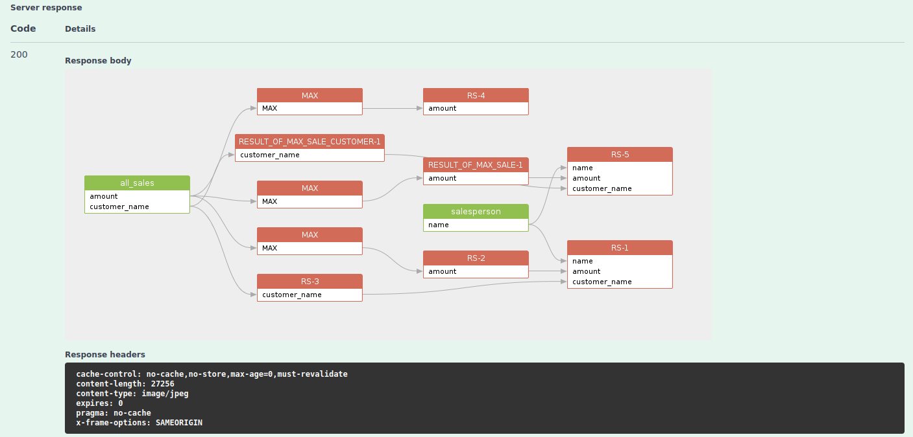

# /sqlflow/graph/image

Return the data lineage image file for the given SQL file.


[swagger_without_token.yaml](../../../.gitbook/assets/swagger_without_token.yaml)


Sample response:

<figure><figcaption></figcaption></figure>

Check our blog [https://www.dpriver.com/blog/2023/03/23/visualize-your-data-with-sqlflow-rest-api/](https://www.dpriver.com/blog/2023/03/23/visualize-your-data-with-sqlflow-rest-api/) for more details about this endpoint.
