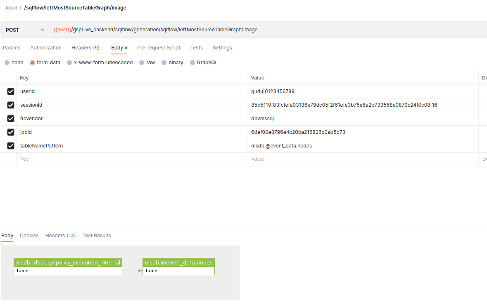

# /sqlflow/leftMostSourceTableGraph

This API returns the left most result for the data element. Corresponds to [this feature](../../../1.-introduction/ui/schema.md#to-left-most) in SQLFlow UI.&#x20;

### Get the left-most lineage in Json

```
/sqlflow/generation/sqlflow/leftMostSourceTableGraph
```


[swagger_with_token.yaml](../../../.gitbook/assets/swagger_with_token.yaml)


Sample:

```bash
curl --location 'https://<SQLFLOW URL>/gspLive_backend/sqlflow/generation/sqlflow/leftMostSourceTableGraph' \
--header 'accept: application/json' \
--form 'userId="gudu|0123456789"' \
--form 'sessionId="85b5119f83fcfefa93136e79dc05f2f61efe3b75e6a2b733568e0879c24f0c08_1680615728918"' \
--form 'dbvendor="dbvmssql"' \
--form 'jobId="6def00e8796e4c20ba216826c0ab5b73"' \
--form 'tableNamePattern="msdb.@event_data.nodes"'
```

### Retrieve the left-most lineage image

```
/sqlflow/generation/sqlflow/leftMostSourceTableGraph/image
```


[swagger_with_token.yaml](../../../.gitbook/assets/swagger_with_token.yaml)


Sample:

```bash
curl --location 'https://<SQLFLOW URL>/gspLive_backend/sqlflow/generation/sqlflow/leftMostSourceTableGraph/image' \
--header 'accept: image/*' \
--form 'userId="gudu|0123456789"' \
--form 'sessionId="85b5119f83fcfefa93136e79dc05f2f61efe3b75e6a2b733568e0879c24f0c08_1680615728918"' \
--form 'dbvendor="dbvmssql"' \
--form 'jobId="6def00e8796e4c20ba216826c0ab5b73"' \
--form 'tableNamePattern="msdb.@event_data.nodes"'
```

<figure><figcaption></figcaption></figure>
