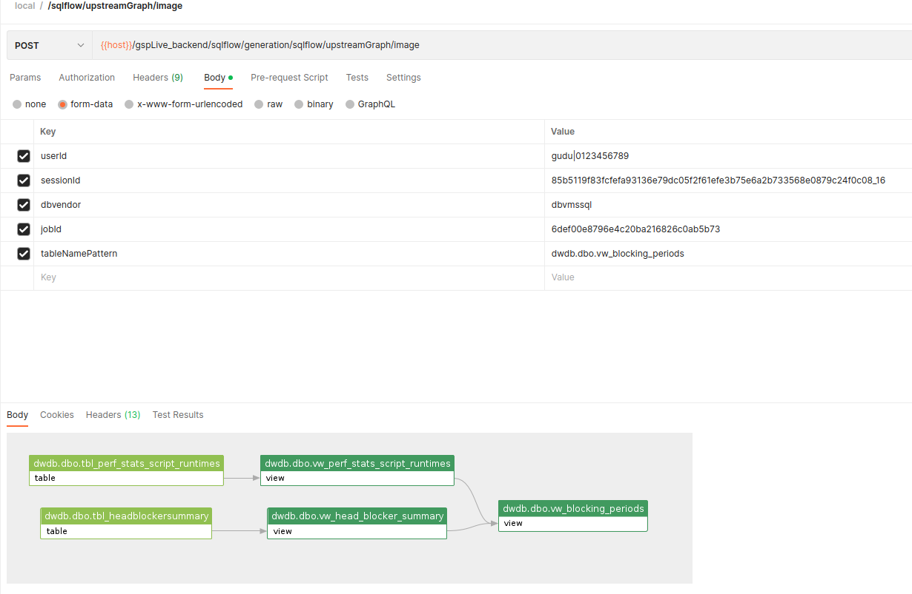

# /sqlflow/upstreamGraph

Retrieve the upstream data lineage for data elements in [_**regular Job**_](../../../1.-introduction/getting-started/different-modes-in-gudu-sqlflow/job-mode.md#regular-job). This Api corresponds to [the downstream/upstream feature](../../../1.-introduction/ui/schema.md#to-upstream-to-downstream) in SQLFlow UI.

### Get upstream data lineage in Json

```
/sqlflow/generation/sqlflow/upstreamGraph
```


[swagger.yaml](../../../.gitbook/assets/swagger.yaml)


### Get upstream data lineage image

```
/sqlflow/generation/sqlflow/upstreamGraph/image
```


[swagger.yaml](../../../.gitbook/assets/swagger.yaml)


Sample:

```bash
curl --location 'https://<SQLFLOW URL>/gspLive_backend/sqlflow/generation/sqlflow/upstreamGraph/image' \
--header 'accept: image/*' \
--form 'userId="gudu|0123456789"' \
--form 'sessionId="85b5119f83fcfefa93136e79dc05f2f61efe3b75e6a2b733568e0879c24f0c08_1680615728918"' \
--form 'dbvendor="dbvmssql"' \
--form 'jobId="6def00e8796e4c20ba216826c0ab5b73"' \
--form 'tableNamePattern="dwdb.dbo.vw_blocking_periods"'
```

<figure><figcaption></figcaption></figure>
