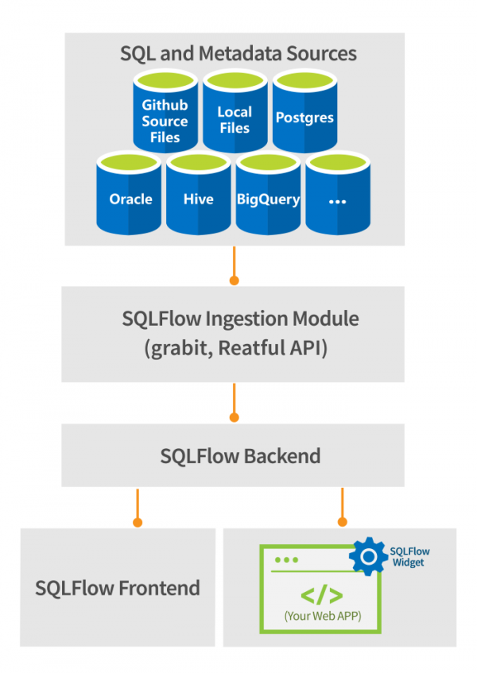

# Widget Get started

The SQLFlow widget is a Javascript library that enables instantaneous data lineage visualisation on your website.

The SQLFlow widet must work together with the Gudu SQLFlow backend in order to visualize the data lineage and provides an actionable diagram.

The SQLFlow widget is shipped together with [the SQLFlow On-Premise version](https://www.gudusoft.com/sqlflow-on-premise-version/).&#x20;

Once the SQLFlow widget is installed on your server, you can access the SQLFlow widget with the url such as: [https://127.0.0.1/widget](https://127.0.0.1/widget). Currently there are no online demos available.

<figure><figcaption></figcaption></figure>

* Visualize the lineage of the SQL queries.
* Show specific table/column lineage graphics on the web page.
* Package the data lineage into a standalone web app.
* Shipped together with the [SQLFlow On-Premise](https://www.gudusoft.com/sqlflow-on-premise-version/) version.\


## **Files**

```
├── index.html
├── jquery.min.js
├── sqlflow.widget.2.4.9.css
└── sqlflow.widget.2.4.9.js
└── 1\
└── 2\
└── 3\
└── ...
```

> Please note that the version number in the file may change. Folders from number 1 to number 15 are example codes.

## Setup

Import the `sqlflow.widget.2.4.9.js` in index.html. During the execution of the JS, a new iframe will be created. The `css` is statically imported by `js` and will be embedded into the iframe so no additional css import is required.

jquery is optional and is included here only for the demostration purpose.

```html
<!DOCTYPE html>
<html lang="en-us">
    <head>
        <meta charset="UTF-8" />
        <title>demo：visualize sqltext</title>
        <script src="/widget/jquery.min.js"></script>
        <script src="/widget/sqlflow.widget.3.0.4.js?t=1667100085601"></script>
        <script src="index.js"></script>
        <style>
            body {
                padding: 20px;
            }

            h1 {
                margin-top: 20px;
                font-size: 24px;
            }
        </style>
    </head>

    <body>
        <h1>demo：visualize sqltext</h1>
        <div id="sqlflow"></div>
    </body>
</html>

```

Insert the following code in index.js:

```js
$(async () => {
    // get a instance of SQLFlow
    const sqlflow = await SQLFlow.init({
        container: document.getElementById('sqlflow'),
        width: 1000,
        height: 315,
        apiPrefix: 'http://xxx.com/api',
        token: '', // input your token
    });

    // set dbvendor property
    sqlflow.vendor.set('oracle');

    // set sql text property
    sqlflow.sqltext.set(`CREATE VIEW vsal 
    AS 
      SELECT a.deptno                  "Department", 
             a.num_emp / b.total_count "Employees", 
             a.sal_sum / b.total_sal   "Salary" 
      FROM   (SELECT deptno, 
                     Count()  num_emp, 
                     SUM(sal) sal_sum 
              FROM   scott.emp 
              WHERE  city = 'NYC' 
              GROUP  BY deptno) a, 
             (SELECT Count()  total_count, 
                     SUM(sal) total_sal 
              FROM   scott.emp 
              WHERE  city = 'NYC') b 
    ;`);

    sqlflow.visualize();
});

```

If you are using SQLFlow On-Premise, you can get the token directly from your license file

<figure><figcaption></figcaption></figure>

With the above code we will have a result:

<figure><figcaption></figcaption></figure>

## Parameters

| name      | detail                                                                             | type             | optional |
| --------- | ---------------------------------------------------------------------------------- | ---------------- | -------- |
| container | the html element where sqlflow is attached                                         | HTMLElement      | no       |
| apiPrefix | the url of sqlflow backend                                                         | string           | no       |
| width     | width of container, both percent and fix length can be used like "100%", or 800px  | string \| number | no       |
| height    | height of container, both percent and fix length can be used like "100%", or 800px | string \| number | no       |
