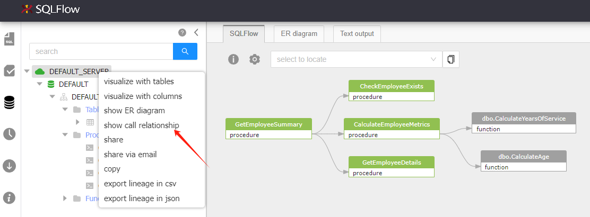

# Usages

## 1. Visualize sqltext

Visualize the data lineage after analyzing the input SQL query.

* input: SQL text
* output: data lineage diagram

Find the example code under the directory:

```
└── 1\
```

<figure><figcaption></figcaption></figure>

```javascript
$(async () => {
    // get a instance of SQLFlow
    const sqlflow = await SQLFlow.init({
        container: document.getElementById('sqlflow'),
        width: 1000,
        height: 315,
        apiPrefix: 'http://xxx.com/api',
        token: '', // input your token
    });

    // set dbvendor property
    sqlflow.vendor.set('oracle');

    // set sql text property
    sqlflow.sqltext.set(`CREATE VIEW vsal 
    AS 
      SELECT a.deptno                  "Department", 
             a.num_emp / b.total_count "Employees", 
             a.sal_sum / b.total_sal   "Salary" 
      FROM   (SELECT deptno, 
                     Count()  num_emp, 
                     SUM(sal) sal_sum 
              FROM   scott.emp 
              WHERE  city = 'NYC' 
              GROUP  BY deptno) a, 
             (SELECT Count()  total_count, 
                     SUM(sal) total_sal 
              FROM   scott.emp 
              WHERE  city = 'NYC') b 
    ;`);

    sqlflow.visualize();
});

```

## **2. Visualize job**

Visualize the data lineage in a [SQLFlow Job](../1.-introduction/getting-started/different-modes-in-gudu-sqlflow/). The SQLFlow job must be already created.

* input: a SQLFlow job id, or leave it empty to view the latest job
* output: data lineage diagram

Find the example code under the directory:

```
└── 2\
```

```javascript
$(async () => {
    const sqlflow = await SQLFlow.init({
        container: document.getElementById('demo-2'),
        width: 1000,
        height: 800,
        apiPrefix: 'http://xxx.com/api',
    });

    // view job detail by job id, or leave it empty to view the latest job
    await sqlflow.job.lineage.viewDetailById('b38273ec356d457bb98c6b3159c53be3');
});
```

<figure><figcaption></figcaption></figure>

## **3. Visualize job with hard coded parameters**

Visualize the data lineage of a specified table or column in a SQLFlow job.

* input: a SQLFlow job id, or leave it empty to view the latest job
* input: database, schema, table, column.
  * If the column is omitted, the data lineage for the specified table will be returned.
  * if the table and column are ommited, the data lineage for the specified schema will be returned.
  * if the schema, table and column are ommited, the data lineage for the specified database will be returned.
* output: data lineage diagram

Find the example code under the directory:

```
└── 3\
```

```javascript
$(async () => {
    const sqlflow = await SQLFlow.init({
        container: document.getElementById('sqlflow'),
        width: 1000,
        height: 700,
        apiPrefix: 'http://xxx.com/api',
    });

    // view job detail by job id, or leave it empty to view the latest job
    await sqlflow.job.lineage.viewDetailById('b38273ec356d457bb98c6b3159c53be3');

    sqlflow.job.lineage.selectGraph({
        database: 'DWDB', //
        schema: 'DBO',
        table: '#TMP',
        column: 'NUMBER_OFOBJECTS',
    });
});
```

## **4. Visualize job with parameters**

Visualize the data lineage of a specified table or column in a SQLFlow job.

* input: a SQLFlow job id, or leave it empty to view the latest job
* input: database, schema, table, column.
  * If the column is omitted, the data lineage for the specified table will be returned.
  * if the table and column are ommited, the data lineage for the specified schema will be returned.
  * if the schema, table and column are ommited, the data lineage for the specified database will be returned.
* output: data lineage diagram

Find the example code under the directory:

```
└── 4\
```

<figure><figcaption></figcaption></figure>

```javascript
$(async () => {
    const $jobid = $('#jobid');
    const $database = $('#database');
    const $schema = $('#schema');
    const $table = $('#table');
    const $column = $('#column');
    const $recordset = $('#recordset');
    const $function = $('#function');
    const $visualize = $('#visualize');

    const sqlflow = await SQLFlow.init({
        container: document.getElementById('sqlflow'),
        width: 1200,
        height: 800,
        apiPrefix: 'http://xxx.com/api',
        token: '', // input your token
    });

    const visualize = async () => {
        // reset default option
        $recordset.prop('checked', false);
        $function.prop('checked', false);

        // view job detail by job id, or leave it empty to view the latest job
        await sqlflow.job.lineage.viewDetailById($jobid.val());

        sqlflow.job.lineage.selectGraph({
            database: $database.val(),
            schema: $schema.val(),
            table: $table.val(),
            column: $column.val(),
        });
    };

    visualize();

    $visualize.click(visualize);

    $recordset.change(() => {
        const checked = $recordset.prop('checked');
        sqlflow.setting.showIntermediateRecordset.set(checked);
    });

    $function.change(() => {
        const checked = $function.prop('checked');
        sqlflow.setting.showFunction.set(checked);
    });
});

```

## **5. Set data lineage options of SQL query**

Generate the data lineage of a SQL query with different input parameters.

Find the example code under the directory:

```
└── 5\
```

```javascript
$(async () => {
    const $sqltext = $('#sqltext');
    const $dataflow = $('#dataflow');
    const $impact = $('#impact');
    const $args = $('#args');
    const $recordset = $('#recordset');
    const $function = $('#function');
    const $constant = $('#constant');
    const $transform = $('#transform');
    const $visualize = $('#visualize');
    const $visualizeTableLevel = $('#visualizeTableLevel');

    // get a instance of SQLFlow
    const sqlflow = await SQLFlow.init({
        container: document.getElementById('sqlflow'),
        width: 1000,
        height: 800,
        apiPrefix: 'http://xxx.com/api',
        token: '', // input your token
    });

    // set dbvendor property
    sqlflow.vendor.set('oracle');

    const visualize = async () => {
        // set sql text property
        sqlflow.sqltext.set($sqltext.val());

        // set default options
        $recordset.prop('checked', true);
        $dataflow.prop('checked', true);
        $args.prop('checked', true);
        $impact.prop('checked', false);
        $function.prop('checked', false);
        $constant.prop('checked', true);
        $transform.prop('checked', false);

        sqlflow.visualize();
    };

    visualize();

    $visualize.click(visualize);

    const visualizeTableLevel = async () => {
        // set sql text property
        sqlflow.sqltext.set($sqltext.val());
        sqlflow.visualizeTableLevel();
    };

    $visualizeTableLevel.click(visualizeTableLevel);

    $dataflow.change(() => {
        const checked = $dataflow.prop('checked');
        sqlflow.setting.dataflow.set(checked);
    });

    $impact.change(() => {
        const checked = $impact.prop('checked');
        sqlflow.setting.impact.set(checked);
    });

    $args.change(() => {
        const checked = $args.prop('checked');
        sqlflow.setting.dataflowOfAggregateFunction.set(checked);
    });

    $recordset.change(() => {
        const checked = $recordset.prop('checked');
        sqlflow.setting.showIntermediateRecordset.set(checked);
    });

    $function.change(() => {
        const checked = $function.prop('checked');
        sqlflow.setting.showFunction.set(checked);
    });

    $constant.change(() => {
        const checked = $constant.prop('checked');
        sqlflow.setting.showConstant.set(checked);
    });
    $transform.change(() => {
        const checked = $transform.prop('checked');
        sqlflow.setting.showTransform.set(checked);
    });
});

```

## **6. Visualize an embedded json object in html page**

SQLFlow will visualize the json object which contains the data lineage information and will show the actionable diagram.

Since all layout data is included in the json file, the SQLFlow widget will draw the diagram and needn't to connect to the SQLFlow backend.

So this SQLFlow widget can work without the installation of the Gudu SQLFlow.

Find the example code under the directory:

```
└── 6\
```

The format of the Json is described in [https://docs.gudusoft.com/7.-reference/lineage-model/json-format-lineage-model#id-4.-dbobjs-payload](https://docs.gudusoft.com/7.-reference/lineage-model/json-format-lineage-model#id-4.-dbobjs-payload)&#x20;

The payload is the sqlflow part of the response in the [graph interface](../3.-api-docs/sqlflow-rest-api-reference/generation-interface/sqlflow-graph.md):

<figure><figcaption></figcaption></figure>

And giving that value to the widget:

<figure><figcaption></figcaption></figure>

## **7. Visualize data lineage in a separate json file**

Read and visualize the data lineage in a json file. This json file should be accessable in the same server as the SQLFlow widget.

Since all layout data is included in the json file, the SQLFlow widget will generate the diagram and needn't to connect to the SQLFlow backend.

This SQLFlow widget can work without the installation of the Gudu SQLFlow.

Find the example code under the directory:

```
└── 7\
```

## **8. Get error message**

Getting error message after processing input SQL qurey.

Find the example code under the directory:

```
└── 8\
```

<figure><figcaption></figcaption></figure>

```javascript
$(async () => {
    const $sqltext = $('#sqltext');
    const $visualize = $('#visualize');
    const $error = $('#error');

    // get a instance of SQLFlow
    const sqlflow = await SQLFlow.init({
        container: document.getElementById('sqlflow'),
        width: 1000,
        height: 400,
        apiPrefix: 'http://xxx.com/api',
        token: '', // input your token
    });

    // set dbvendor property
    sqlflow.vendor.set('oracle');

    const visualize = async () => {
        // set sql text property
        sqlflow.sqltext.set($sqltext.val());

        await sqlflow.visualize();

        const error = sqlflow.error.get();
        if (error && error.length > 0) {
            console.log(sqlflow.error.get());
            let text = '';
            error.forEach(item => {
                text += `${item.errorType} : ${item.errorMessage}`;
            });
            $error.val(text);
        } else {
            $error.val('');
        }
    };

    visualize();

    $visualize.click(visualize);
});

```

## **9. Event: add an event listener on field(column) click**

Add an event listener on field(column) click so that you can get detailed information about the field(column) that been clicked.

Find the example code under the directory:

```
└── 9\
```

<figure><figcaption></figcaption></figure>

```javascript
$(async () => {
    const $sqltext = $('#sqltext');
    const $visualize = $('#visualize');
    const $message = $('#message');

    // get a instance of SQLFlow
    const sqlflow = await SQLFlow.init({
        container: document.getElementById('sqlflow'),
        width: 1000,
        height: 400,
        apiPrefix: 'http://xxx.com/api',
        token: '', // input your token
    });

    // set dbvendor property
    sqlflow.vendor.set('oracle');

    // add an event listener on field(column) click
    sqlflow.addEventListener('onFieldClick', field => {
        $message.val(JSON.stringify(field));

        // remove all event listeners
        // sqlflow.removeAllEventListener()
    });

    const visualize = async () => {
        // set sql text property
        sqlflow.sqltext.set($sqltext.val());

        await sqlflow.visualize();
    };

    visualize();

    $visualize.click(visualize);
});

```

## **12. Access data lineage from url**

User can directly access the data lineage through an url by specifying the data lineage type, table and column.

> All data lineages come from the default job at the Gudu SQLFlow backend. If no default job is set, the lineage data will be retrieved from the latest job.

```
http://127.0.0.1/widget/12/?type=upstream&table=dbo.emp
http://127.0.0.1/widget/12/?type=upstream&table=dbo.emp&column=salary
```

### Input parameters

* type: upstream or downstream
* table
* column: if column is omitted, return the lineage for table
* stopat: value in regex expression, the lineage(upstream or downstream) stops at the given table if this input is set

the table and column name in the url is case insensitive.

#### stopat with regex expression

? The question mark indicates _zero or one_ occurrences of the preceding element. For example,`colou?r` matches both "color" and "colour". The question mark equals to {0, 1}

\* The asterisk indicates _zero or more_ occurrences of the preceding element. For example,`ab*c` matches "ac", "abc", "abbc", "abbbc", and so on. The asterisk equals to {0,}

\+ The plus sign indicates _one or more_ occurrences of the preceding element. For example,`ab+c` matches "abc", "abbc", "abbbc", and so on, but not "ac".

Regular expression has two matching modes: `matches` and `find`.

`matches` are all exact matches, `find` is a partial match. SQLFlow uses `matches` mode.

**Example:**

To match `mio.public.usecase_na_mio004_infohubview006` with base string `mio.public.usecase_na_mio004_infohub`

The regex expression should be: `mio.public.usecase_na_mio004_infohub.*`


`.` matches any single character, \* matches the preceding element zero or more times(in this case, it can be any character).

we cannot use `mio.public.usecase_na_mio004_infohub.？` to match because `?` indicates only zero or one occurrences of the preceding element, it is not a exact match:


**Use Regex Expression in stopat:**

http://127.0.0.1/widget/12/?type=downstream&\&table=MIO.PUBLIC.XXX&\&column=fact\_guid

<figure><figcaption></figcaption></figure>

http://127.0.0.1/widget/12/?type=downstream\&table=MIO.PUBLIC.XXX\&column=fact\_guid\&stopat=mio.public.usecase.\*

<figure><figcaption></figcaption></figure>

Find the example code under the directory:

```
└── 12\
```

## **13. Visualize a csv file that includes lineage data**

The format of the csv:

```csv
source_db,source_schema,source_table,source_column,target_db,target_schema,target_table,target_column,relation_type,effect_type
D1E9IQ1AE488E4,DBT_TESTS,STG_PAYMENTS,AMOUNT,DEFAULT,DEFAULT,RS-5,COUPON_AMOUNT,fdd,select
D1E9IQ1AE488E4,DBT_TESTS,STG_ORDERS,ORDER_ID,DEFAULT,DEFAULT,RS-5,ORDER_ID,fdd,select
D1E9IQ1AE488E4,DBT_TESTS,STG_ORDERS,STATUS,DEFAULT,DEFAULT,RS-5,STATUS,fdd,select
D1E9IQ1AE488E4,DBT_TESTS,STG_PAYMENTS,AMOUNT,DEFAULT,DEFAULT,RS-5,CREDIT_CARD_AMOUNT,fdd,select
D1E9IQ1AE488E4,DBT_TESTS,STG_PAYMENTS,AMOUNT,DEFAULT,DEFAULT,RS-5,GIFT_CARD_AMOUNT,fdd,select
D1E9IQ1AE488E4,DBT_TESTS,STG_ORDERS,ORDER_DATE,DEFAULT,DEFAULT,RS-5,ORDER_DATE,fdd,select
D1E9IQ1AE488E4,DBT_TESTS,STG_PAYMENTS,AMOUNT,DEFAULT,DEFAULT,RS-5,AMOUNT,fdd,select
D1E9IQ1AE488E4,DBT_TESTS,STG_ORDERS,CUSTOMER_ID,DEFAULT,DEFAULT,RS-5,CUSTOMER_ID,fdd,select
D1E9IQ1AE488E4,DBT_TESTS,STG_PAYMENTS,AMOUNT,DEFAULT,DEFAULT,RS-5,BANK_TRANSFER_AMOUNT,fdd,select
```

All necessary files are under this directory.

```
└── 13\
```

<figure><figcaption></figcaption></figure>

```javascript
$(async () => {
    const $sqltext = $('#sqltext');
    const $dataflow = $('#dataflow');
    const $impact = $('#impact');
    const $recordset = $('#recordset');
    const $function = $('#function');
    const $visualize = $('#visualize');
    const $file = $('#file');

    // get a instance of SQLFlow
    const sqlflow = await SQLFlow.init({
        container: document.getElementById('sqlflow'),
        width: 1000,
        height: 800,
        apiPrefix: 'http://xxx.com/api',
        token: '', // input your token
    });

    // set dbvendor property
    sqlflow.vendor.set('oracle');

    const visualize = async () => {
        // set sql text property
        sqlflow.sqltext.set($sqltext.val());

        // set default options
        $recordset.prop('checked', true);
        $dataflow.prop('checked', true);
        $impact.prop('checked', false);
        $function.prop('checked', false);

        sqlflow.visualize();
    };

    $file.on('change', async e => {
        const file = $file.prop('files')[0];
        const content = await file.text();
        $sqltext.val(content);
        visualize();
    });

    $visualize.click(visualize);

    $dataflow.change(() => {
        const checked = $dataflow.prop('checked');
        sqlflow.setting.dataflow.set(checked);
    });

    $impact.change(() => {
        const checked = $impact.prop('checked');
        sqlflow.setting.impact.set(checked);
    });

    $recordset.change(() => {
        const checked = $recordset.prop('checked');
        sqlflow.setting.showIntermediateRecordset.set(checked);
    });

    $function.change(() => {
        const checked = $function.prop('checked');
        sqlflow.setting.showFunction.set(checked);
    });
});

```

## **14. Visualize the lineage data using Vue**

SQLFlow Widget provides a Vue library to support Vue framework.

Find the example code under the directory:

```
└── 14\
```

```javascript
document.addEventListener('DOMContentLoaded', async () => {
    Vue.component('sqlflow', {
        template: '<div ref="el"></div>',

        async mounted() {
            // get a instance of SQLFlow
            const sqlflow = await SQLFlow.init({
                container: this.$refs.el, // get element ref from vue
                width: 1000,
                height: 315,
                apiPrefix: 'http://xxx.com/api',
                token: '', // input your token
            });

            // set dbvendor property
            sqlflow.vendor.set('oracle');

            // set sql text property
            sqlflow.sqltext.set(`CREATE VIEW vsal
                    AS
                      SELECT a.deptno                  "Department",
                             a.num_emp / b.total_count "Employees",
                             a.sal_sum / b.total_sal   "Salary"
                      FROM   (SELECT deptno,
                                     Count()  num_emp,
                                     SUM(sal) sal_sum
                              FROM   scott.emp
                              WHERE  city = 'NYC'
                              GROUP  BY deptno) a,
                             (SELECT Count()  total_count,
                                     SUM(sal) total_sal
                              FROM   scott.emp
                              WHERE  city = 'NYC') b
                    ;`);

            sqlflow.visualize();
        },
    });

    var app = new Vue({
        el: '#sqlflow',
        template: '<sqlflow />',
    });
});

```

## **15. Event: add an event listener on table click**

Add an event listener on table click so that you can get detailed information about the table which is clicked.

Find the example code under the directory:

```
└── 15\
```

<figure><figcaption></figcaption></figure>

```javascript
$(async () => {
    const $sqltext = $('#sqltext');
    const $visualize = $('#visualize');
    const $message = $('#message');

    // get a instance of SQLFlow
    const sqlflow = await SQLFlow.init({
        container: document.getElementById('sqlflow'),
        width: 1000,
        height: 400,
        apiPrefix: 'http://xxx.com/api',
        token: '', // input your token
    });

    // set dbvendor property
    sqlflow.vendor.set('oracle');

    // add an event listener on table click
    sqlflow.addEventListener('onTableNameClick', table => {
        $message.val(JSON.stringify(table));

        // remove all event listeners
        // sqlflow.removeAllEventListener()
    });

    const visualize = async () => {
        // set sql text property
        sqlflow.sqltext.set($sqltext.val());

        await sqlflow.visualize();
    };

    visualize();

    $visualize.click(visualize);
});

```

