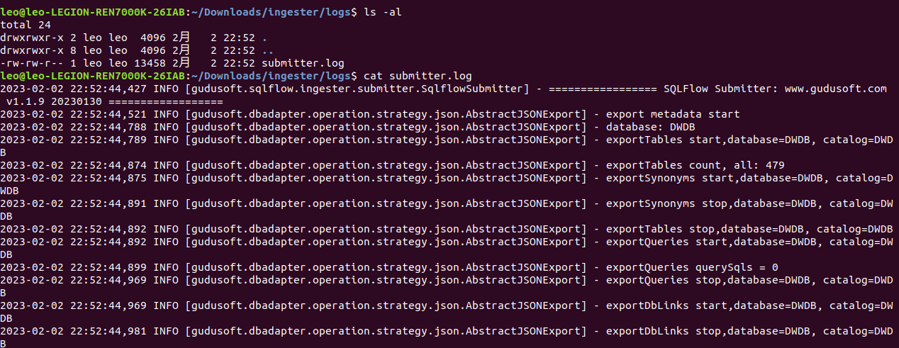

# SQLFlow-Submitter

With SQLFlow-Submitter, you will be able to submit SQL and metadata to the SQLFlow server, to create [SQLFlow Jobs](../../1.-introduction/getting-started/different-modes-in-gudu-sqlflow/job-mode.md) as well as to generate data lineage.

## Prerequisites

*   SQLFlow-Ingester package

    Download our latest SQFlow-Ingester package [here](https://github.com/sqlparser/sqlflow\_public/releases).
* Java 8 or higher version must be installed and configured correctly.

## Installation

```
unzip sqlflow-ingesterx.x.x.zip -d <ingester_folder>

cd <ingester_folder>
```

* **Under Linux & Mac to add permissions**

```
chmod 777 *.sh
```

## Usage

<figure><figcaption></figcaption></figure>

After decompressing the package, you will find `submitter.bat` for Windows and `submitter.sh` for Linux & Mac.&#x20;

### Windows&#x20;

```
submitter.bat -f D:/mssql-winuser-config.json
```

<figure><figcaption></figcaption></figure>

### Linux & Mac

```bash
bash submitter.sh -f <path_to_config_file>  

note: 
    path_to_config_file: the full path to the config file

eg: 
    bash submitter.sh -f /home/workspace/gudu_ingester/submitter_config.json
```

<figure><figcaption></figcaption></figure>

After successfully executing the Submitter, check the Job list on UI and you will find the job submitted by the Submitter, with the Job name configured in the configuration file.

<figure><figcaption></figcaption></figure>

### Cron Job

If you are on Linux or Mac, you can schedule the submitter with `crontab` to create a cron job.

```
crontab -e
```

In the editor opened by the above command, let's say now we want to schedule a daily cron job, add the following code

```bash
0 0 * * * bash submitter.sh -f <path_to_config_file> <lib_path>

note: 
    path_to_config_file: config file path 
    lib_path: lib directory absolute path
```

Please check [this document](https://phoenixnap.com/kb/set-up-cron-job-linux) for more information about `cron` and you can learn the `cron` grammar with [Wikipedia](https://en.wikipedia.org/wiki/Cron).

## SQLFlow-Submitter Log

The logs of the submitter are persisted under `log` folder.

<figure><figcaption></figcaption></figure>

### **Common Logs**

* file is not a valid file.

The file does not exist or the file address cannot be found.

* sqlScriptSource is valid, support source are database,gitserver,singleFile,directory

The `sqlScriptSource` parameter is incorrectly set. Data sources are only supported from databases, remote repositories, and files and directories

* lineageReturnFormat is valid, support types are json,csv,graphml

Parameter `lineageReturnFormat` is incorrectly set. The data lineage result obtained can only be in JSON, CSV, and GraphML formats

* export metadata in json successful. the resulting metadata is as follows

Exporting metadata from the specified database succeeded.

* This database is not currently supported

Parameter `databaseType` set error, at present only support access, bigquery, couchbase, dax, db2, greenplum, hana, hive, impala, informix, mdx, mssql,sqlserver,mysql,netezza,odbc,openedge,oracle,postgresql,postgres,redshift,snowflake,sybase,teradata,soql,vertica,azure

* db connect failed

The metadata fails to be exported from the specified database. If the metadata fails to be exported, check whether the database connection information in the `dataServer` object is correct

* export metadata in json failed

Failed to export metadata from the specified database. Check whether the user who logs in to the database has the permission to obtain metadata

* metadata is empty

Exporting metadata from specified database is empty, please contact me for processing

* remote warehouse url cannot be empty

The URL in the gitServer parameter cannot be empty

* remote warehouse pull failed

Failed to connect to the remote warehouse. Check whether the remote warehouse connection information is correct

* connection failed，repourl is the ssh URL

The remote repository address is incorrect. Please check whether it is a Git address

* remote warehouse file to zip successful. path is：xx

Pull to a local storage address from a remote repository

* get token from sqlflow failed

Failed to connect to SQLFlow. Check whether connection parameters of `sqlflowServer` are correct

* submit job to sqlflow failed, please input https with url

Failed to submit the SQLFlow task. Check whether the URL and port of the `sqlflowServer` are correct

* submit job to sqlflow failed

Failed to submit the SQLFLOW task. Check whether the sqlFLOW background service is started properly

* get job to status failed

After a job is submitted to SQLFLOW, SQLFlow fails to execute the job

* export json result failed

Description Failed to export Data Lineage in JSON format from SQLflow

* export csv result failed

Description Failed to export Data Lineage in csv format from SQLflow

* export diagram result failed

Description Failed to export Data Lineage in diagram format from SQLflow

* submit job to sqlflow successful

The job is successfully submitted to SQLFlow, and the basic information about the submitted job is displayed

* \[database: 0 table: 0 view: 0 procedure: 0 column: 0 synonym: 0]

Statistics the amount of metadata exported from the specified database

* the time taken to export : 0ms

Time, in milliseconds, to export metadata from the specified database

* download success, path: xxx

Local storage address of Data Lineage returned after successfully submitting a job to SQLFlow

* job id is : xxxx

job id from sqlflow , log in to the SQLFlow website to view the newly analyzed results. In the `Job List`, you can view the analysis results of the currently submitted tasks.

* The number of relationships in this task is too large to export this file, please check data lineage on SQLFlow platform.

When the task uploaded to SQLFlow is too large or the number of rolls parsed by SQLFlow is too large, SQLFlow-Submitter cannot obtain CSV files from it.

## Configuration File

### Configuration sample

```json
{
	"databaseServer":{
		"hostname":"DESKTOP-MLUR76N\\SQLEXPRESS",
		"port":"1443",
		"database":"master",
		"extractedDbsSchemas":"",
	        "excludedDbsSchemas":"",
	        "extractedStoredProcedures":"",
	        "extractedViews":"",
		"enableQueryHistory":false,
		"queryHistoryBlockOfTimeInMinutes":0,
		"sqlsourceTableName":"",
		"sqlsourceColumnQuerySource":"",
		"sqlsourceColumnQueryName":"",
		"authentication":"windowsuser"
	},
	"sqlFlowServer":{
		"server":"http://sqlflow.cn",
		"serverPort":"8081",
		"userId":"gudu|0123456789",
		"userSecret":""
	},
	"sqlScriptSource":"database",
	"lineageReturnFormat":"json",
	"lineageReturnOutputFile":"",
	"databaseType":"mssql",
	"taskName": "sumitterTest",
	"jobNameToId": 1,
	"jobType":"regular",
	"donotConnectToSQLFlowServer": 1
}
```

### Snowflake query history

For the query history of Snowflake, we will need the following settings:

```json
"databaseServer"."enableQueryHistory"=true //enable query history
"databaseType":"snowflake", //set the DB type as Snowflake
"taskName": "snowflakeSumitterTest", //job name
"jobNameToId": 1, //when setting this value to 1, we can create an incremental job  
"jobType":"regular" //job type, regular job
```

For more details, check [configuration table](sqlflow-submitter.md#configuration-fields).

### Configuration Fields

| Field Name                                       | Description                                                                                                                                                                                                                                                                                                                                                                                                                                                   | Sample Value                                                                                                                                                                                                                                                                                                                                            |
| ------------------------------------------------ | ------------------------------------------------------------------------------------------------------------------------------------------------------------------------------------------------------------------------------------------------------------------------------------------------------------------------------------------------------------------------------------------------------------------------------------------------------------- | ------------------------------------------------------------------------------------------------------------------------------------------------------------------------------------------------------------------------------------------------------------------------------------------------------------------------------------------------------- |
| $databaseServer                                  | Contains the DB information and DB related settings                                                                                                                                                                                                                                                                                                                                                                                                           | N/A, Object                                                                                                                                                                                                                                                                                                                                             |
| $databaseServer.hostname                         | DB server hostname, can be the IP address or the domain name if using SQLFlow On-Premise                                                                                                                                                                                                                                                                                                                                                                      | DESKTOP-MLUR76N\SQLEXPRESS or 115.159.115.32                                                                                                                                                                                                                                                                                                            |
| $databaseServer.port                             | DB server port number                                                                                                                                                                                                                                                                                                                                                                                                                                         | 1433                                                                                                                                                                                                                                                                                                                                                    |
| $databaseServer.database                         | The name of the database instance to which it is connected                                                                                                                                                                                                                                                                                                                                                                                                    | For azure,greenplum,netezza,oracle,postgresql,redshift,teradata databases, it represents the database name and is required, For other databases, it is optional.                                                                                                                                                                                        |
| $databaseServer.extractedDbsSchemas              | List of databases and schemas to extract, separated by commas, which are to be provided in the format database/schema; Or blank to extract all databases. `database1/schema1,database2/schema2,database3` or `database1.schema1,database2.schema2,database3` When parameter `database` is filled in, this parameter is considered a schema. And support wildcard characters such as `database1/*`,`*/schema`,`*/*`                                            | <p>When the connected databases are Oracle and Teradata, this parameter is  schemas, for example:</p><p>extractedDbsSchemas: "HR,SH"</p><p>When the connected databases are Mysql , Sqlserver, Postgresql, Snowflake, Greenplum, Redshift, Netezza , Azure, this parameter database/schema, for example:</p><p>extractedDbsSchemas: "MY/ADMIN"</p>      |
| $databaseServer.excludedDbsSchemas               | This parameters works under the resultset filtered by `extractedDbsSchemas`. List of databases and schemas to exclude from extraction, separated by commas `database1/schema1,database2` or `database1.schema1,database2` When parameter `database` is filled in, this parameter is considered a schema. And support wildcard characters such as `database1/*`,`*/schema`,`*/*`                                                                               | <p>When the connected databases are Oracle and Teradata, this parameter is set the schemas, for example:</p><p>excludedDbsSchemas: "HR"</p><p>When the connected databases are Mysql , Sqlserver, Postgresql, Snowflake, Greenplum, Redshift, Netezza , Azure, this parameter is set database/schema, for example:</p><p>excludedDbsSchemas: "MY/*"</p> |
| $databaseServer.extractedStoredProcedures        | A list of stored procedures under the specified database and schema to extract, separated by commas, which are to be provided in the format database.schema.procedureName or schema.procedureName; Or blank to extract all databases, support expression. `database1.schema1.procedureName1,database2.schema2.procedureName2,database3.schema3,database4` or `database1/schema1/procedureName1,database2/schema2`                                             | <p>extractedStoredProcedures: "database.scott.vEmp*"</p><p>or</p><p>extractedStoredProcedures: "database.scott"</p>                                                                                                                                                                                                                                     |
| $databaseServer.extractedViews                   | A list of stored views under the specified database and schema to extract, separated by commas, which are to be provided in the format database.schema.viewName or schema.viewName. Or blank to extract all databases, support expression. `database1.schema1.procedureName1,database2.schema2.procedureName2,database3.schema3,database4` or `database1/schema1/procedureName1,database2/schema2`                                                            | <p>extractedViews: "database.scott.vEmp*"</p><p>or</p><p>extractedViews: "database.scott"</p>                                                                                                                                                                                                                                                           |
| $databaseServer.enableQueryHistory               | Fetch SQL queries from the query history if set to `true` default is false.                                                                                                                                                                                                                                                                                                                                                                                   | true/false                                                                                                                                                                                                                                                                                                                                              |
| $databaseServer.queryHistoryBlockOfTimeInMinutes | When `enableQueryHistory:true`, the interval at which the SQL query was extracted in the query History,default is `30` minutes.                                                                                                                                                                                                                                                                                                                               | 15                                                                                                                                                                                                                                                                                                                                                      |
| $databaseServer.sqlsourceTableName               | Check [here](sqlflow-submitter.md#process-sql-queries-in-a-database-table)                                                                                                                                                                                                                                                                                                                                                                                    | query\_table                                                                                                                                                                                                                                                                                                                                            |
| $databaseServer.sqlsourceColumnQuerySource       | Check [here](sqlflow-submitter.md#process-sql-queries-in-a-database-table)                                                                                                                                                                                                                                                                                                                                                                                    | query\_source                                                                                                                                                                                                                                                                                                                                           |
| $databaseServer.sqlsourceColumnQueryName         | Check [here](sqlflow-submitter.md#process-sql-queries-in-a-database-table)                                                                                                                                                                                                                                                                                                                                                                                    | query\_name                                                                                                                                                                                                                                                                                                                                             |
| $databaseServer.metaStore                        | <p>The metadata that is fetched from a Hive or SparkSQL metaStore. The metaStore uses the RDBMS such as MySQL to save the metadata.</p><p>Only Hive metaStore is supported in current version.</p><p>when this option is set to <code>hive</code>, SQLFlow-Submitter extract metadata from the metaStore, but not from the common metadata of the database.</p>                                                                                               | Hive                                                                                                                                                                                                                                                                                                                                                    |
| $databaseServer.authentication                   | Authentication method to connect to the Database server, only windows user is required to give the fixed value `windowsuser` .                                                                                                                                                                                                                                                                                                                                | windowsuser                                                                                                                                                                                                                                                                                                                                             |
| $sqlFlowServer                                   | Contains the SQLFlow server information                                                                                                                                                                                                                                                                                                                                                                                                                       | N/A, Object                                                                                                                                                                                                                                                                                                                                             |
| $sqlFlowServer.server                            | SQLFlow server address                                                                                                                                                                                                                                                                                                                                                                                                                                        | [https://api.gudusoft.com](https://api.gudusoft.com)                                                                                                                                                                                                                                                                                                    |
| $sqlFlowServer.serverPort                        | SQLFlow server port                                                                                                                                                                                                                                                                                                                                                                                                                                           | 443                                                                                                                                                                                                                                                                                                                                                     |
| $sqlFlowServer.userId                            | Account userId                                                                                                                                                                                                                                                                                                                                                                                                                                                | gudu\|0123456789                                                                                                                                                                                                                                                                                                                                        |
| $sqlFlowServer.userSecret                        | Account user secret                                                                                                                                                                                                                                                                                                                                                                                                                                           | eyJhbGciOiJIUzIxxxxxxx                                                                                                                                                                                                                                                                                                                                  |
| sqlScriptSource                                  | <p>You may collect SQL scripts from various sources such as database, Github repo, file system. This parameter tells SQLFlow-Submitter where the SQL scripts come from.</p><p>Only database is supported in current version</p>                                                                                                                                                                                                                               | database                                                                                                                                                                                                                                                                                                                                                |
| lineageReturnFormat                              | <p>SQLFlow-Submitter will fetch the data lineage back to the directory where the SQLFlow-Submitter is running. Those data lineage results are stored in the <code>data/job_%jobname/result/</code> directory.</p><p>This parameter specifies which kind of format is used to save the data lineage result.</p><p>Available values for this parameter:</p><ul><li>json, data lineage result in JSON.</li><li>csv, data lineage result in CSV format.</li></ul> | json                                                                                                                                                                                                                                                                                                                                                    |
| lineageReturnOutputFile                          | path to output the data lineage                                                                                                                                                                                                                                                                                                                                                                                                                               | "lineageReturnOutputFile":"/user/data.csv"                                                                                                                                                                                                                                                                                                              |
| databaseType                                     | the SQL type of the scripts                                                                                                                                                                                                                                                                                                                                                                                                                                   | mysql                                                                                                                                                                                                                                                                                                                                                   |
| taskName                                         | Job name                                                                                                                                                                                                                                                                                                                                                                                                                                                      |                                                                                                                                                                                                                                                                                                                                                         |
| jobNameToId                                      | 0 or 1, if set to 1, job can be submitted for multiple times                                                                                                                                                                                                                                                                                                                                                                                                  | 1                                                                                                                                                                                                                                                                                                                                                       |
| jobType                                          | <p>job type, Simple job or Regular job<br>Check <a href="../../1.-introduction/ui/job-management/">here</a> for more info</p>                                                                                                                                                                                                                                                                                                                                 | simple                                                                                                                                                                                                                                                                                                                                                  |
| donotConnectToSQLFlowServer                      | If `donotConnectToSQLFlowServer` is set to 1, the metadata file is not uploaded to SQLFlow. the default is 0                                                                                                                                                                                                                                                                                                                                                  | 0                                                                                                                                                                                                                                                                                                                                                       |

### Process SQL queries in a database table

This feature will extract SQL queries saved in a database table, metadata of the same database will also be extracted into the same JSON file.

#### sqlsourceTableName

Name of the table where SQL queries are saved.

table name: **query\_table**

| query\_name | query\_source                       |
| ----------- | ----------------------------------- |
| query1      | create view v1 as select f1 from t1 |
| query2      | create view v2 as select f2 from t2 |
| query3      | create view v3 as select f3 from t3 |

If you save SQL queries in a specific table, one SQL query per row.

Let's say: The column `query_table.query_source` stores the source code of the query. We can use this query to fetch all SQL queries in this table:

```
select query_name as queryName, query_source as querySource
from query_table
```

By setting the value of `sqlsourceTableName` and `sqlsourceColumnQuerySource`,`sqlsourceColumnQueryName` , SQLFLow-Submitter can fetch all SQL queries in this table and send it to the SQLFlow to analzye the lineage.

In this example,

```
"sqlsourceTableName":"query_table"
"sqlsourceColumnQuerySource":"query_source"
"sqlsourceColumnQueryName":"query_name"
```

Please leave `sqlsourceTableName` empty if you don't fetch SQL queries from a specific table.

#### **sqlsourceColumnQuerySource**

In the above sample:

```
"sqlsourceColumnQuerySource":"query_source
```

#### **sqlsourceColumnQueryName**

```
"sqlsourceColumnQueryName":"query_name"
```

This parameter is optional, you don't need to specify a query name column if it doesn't exist in the table.
