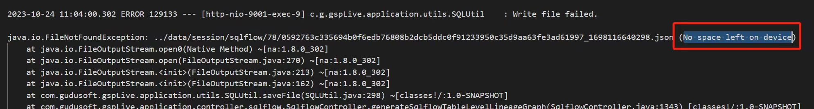
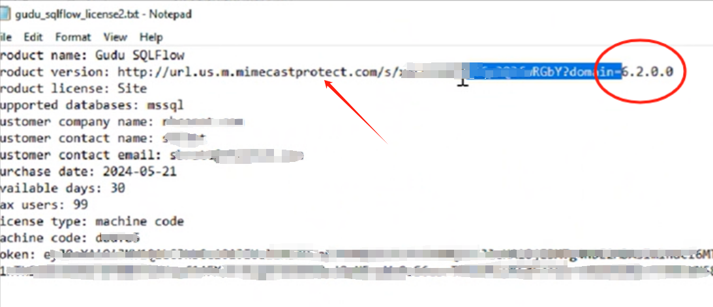
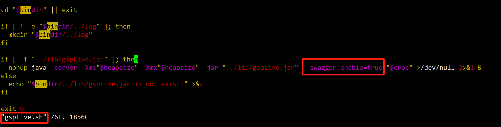
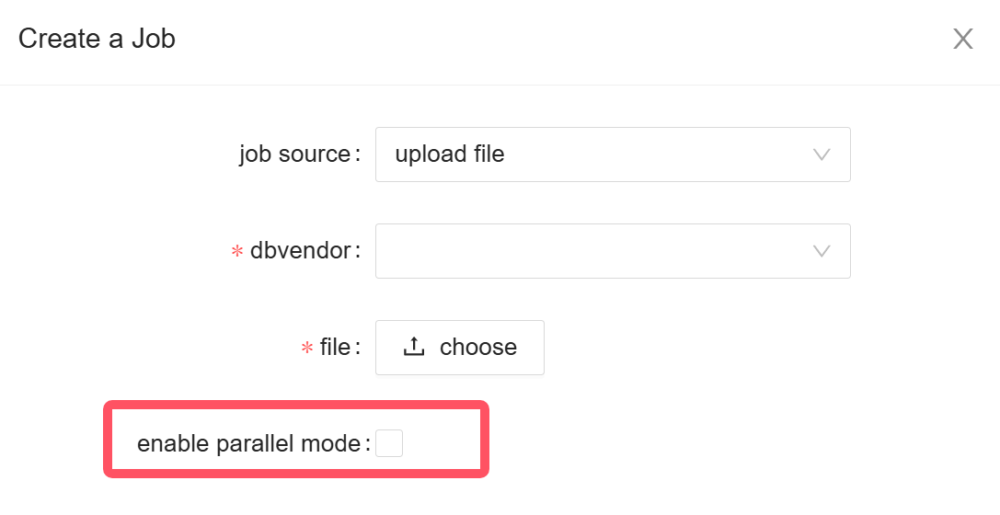

# FAQ

## Frequently Asked Questions

This page contains some frequently asked questions. You can also check the details response under the subpages.

### Q1: How to deal with internal database?

If your database is deployed in an internal network which is not accessible for external connection request, you can:

1. Use [sqlflow-ingester](../../6.-sqlflow-ingester/introduction/) to export the database metadata file.
2. Create sqlflow job by [uploading that metadata file on our SQLFlow UI](../../1.-introduction/ui/job-management/job-sources.md#upload-file).
3. Use [SQLFlow on-premise](../../1.-introduction/installation/versions/cloud-and-on-premise-version.md#install-a-sqlflow-on-premise-version-on-your-own-server) version.

Check [deal with internal database](handling-internal-database.md) for more details.

### Q2: Can I delete my account?

Yes, you can delete your account. Check [here](delete-your-account.md) for how to do that.

**Note: your data will be deleted with your account together**

### Q3: How to output only the relationships in a table form without temporary intermediates, just column to column relationships between tables?

You can archive this using one of the following two approaches:

* If you are using SQLFlow UI, change the SQLFlow UI settings and download the data lineage as CSV.
* You can make REST api request to get the desired CSV data.

Check [Table Form Data Without Intermediates](table-form-data-without-intermediates.md) to get more details.

### Q4: Some schema are missing in the result when using Oracle

Try to check the metadata.json to see whether there's a ORA-01000 error.

```
ORA-01000: maximum open cursors exceeded tips
```

Alter the open\_cursors value to fix this issue .

Check [Not all schema exported from Oracle ](not-all-schema-exported-from-oracle.md)to get more details.

### Q5: Would my shareable links remain valid after my premium account expires?

No.

To facilitate team working with data lineage, one of the premium account privilege is to create shareable link for the data lineage result generated by SQLFlow.


[basic-usage.md](../../1.-introduction/getting-started/basic-usage.md)


However, in case of the expiration of your premium account, **the link used for sharing will expire together** with your account even if they were generated before the account's expiration. So please remember to renew in time if these links are still being used.

### Q6: Getting "Failed to fetch" when creating a SQLFlow Job

<figure><figcaption></figcaption></figure>

There are various possible reasons to cause this issue:

* Poor network quality
* Cross-domain issue between the server and the client
* Wrong Nginx config
* Certificate problem for HTTPS
* Insufficient server disk space
* ...

Yon can check your browser console to see the error details (F12 for chrome)

<figure><figcaption></figcaption></figure>

Please contact us and send us the error details to support@gudusoft.com. Our support team will help you to solve out this issue.

### Q7: Failed to start SQLflow backend for Windows users

Windows users may have following issue when trying to start the sqlflow backend:

<figure><figcaption></figcaption></figure>

This might be due to the lack of memory. SQLFlow needs at least 32G RAM available. Please check if you have enough RAM available.

To assign more memory to SQLFlow, please edit the sqlservice.bat file under sqlflow\backend\bin, add the following line of code after line 16:\
`set heapsize=4G`

<figure><figcaption></figcaption></figure>

The more RAM you assign to SQLFlow, the more complex SQL it would be able to deal with and your host server should have enough RAM to assign.

### Q8: Get license fail: Could not initialize class com.gudusoft.gspLive.validate.utils.MachineFingerprint

If you have installed SQLFlow On-Premise but when going to your local SQLFlow UI and see this error:

```
Get license fail: Could not initialize class com.gudusoft.gspLive.validate.utils.MachineFingerprint
```

It is probably due to the lack of disk space. You can confirm that by checking the log files under

```
/wings/sqlflow/backend/log
```

<figure><figcaption></figcaption></figure>

You need to clean your disk and prepare more disk space to launch the SQLFlow backend.

### Q9: License check failed&#x20;

If your network is protected by some email protectors, you may get the dismatch license failure.

The root cause of this issue is that some email system could mistakenly rewrite the license file when we send it to you via email:

<figure><figcaption></figcaption></figure>

Our license file is a text file and some network protectors will trat the license file like part of the email body for scanning purposes.\
Please reach out to us if you find the license file you receive does not work.

### Q10: Turn on the Swagger Doc

The local API doc is turned off by default for the security reasons and the API doc is available at: [https://docs.gudusoft.com/3.-api-docs/sqlflow-rest-api-reference](https://docs.gudusoft.com/3.-api-docs/sqlflow-rest-api-reference)

If you need to check the detailed local Swagger Doc (http://\<yourIp>/api/gspLive\_backend/doc.html?lang=en), please add one extra config flag in the `gspLive.sh/gspLive.bat`:

<figure><figcaption></figcaption></figure>

Add `--swagger.enable=true` to the execution command `nohup` to turn on the Swagger Doc.

### Q11: Reduce memory usage&#x20;

In case the SQLFlow jobs end failure for any memory issues, you may try the following approaches:

* Assigning more memory to SQLFlow

Please check this page for the detail: [https://docs.gudusoft.com/1.-introduction/installation/linux#start-backend-services](https://docs.gudusoft.com/1.-introduction/installation/linux#start-backend-services)

* Restricting memory usage

Update the `gudu_sqlflow.conf` file:

```
# Execution amount, the larger the value, the more memory is occupied
parallel=1
# Split SQL, Unit MB, default 20MB
# The larger the value, the more memory SQLFlow occupies
split_sql_size=5
```

The smaller above values ​​are, the slower the job execution will be.

* Enable parallel mode

Turning on the parallel mode makes each SQL statement be executed separately which reduces memory usage.

<figure><figcaption></figcaption></figure>
