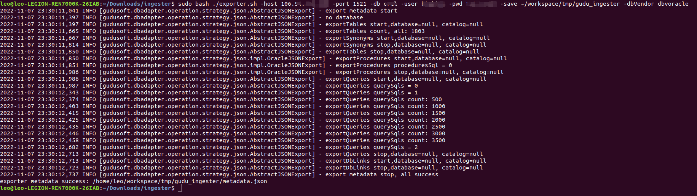
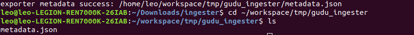
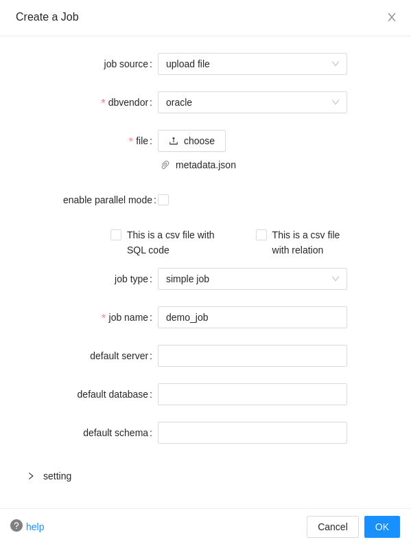
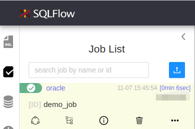

# Handling Internal Database

If your database is deployed in an internal network which is not accessible for external connection, you may not be able to read your internal database directly from the public SQLFlow server.

You can use [SQLFlow on-premise version](https://www.gudusoft.com/sqlflow-on-premise-version/) to connect your database(Read [here](../../1.-introduction/installation/) for how to install) or you can try with the belowing approach:

### Use [sqlflow-ingester](../../6.-sqlflow-ingester/introduction/) to export the database metadata file.

```bash
sudo bash exporter.sh 
-host 127.0.0.1 
-port 1521 
-db orcl 
-user your_username
-pwd your_password 
-save /tmp/sqlflow-ingester 
-dbVendor dbvoracle
```

You may want to check [here](../../6.-sqlflow-ingester/introduction/sqlflow-exporter.md#parameters) for more possible inputs.

<figure><figcaption></figcaption></figure>

You will receive the message if the export is succeeded:

```
exporter metadata success: /home/leo/workspace/tmp/gudu_ingester/metadata.json
```

Check your output folder and you shall find your `metadata.json`:

<figure><figcaption></figcaption></figure>

### Create sqlflow job by [uploading that metadata file on our SQLFlow UI](../../1.-introduction/ui/job-management/job-sources.md#upload-file).

With the exported `metadata.json`, we are now ready to retrieve data lineage.

Open your browser and go to our [SQLFlow UI](https://sqlflow.gudusoft.com/#/), then create a Job with the `Job Source` as `upload file`:

<figure><figcaption></figcaption></figure>

Read more details on how to create the job and what do these parameters stand for [here](../../1.-introduction/ui/job-management/#create-a-job).

You may want read more about the [job type](../../1.-introduction/getting-started/different-modes-in-gudu-sqlflow/job-mode.md).

<figure><figcaption></figcaption></figure>

Check the lineage overview/detail once the job is finished.

## Use SQLFlow On-Premise Version


[cloud-and-on-premise-version.md](../../1.-introduction/readme/cloud-and-on-premise-version.md)

