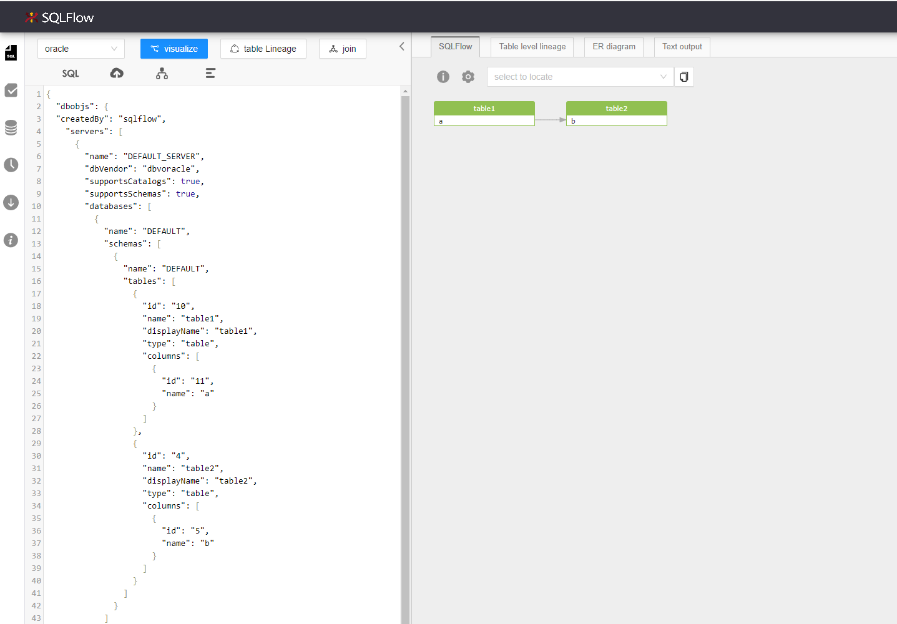

# Visualize Customization Lineage

SQLFlow enables the customization of the data lineage in case users need to build their own visual representaiton of the query making it more comprehensible for non DBA people.

Let's take a simple query as an example:

```sql
TABLE1.A -> TABLE2.B
```

### &#x20;Get Lineage Model

All SQLFlow lineages can be represented under the lineage model structure. It can either be in Json format or in XML format. Please refer to [this page](../../7.-reference/lineage-model/) to read the details information for the lineage mode.&#x20;

There are several ways to retrieve the SQLFlow lineage mode:&#x20;

1. Invoking REST APIs,  [/sqlflow/graph](https://docs.gudusoft.com/3.-api-docs/sqlflow-rest-api-reference/generation-interface/sqlflow-graph) for example will give the lineage model.
2. Using GSP [https://docs.gudusoft.com/1.-introduction/java-library](https://docs.gudusoft.com/1.-introduction/java-library)
3. DIrectly copy the lineage model value from SQLFlow Web

<figure><figcaption></figcaption></figure>

A Json/XML format SQLFlow lineage model is now available:

```json
{
  "dbobjs": {
  "createdBy": "sqlflow",
    "servers": [
      {
        "name": "DEFAULT_SERVER",
        "dbVendor": "dbvoracle",
        "supportsCatalogs": true,
        "supportsSchemas": true,
        "databases": [
          {
            "name": "DEFAULT",
            "schemas": [
              {
                "name": "DEFAULT",
                "tables": [
                  {
                    "id": "10",
                    "name": "table1",
                    "displayName": "table1",
                    "type": "table",
                    "columns": [
                      {
                        "id": "11",
                        "name": "a"
                      }
                    ]
                  },
                  {
                    "id": "4",
                    "name": "table2",
                    "displayName": "table2",
                    "type": "table",
                    "columns": [
                      {
                        "id": "5",
                        "name": "b"
                      }
                    ]
                  }
                ]
              }
            ]
          }
        ]
      }
    ]
  },
  "relationships": [
    {
      "id": "1",
      "type": "fdd",
      "target": {
        "id": "5",
        "column": "B",
        "parentId": "4",
        "parentName": "TABLE2"
      },
      "sources": [
        {
          "id": "11",
          "column": "A",
          "parentId": "10",
          "parentName": "TABLE1"
        }
      ]
    }
  ]
}

```

### The D**bobjs**&#x20;

`dbobjs` lists all data objects, and it is the data source of relationships. The target and source in relationships are all in the `dbobjs`. You can customize your own lineage by updating this object.

```json
{
  "createdBy": "sqlflow",//hard coded value to distinguish the json version
    "servers": [
      {
        "name": "DEFAULT_SERVER",//server name
        "dbVendor": "dbvoracle"//db type
        "supportsCatalogs": true,
        "supportsSchemas": true,
        "databases": [
          {
            "name": "DEFAULT",//database type, use default value if no database
            "schemas": [
              {
                "name": "DEFAULT",//schema name, use default value if no schema
                "tables": [
                  {
                    "id": "10",//table ID
                    "name": "table1",//table name 
                    "type": "table",//type, table or view
                    "columns": [
                      {
                        "id": "11",// column ID
                        "name": "a"//column name
                      }
                    ]
                  },
                  {
                    "id": "4",
                    "name": "table2",
                    "type": "table",
                    "columns": [
                      {
                        "id": "5",
                        "name": "b"
                      }
                    ]
                  }
                ]
              }
            ]
          }
        ]
      }
    ]
  }
```

### The Relationships

`relationships` has all data lineage relationships. The neighborhoring lineage of each field is regarded as one item. The target and source of each relationship can be found in dbobjs.

```json
 [
    {
      "id": "1",//Unique identifier
      "type": "fdd",//lineage type
      "target": {//target object in the lineage, only 1 target in one lineage 
        "id": "5",//field identifier, column.id of the dbobjs
        "column": "B",//column.name
        "parentId": "4",//The table/view ID where the data field is located, corresponding to table.id of dbobjs
        "parentName": "TABLE2"//The name of the table/view where the data field is located, corresponding to table.name in dbobjs
      },
      "sources": [//source of the lineage, can be multiple
        {
          "id": "11",//columns.id
          "column": "A",//Data field name, corresponding to the column.name in dbobjs
          "parentId": "10",//The table/view ID where the data field is located, corresponding to table.id of dbobjs
          "parentName": "TABLE1"//The name of the table/view where the data field is located, corresponding to table.name in dbobjs
        }
      ]
    }
  ]
```

Note that:

* Id type of the object should be **int**
* Ensure the uniqueness of the id. Duplicate id makes error in the syntax.

Please check [https://docs.gudusoft.com/7.-reference/lineage-model](https://docs.gudusoft.com/7.-reference/lineage-model) if more detailed information is required.

### Visualization

Paste the updated lineage mode(Json/XML) in the query editor of the SQLFlow Web and it generates the updated graph:&#x20;

<figure><figcaption></figcaption></figure>

You can change the display configuration and export the image files with SQLFlow Web.
