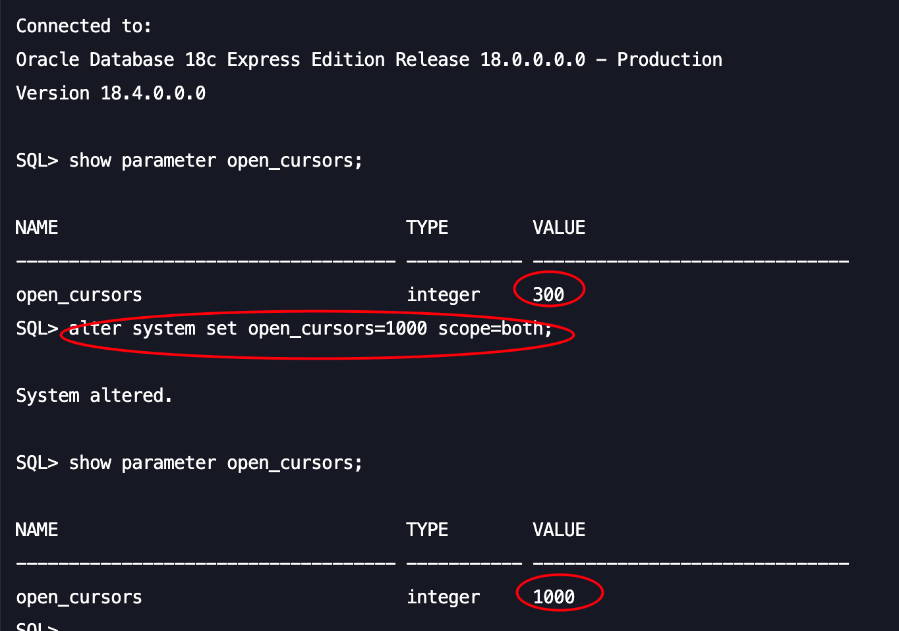

# Not all schema exported from Oracle

If you are Oracle user, you may find some schema are absent in the exported result. In such case, please try to check the errorMessages block in the **metadata.json** to see whether there's a ORA-01000 error.

```
ORA-01000: maximum open cursors exceeded tips
```

This issue is caused by the open\_cursors in Oracle. Oracle docs note this about ORA-01000:

_**ORA-01000** maximum open cursors exceeded_

**Cause**: _A host language program attempted to open too many cursors. The initialization parameter OPEN\_CURSORS determines the maximum number of cursors per user._

**Action**: _Modify the program to use fewer cursors. If this error occurs often, shut down Oracle, increase the value of OPEN\_CURSORS, and then restart Oracle._

It happens when the application attempts to open more ResultSets than there are configured cursors on a database instance. Alter the open\_cursors value to fix this issue:

```
ALTER SYSTEM SET open_cursors = 1000 SCOPE=BOTH;
```

Check the open\_cursors value with:

```
SHOW PARAMETER open_cursors;
```

<figure><figcaption></figcaption></figure>
