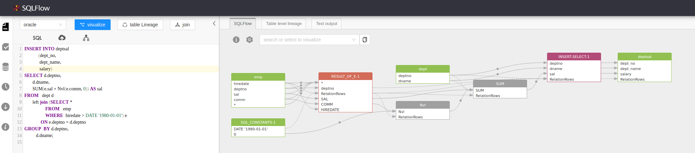
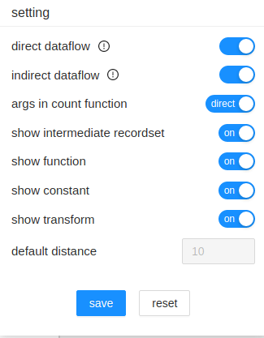
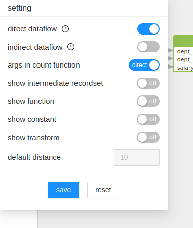
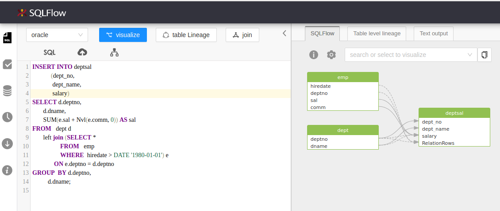
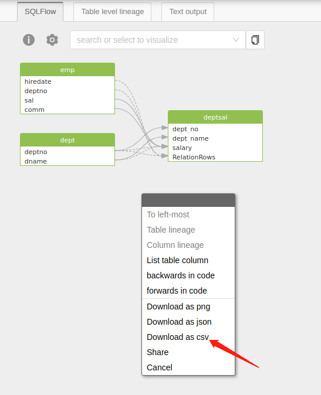

# Table Form Data Without Intermediates

How to output only the relationships in a table form without temporary intermediates, just column to column relationships between tables?

Let's say you have a data lineage like:

```
table1.column -> temp.column -> table2.column
```

Instead of getting the temp table in the above result, you would prefer to have directly:&#x20;

```
table1.column -> table2.column
```

and if you would like to have the results under table form such as CSV, you can archive this using one of the following two approaches:

* If you are using SQLFlow UI, change the SQLFlow UI settings and download the data lineage as CSV.
* You can make REST api request to get the desired CSV data.

Let's consider this SQL:

```sql
INSERT INTO deptsal
            (dept_no,
             dept_name,
             salary)
SELECT d.deptno,
       d.dname,
       SUM(e.sal + Nvl(e.comm, 0)) AS sal
FROM   dept d
       left join (SELECT *
                  FROM   emp
                  WHERE  hiredate > DATE '1980-01-01') e
              ON e.deptno = d.deptno
GROUP  BY d.deptno,
          d.dname; 
```

## SQLFlow UI

The initial status of the lineage contains temporary tables

<figure><figcaption></figcaption></figure>

Click the settings button and change the settings

<figure><figcaption></figcaption></figure>

Turn off `show intermediate recordset`, `show function`, `show constant`, `show tranform` and `indirect dataflow`.

<figure><figcaption></figcaption></figure>

You will then get your lineage without intermediates.

<figure><figcaption></figcaption></figure>

Right click on the main view area.

<figure><figcaption></figcaption></figure>

Choose Download as csv and the CSV file will be downloaded. In the CSV file you can have the above lineage under table form.

```csv
source_db,source_schema,source_table,source_column,target_db,target_schema,target_table,target_column,relation_type,effectType
"","","DEPT","DEPTNO","","","DEPTSAL","DEPT_NO","fdd","insert"
"","","DEPT","DNAME","","","DEPTSAL","DEPT_NAME","fdd","insert"
"","","EMP","COMM","","","DEPTSAL","SALARY","fdd","insert"
"","","EMP","SAL","","","DEPTSAL","SALARY","fdd","insert"
```

## REST Call

[/sqlflow/exportLineageAsCsv](../../3.-api-docs/sqlflow-rest-api-reference/export-csv/sqlflow-generation-sqlflow-exportlineageascsv.md) endpoint is dedicated for CSV export.

If you are trying to export a Job result under CSV format, you can check  [/sqlflow/job/exportFullLineageAsCsv](../../3.-api-docs/sqlflow-rest-api-reference/export-csv/sqlflow-job-exportfulllineageascsv.md)

To remove the intermediates in the result, just set `false` to the request params `showConstantTable` and `showTransform` and set `true` to the params `ignoreRecordSet` and `ignoreFunction`.&#x20;

```bash
curl --location --request POST 'https://api.gudusoft.com/gspLive_backend/sqlflow/generation/sqlflow/exportLineageAsCsv?showRelationType=fdd' \
--header 'Request-Origion: SwaggerBootstrapUi' \
--header 'accept: application/json;charset=utf-8' \
--header 'Authorization;' \
--form 'dbvendor="dbvoracle"' \
--form 'userId="xx"' \
--form 'ignoreFunction="true"' \
--form 'ignoreRecordSet="true"' \
--form 'showConstantTable="false"' \
--form 'showTransform="false"' \
--form 'sqltext="INSERT INTO deptsal (dept_no, dept_name, salary) SELECT d.deptno, d.dname, SUM(e.sal + Nvl(e.comm, 0)) AS sal FROM dept d left join (SELECT * FROM emp WHERE hiredate > DATE '\''1980-01-01'\'') e ON e.deptno = d.deptno GROUP BY d.deptno, d.dname;"' \
--form 'token="xxx"'
```
