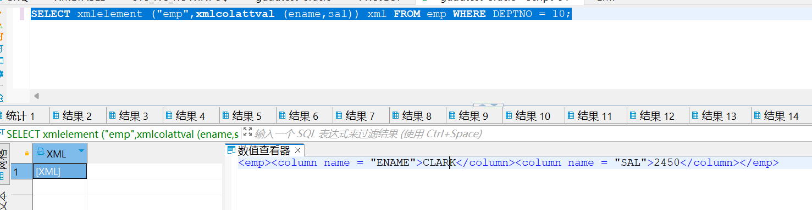
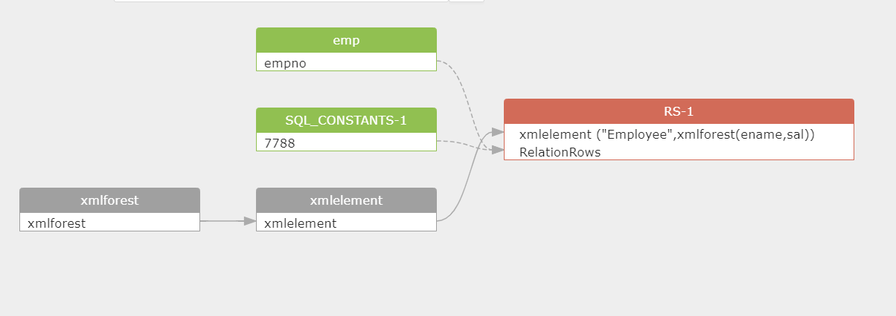

# SQLFlow with Oracle XML functions

### UPDATEXML（XMLType\_instance,Xpath\_string,value\_expr)

`UPDATEXML` takes as arguments an `XMLType` instance and an XPath-value pair and returns an `XMLType` instance with the updated value. If `XPath_string` is an XML element, then the corresponding `value_expr` must be an `XMLType` instance. If `XPath_string` is an attribute or text node, then the `value_expr` can be any scalar data type. You can specify an absolute `XPath_string` with an initial slash or a relative `XPath_string` by omitting the initial slash. If you omit the initial slash, then the context of the relative path defaults to the root node.\
[https://docs.oracle.com/en/database/oracle/oracle-database/12.2/sqlrf/UPDATEXML.html#GUID-55FE0EE5-6148-4934-947E-B9693AC32EF1](https://docs.oracle.com/en/database/oracle/oracle-database/12.2/sqlrf/UPDATEXML.html#GUID-55FE0EE5-6148-4934-947E-B9693AC32EF1)

```sql
UPDATE xmltable p SET p=UPDATEXML(value (p), '/PurchaseOrder/Actions/User/text() ','SCOTT');
```

<figure><figcaption></figcaption></figure>

Result:

<figure><figcaption></figcaption></figure>

### EXISTSNODE（XMLType\_instance，Xpath\_string）

`EXISTSNODE` determines whether traversal of an XML document using a specified path results in any nodes. It takes as arguments the `XMLType` instance containing an XML document and a `VARCHAR2` XPath string designating a path. The optional `namespace_string` must resolve to a `VARCHAR2` value that specifies a default mapping or namespace mapping for prefixes, which Oracle Database uses when evaluating the XPath expression(s).\
[https://docs.oracle.com/en/database/oracle/oracle-database/19/sqlrf/EXISTSNODE.html](https://docs.oracle.com/en/database/oracle/oracle-database/19/sqlrf/EXISTSNODE.html)

```sql
SELECT existsnode(VALUE(p),'/PurchaseOrder/Actions/User') node  FROM xmltable p;
```

<figure><figcaption></figcaption></figure>

Result:

<figure><figcaption></figcaption></figure>

### EXTRACT（XMLType\_instance，Xpath\_string）

This function is used to return the corresponding content under the XML node path. The parameter XMLType\_instance is used to specify the XMLType instance, and Xpath\_string is used to specify the XML node path.

```sql
SELECT extract(value (p),'/PurchaseOrder/Actions/User') content  FROM xmltable p;
```

Result:

<figure><figcaption></figcaption></figure>

<figure><figcaption></figcaption></figure>

### EXTRACTVALUE（XMLType\_instance,Xpath\_string)

The `EXTRACTVALUE` function takes as arguments an `XMLType` instance and an XPath expression and returns a scalar value of the resultant node. The result must be a single node and be either a text node, attribute, or element. If the result is an element, then the element must have a single text node as its child, and it is this value that the function returns. You can specify an absolute `XPath_string` with an initial slash or a relative `XPath_string` by omitting the initial slash. If you omit the initial slash, the context of the relative path defaults to the root node.\
[https://docs.oracle.com/en/database/oracle/oracle-database/19/sqlrf/EXTRACTVALUE.html#GUID-20AB974B-7544-4F44-B539-787FB6145680](https://docs.oracle.com/en/database/oracle/oracle-database/19/sqlrf/EXTRACTVALUE.html#GUID-20AB974B-7544-4F44-B539-787FB6145680)

```sql
SELECT extractvalue(value(p),'/PurchaseOrder/Actions/User')  data  FROM xmltable  p;
```

Result:

<figure><figcaption></figcaption></figure>

<figure><figcaption></figcaption></figure>

<figure><figcaption></figcaption></figure>

### XMLCONCAT（XMLType\_instance1\[,XMLType\_instance2],...)

XMLConcat takes as input a series of XMLType instances, concatenates the series of elements for each row, and returns the concatenated series. XMLConcat is the inverse of XMLSequence.\
[https://docs.oracle.com/en/database/oracle/oracle-database/19/sqlrf/XMLCONCAT.html#GUID-CEEEF777-4C7D-41E4-9F69-69DE6D1B07C2](https://docs.oracle.com/en/database/oracle/oracle-database/19/sqlrf/XMLCONCAT.html#GUID-CEEEF777-4C7D-41E4-9F69-69DE6D1B07C2)

```sql
SELECT xmlconcat(xmlelement("ename", EMP.ENAME), xmlelement("sal", EMP.SAL)) xml FROM EMP WHERE EMP.DEPTNO =10;
```

<figure><figcaption></figcaption></figure>

<figure><figcaption></figcaption></figure>

Result:

<figure><figcaption></figcaption></figure>

### XMLCOLATTVAL（value\_expr\[,value\_expr2],...)

This function is used to generate an XML block, and the parameter value\_expr is used to specify the column name or alias as the attribute name.

```sql
SELECT xmlelement ("emp",xmlcolattval (ename,sal)) xml FROM emp WHERE DEPTNO = 10;
```

<figure><figcaption></figcaption></figure>

Result:

<figure><figcaption></figcaption></figure>

### SYS\_DBURIGEN({column|attribute})

`SYS_DBURIGen` takes as its argument one or more columns or attributes, and optionally a rowid, and generates a URL of data type `DBURIType` to a particular column or row object. You can then use the URL to retrieve an XML document from the database.\
[https://docs.oracle.com/en/database/oracle/oracle-database/19/sqlrf/SYS\_DBURIGEN.html#GUID-ABA33BEB-F7B7-477B-9FF2-028D62768797](https://docs.oracle.com/en/database/oracle/oracle-database/19/sqlrf/SYS\_DBURIGEN.html#GUID-ABA33BEB-F7B7-477B-9FF2-028D62768797)

```sql
SELECT sys_dburigen(ename) url FROM emp WHERE deptno=10;
```

<figure><figcaption></figcaption></figure>

Result:

<figure><figcaption></figcaption></figure>

### SYS\_XMLAGG（expr\[，fmt]）

`SYS_XMLAgg` aggregates all of the XML documents or fragments represented by `expr` and produces a single XML document. It adds a new enclosing element with a default name `ROWSET`. If you want to format the XML document differently, then specify `fmt`, which is an instance of the `XMLFormat` object.\
[https://docs.oracle.com/en/database/oracle/oracle-database/19/sqlrf/SYS\_XMLAGG.html#GUID-BEDD241D-360A-46A2-AEBF-C8B70E465D75](https://docs.oracle.com/en/database/oracle/oracle-database/19/sqlrf/SYS\_XMLAGG.html#GUID-BEDD241D-360A-46A2-AEBF-C8B70E465D75)

```sql
SELECT SYS_XMLAGG(SYS_XMLGEN(ename))  xml_content FROM emp;
```

<figure><figcaption></figcaption></figure>

Result:

<figure><figcaption></figcaption></figure>

### SYS\_XMLGEN(expr\[,fmt])

`SYS_XMLGen` takes an expression that evaluates to a particular row and column of the database, and returns an instance of type `XMLType` containing an XML document. The `expr` can be a scalar value, a user-defined type, or an `XMLType` instance.\
[https://docs.oracle.com/en/database/oracle/oracle-database/19/sqlrf/SYS\_XMLGEN.html#GUID-1AC25984-F4AB-468E-BF53-561275AD44E8](https://docs.oracle.com/en/database/oracle/oracle-database/19/sqlrf/SYS\_XMLGEN.html#GUID-1AC25984-F4AB-468E-BF53-561275AD44E8)

```sql
SELECT sys_xmlgen(ename) xml FROM emp WHERE deptno=10;
```

<figure><figcaption></figcaption></figure>

Result:

<figure><figcaption></figcaption></figure>

### XMLAGG（XMLType\_instance\[ORDER BY sort\_list])

This function is used to aggregate multiple XML fragment and generate an XML document. The parameter XMLType\_instance is used to specify the XMLType instance, and sort\_list is used to generate the specified sorting method.

```sql
SELECT xmlagg(xmlelement("employee",ename||' '||sal))  xml FROM emp WHERE deptno=10;
```

<figure><figcaption></figcaption></figure>

Result:

<figure><figcaption></figcaption></figure>

### XMLELEMENT(identifier\[,xml\_attribute\_clause]\[,value\_expr])

`XMLElement` takes an element name for `identifier` or evaluates an element name for `EVALNAME` `value_expr`, an optional collection of attributes for the element, and arguments that make up the content of the element. It returns an instance of type `XMLType`. `XMLElement` is similar to `SYS_XMLGen` except that `XMLElement` can include attributes in the XML returned, but it does not accept formatting using the `XMLFormat` object.\
[https://docs.oracle.com/en/database/oracle/oracle-database/19/sqlrf/XMLELEMENT.html#GUID-DEA75423-00EA-4034-A246-4A774ADC988E](https://docs.oracle.com/en/database/oracle/oracle-database/19/sqlrf/XMLELEMENT.html#GUID-DEA75423-00EA-4034-A246-4A774ADC988E)

```sql
select xmlelement ("DATE",sysdate)  from dual;
```

<figure><figcaption></figcaption></figure>

Result:

<figure><figcaption></figcaption></figure>

### XMLFOREST（value\_expr1\[,value\_expr2],...)

`XMLForest` converts each of its argument parameters to XML, and then returns an XML fragment that is the concatenation of these converted arguments.

* If `value_expr` is a scalar expression, then you can omit the `AS` clause, and Oracle Database uses the column name as the element name.
*   If `value_expr` is an object type or collection, then the `AS` clause is mandatory, and Oracle uses the specified expression as the enclosing tag.

    You can do this by specifying `c_alias`, which is a string literal, or by specifying `EVALNAME` `value_expr`. In the latter case, the value expression is evaluated and the result, which must be a string literal, is used as the identifier. The identifier does not have to be a column name or column reference. It cannot be an expression or null. It can be up to 4000 characters if the initialization parameter `MAX_STRING_SIZE` `=` `STANDARD`, and 32767 characters if `MAX_STRING_SIZE` `=` `EXTENDED`. See "[Extended Data Types](https://docs.oracle.com/en/database/oracle/oracle-database/19/sqlrf/Data-Types.html#GUID-8EFA29E9-E8D8-40A6-A43E-954908C954A4)" for more information.
* If `value_expr` is null, then no element is created for that `value_expr`.\
  [https://docs.oracle.com/en/database/oracle/oracle-database/19/sqlrf/XMLFOREST.html#GUID-68E5C67E-CE97-4BF8-B7FF-2365E062C363](https://docs.oracle.com/en/database/oracle/oracle-database/19/sqlrf/XMLFOREST.html#GUID-68E5C67E-CE97-4BF8-B7FF-2365E062C363)

```sql
 SELECT xmlelement ("Employee",xmlforest(ename,sal))  FROM emp WHERE empno=7788;
XMLELEMENT ("EMPLOYEE",XMLFOREST(ENAME,SAL))
------------------------------------------------
<Employee>
    <ENAME>SCOTT</ENAME>
    <SAL>3000</SAL>
</Employee>
```

Result:

<figure><figcaption></figcaption></figure>

### XMLSEQUENCE（xmltype\_instance)

This function is used to return the VARRAY elements below the top node in the XMLType instance.

```sql
 SELECT xmlsequence(extract(value(x),    '/PurchaseOrder/LineItem/*'))  varray FROM xmltable x;
VARRAY
--------------------------------------------------
XMLSEQUENCETYPE(XMLTYPE(<LineItem ItemNumber="1">
    <Description>The Ruling Class</Description>
    <Part Id="715515012423" UnitPrice="29.95" Quantity="2"/>
</LineItem>
),  XMLTYPE(<LineItem ItemNumber="2">
  <Description>Diabolique</Description>
  <Part Id="037429135020" UnitPrice="29.95" Quantity="3"/>
</LineItem>
),  XMLTYPE(<LineItem ItemNumber="3">
  <Description>8 1/2</Description>
  <Part Id="037429135624" UnitPrice="39.95" Quantity="4"/>
</LineItem>
))
```

<figure><figcaption></figcaption></figure>

### XMLTRANSFORM（xmltype\_instance,xsl\_ss)

This function is used to convert XMLType instances according to XSL style and generate new XMLType instances.

```sql
 SELECT XMLTRANSFORM(w.warehouse-spec,x.coll).GetClobVal()  FROM warehouse w,xsl_tab x   WHERE w.warehouse_name='San Francisco';
```

Result:

<figure><figcaption></figcaption></figure>

### PATH（correction\_integer)

This function is used to return the relative path corresponding to a specific XML resource, and the parameter correction\_integer is used to specify the number of path levels.

```sql
 SELECT PATH(1), DEPTH(2)    FROM  resource_view  WHERE UNDER_PATH(res, '/sys/schemas/OE', 1)=1   AND INDER_PATH(res,'/sys/schemas/OE',2)=1;
PATH(1)                                                   DEPTH(2)
----------------------------                             --------
/www.oracle.com                                                1
/www.oracle.com/xwarehouses.xsd             
```

<figure><figcaption></figcaption></figure>

### DEPTH（n）

This function is used to return the relative level number corresponding to the UNDER\_PATH path in the XML scheme, where the parameter n is used to specify the relative level number.

```sql
 SELECT PATH(1),DEPTH(2) FROM resource_view WHERE UNDER_PATH(res, '/sys/schema/OE', 1)=1  AND UNDER_PATH(res, '/sys/schema/OE', 2)=1;
PATH(1)                                                  DEPTH(2)
----------------------------                               --------
/www.oracle.com                                                1
/www.oracle.com/xwarehouses.xsd                      2
```

Result:

<figure><figcaption></figcaption></figure>

### XMLTABLE

The following example converts the result of applying the XQuery '/Warehouse' to each value in the warehouse\_spec column of the warehouses table into a virtual relational table with columns Water and Rail:

```sql
SELECT warehouse_name warehouse,
 warehouse2."Water", warehouse2."Rail"
 FROM warehouses,
 XMLTABLE('/Warehouse'
 PASSING warehouses.warehouse_spec
 COLUMNS 
 "Water" varchar2(6) PATH 'WaterAccess',
 "Rail" varchar2(6) PATH 'RailAccess') 
 warehouse2;
WAREHOUSE Water Rail
----------------------------------- ------ ------
Southlake, Texas Y N
San Francisco Y N
New Jersey N N
Seattle, Washington N Y
```

Result

<figure><figcaption></figcaption></figure>

### XMLCAST

NA

### XMLCDATA

The following statement uses the DUAL table to illustrate the syntax of XMLCData:

```sql
SELECT XMLELEMENT("PurchaseOrder",
 XMLAttributes(dummy as "pono"),
 XMLCdata('<!DOCTYPE po_dom_group [
 <!ELEMENT po_dom_group(student_name)*>
 <!ELEMENT po_purch_name (#PCDATA)>
 <!ATTLIST po_name po_no ID #REQUIRED>
 <!ATTLIST po_name trust_1 IDREF #IMPLIED>
 <!ATTLIST po_name trust_2 IDREF #IMPLIED>
 ]>')) "XMLCData" FROM DUAL;
XMLCData
----------------------------------------------------------
<PurchaseOrder pono="X"><![CDATA[
<!DOCTYPE po_dom_group [
 <!ELEMENT po_dom_group(student_name)*>
 <!ELEMENT po_purch_name (#PCDATA)>
 <!ATTLIST po_name po_no ID #REQUIRED>
 <!ATTLIST po_name trust_1 IDREF #IMPLIED>
 <!ATTLIST po_name trust_2 IDREF #IMPLIED>
 ]>
 ]]>
</PurchaseOrder>
```

Result:

<figure><figcaption></figcaption></figure>

### XMLCOMMENT

The following example uses the DUAL table to illustrate the XMLComment syntax:

```sql
SELECT XMLCOMMENT('OrderAnalysisComp imported, reconfigured, disassembled')
 AS "XMLCOMMENT" FROM DUAL;
XMLCOMMENT
--------------------------------------------------------------------------------
<!--OrderAnalysisComp imported, reconfigured, disassembled-->
```

Result:

<figure><figcaption></figcaption></figure>

### XMLDIFF

The following example compares two XML documents and returns the difference as an XMLType document:

```sql
SELECT XMLDIFF(
XMLTYPE('<?xml version="1.0"?>
<bk:book xmlns:bk="http://example.com">
 <bk:tr>
 <bk:td>
 <bk:chapter>
 Chapter 1.
 </bk:chapter>
 </bk:td>
 <bk:td>
 <bk:chapter>
 Chapter 2.
 </bk:chapter>
 </bk:td>
 </bk:tr>
</bk:book>'),
XMLTYPE('<?xml version="1.0"?>
<bk:book xmlns:bk="http://example.com">
 <bk:tr>
 <bk:td>
 <bk:chapter>
 Chapter 1.
 </bk:chapter>
 </bk:td>
 <bk:td/>
 </bk:tr>
</bk:book>')
)
FROM DUAL; 
```

Result:

<figure><figcaption></figcaption></figure>

### XMLEXISTS

NA

### XMLISVALID

NA

### XMLPARSE

```sql
SELECT XMLPARSE(CONTENT '124 <purchaseOrder poNo="12435"> 
 <customerName> Acme Enterprises</customerName>
 <itemNo>32987457</itemNo>
 </purchaseOrder>' 
WELLFORMED) AS PO FROM DUAL;
PO
-----------------------------------------------------------------
124 <purchaseOrder poNo="12435">
 <customerName> Acme Enterprises</customerName>
 <itemNo>32987457</itemNo>
 </purchaseOrder>
```

Result:

<figure><figcaption></figcaption></figure>

### XMLPATCH

The following example patches an XMLType document with the changes specified in another XMLType and returns a patched XMLType document:

```sql
SELECT XMLPATCH(
XMLTYPE('<?xml version="1.0"?>
<bk:book xmlns:bk="http://example.com">
 <bk:tr>
 <bk:td>
 <bk:chapter>
 Chapter 1.
 </bk:chapter>
 </bk:td>
 <bk:td>
 <bk:chapter>
 Chapter 2.
 </bk:chapter>
 </bk:td>
 </bk:tr>
</bk:book>'),
XMLTYPE('<?xml version="1.0"?>
<xd:xdiff xsi:schemaLocation="http://xmlns.oracle.com/xdb/xdiff.xsd
 http://xmlns.oracle.com/xdb/xdiff.xsd"
 xmlns:xd="http://xmlns.oracle.com/xdb/xdiff.xsd"
 xmlns:xsi="http://www.w3.org/2001/XMLSchema-instance"
 xmlns:bk="http://example.com">
 <?oracle-xmldiff operations-in-docorder="true" output-model="snapshot"
 diff-algorithm="global"?>
 <xd:delete-node xd:node-type="element"
 xd:xpath="/bk:book[1]/bk:tr[1]/bk:td[2]/bk:chapter[1]"/>
</xd:xdiff>')
)
FROM DUAL;
```

Result:

<figure><figcaption></figcaption></figure>

### XMLPI

The following statement uses the DUAL table to illustrate the use of the XMLPI syntax:

```sql
SELECT XMLPI(NAME "Order analysisComp", 'imported, reconfigured, disassembled')
 AS "XMLPI" FROM DUAL;
XMLPI
--------------------------------------------------------------------------------
<?Order analysisComp imported, reconfigured, disassembled?>
```

Result:

<figure><figcaption></figcaption></figure>

### XMLQUERY

The following statement specifies the warehouse\_spec column of the oe.warehouses table in the XML\_passing\_clause as a context item. The statement returns specific information about the warehouses with area greater than 50K.

```sql
SELECT warehouse_name,
EXTRACTVALUE(warehouse_spec, '/Warehouse/Area'),
XMLQuery(
 'for $i in /Warehouse
 where $i/Area > 50000
 return <Details>
 <Docks num="{$i/Docks}"/>
 <Rail>
 {
 if ($i/RailAccess = "Y") then "true" else "false"
 }
 </Rail>
 </Details>' PASSING warehouse_spec RETURNING CONTENT) "Big_warehouses"
 FROM warehouses;
WAREHOUSE_ID Area Big_warehouses
------------ --------- --------------------------------------------------------
 1 25000
 2 50000
 3 85700 <Details><Docks></Docks><Rail>false</Rail></Details>
 4 103000 <Details><Docks num="3"></Docks><Rail>true</Rail></Details>
 . . . 
```

Result:

<figure><figcaption></figcaption></figure>

### XMLSERIALIZE

The following statement uses the DUAL table to illustrate the syntax of XMLSerialize:

```sql
SELECT XMLSERIALIZE(CONTENT XMLTYPE('<Owner>Grandco</Owner>')) AS 
xmlserialize_doc
 FROM DUAL;
XMLSERIALIZE_DOC
----------------
<Owner>Grandco</Owner>
```

Result:

<figure><figcaption></figcaption></figure>
