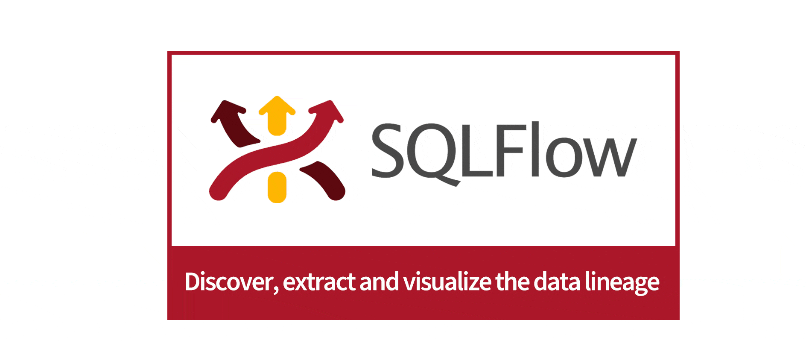

# What is Gudu SQLFlow?

<figure><figcaption></figcaption></figure>

## Product Description

Gudu SQLFlow is an automated data lineage tool that specializes in analyzing SQL queries to discover and visualize data lineage that shows the complete data cycle.

With its superior ability to thoroughly and in-depth analyze different SQL syntax from multiple database providers,\
SQLFlow is able to quickly and accurately produce data lineage results from intricate and extensive SQL queries.

Gudu SQLFlow is widely used in the data governance tool of the Industry leading companies providing SQL-related data lineage analysis features.

It provides a visual representation of the overall flow of data, depicting all the data movement graphically.

<figure><figcaption></figcaption></figure>

## Product Features

* It is used via the web as it’s cloud-based or installed on Windows and Linux computers
* Analyze SQL queries: from a simple SELECT statement to a stored procedure with thousands of lines of code;
* Connect to the database to analyze the data lineage automatically in real-time;
* Analyzes different data sources such as Redshift log, Snowflake query history, DBT scripts, etc., and quickly discover the data lineage relationship in the enterprise data platform;
* Provides a rich Rest API interface to quickly integrate into your data governance platform;
* Provides Java libraries that deploy to the end customers along with your data governance tools;
* Provides front-end UI library to quickly provide interactive data lineage relationship display function for your data governance platform;
* Provides an integrated solution with datahub open source metadata management software;
