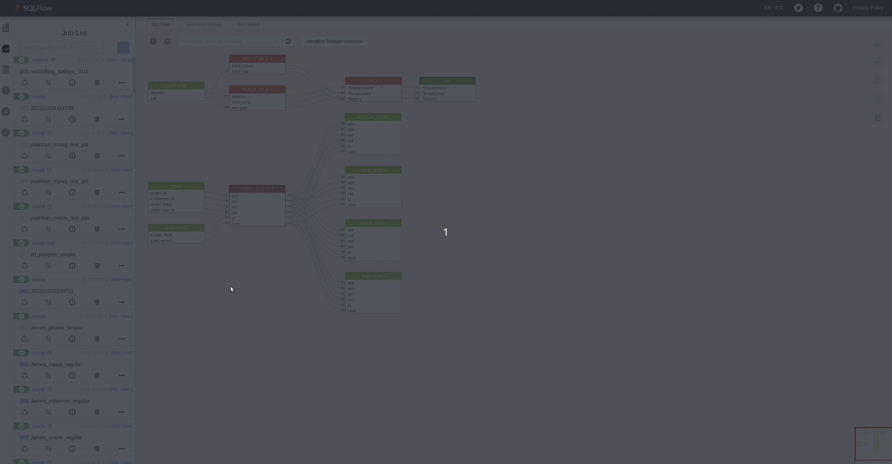

# Usage

This page gives a breif introduction on the main functions of SQLFlow UI. Details will be given in the page link.

## Visualize a query

<figure><figcaption></figcaption></figure>

Read more about how to use our SQLText Editor [here](../ui/sqltext-editor.md).

## Visualize SQL files

<figure><figcaption></figcaption></figure>

You can also read data lineage from your SQL files and you will need to create a job to do that. Read more about the SQL files visualization [here](../ui/job-management/).&#x20;

## Visualize database

<figure><figcaption></figcaption></figure>

You may want directly connect to your database and generate data lineage. You can find more details about how to do that [here](../ui/job-management/job-sources.md#from-database).

## Share the data lineage

## Visualize JOIN

<figure><figcaption></figcaption></figure>

## Upstream and Downstream data lineage
