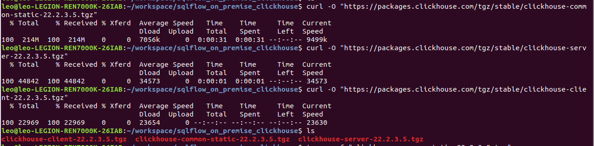
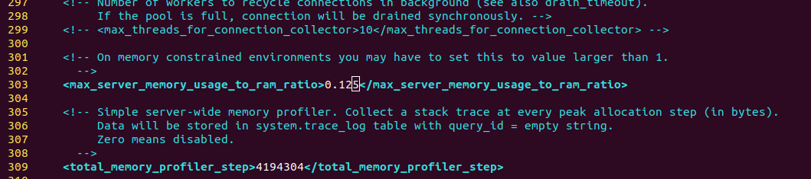
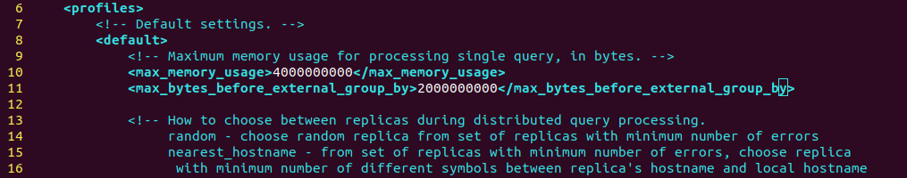

# Clickhouse For Centos

If you need to enable regular job features, you will also need to install Clickhouse on your server.

## JDK&#x20;

Using JDK 11 as well as enabling _G1 garbage collector_ is recommended. Comparing to JDK 8, the performance of handling jobs under multi-threads will be improved more than 30%.

## Clickhouse

### 1. Download&#x20;

```bash
curl -O "https://packages.clickhouse.com/tgz/stable/clickhouse-common-static-22.2.3.5.tgz"
curl -O "https://packages.clickhouse.com/tgz/stable/clickhouse-server-22.2.3.5.tgz"
curl -O "https://packages.clickhouse.com/tgz/stable/clickhouse-client-22.2.3.5.tgz"
```

<figure><figcaption></figcaption></figure>

### 2. Install

```bash
# untar the file and execute the shell
tar -xzvf "clickhouse-common-static-22.2.3.5.tgz"
# generate the binary file 
sudo "clickhouse-common-static-22.2.3.5/install/doinst.sh"

tar -xzvf "clickhouse-server-22.2.3.5.tgz"
# create clickhouse-server soft link and install the default config serice
# the initial password is sqlflow@gudu. you can config whether remote access is allowed
sudo "clickhouse-server-22.2.3.5/install/doinst.sh"
# start the service
sudo /etc/init.d/clickhouse-server start

tar -xzvf "clickhouse-client-22.2.3.5.tgz"
# create clickhouse-client soft link and install the client config files
sudo "clickhouse-client-22.2.3.5/install/doinst.sh"

```

### 3. Memory Settings

We will need to limit the clickhouse service If the client server has a memory less than 32GB.

#### clickhouse memory settings

In `/etc/clickhouse-server/config.xml` set `max_server_memory_usage_to_ram_ratio` to 0.125 so that 32G\*0.125 will be 4G

<figure><figcaption></figcaption></figure>

Update `/etc/clickhouse-server/users.xml` and set `max_memory_usage` to 4000000000, `max_bytes_before_external_group_by` to 2000000000. You may need to create `max_bytes_before_external_group_by` if it isn't present.

<figure><figcaption></figcaption></figure>

Restart the Clickhouse service: `sudo /etc/init.d/clickhouse-server restart`

#### Sqlservice memory settings

With this config, the Simple mode will use 22G memory and the Rugular mode will be in 18G memory.

```bash
# Update sqlservice.sh, set the heapsize as 18G
elif (( $memory < 32*1024*1024 ));
  then
    heapsize="18g"

```

### 4. Set Clickhouse default password

set Clickhouse password to [_**sqlflow@gudu**_](https://gitee.com/link?target=mailto:sqlflow@gudu)__

If mistakenly set to another password, you will need:

1. delete `/etc/clickhouse-server/users.d/default-password.xml`
2. update `/etc/clickhouse-server/users.xml`, set password to [_**sqlflow@gudu**_](https://gitee.com/link?target=mailto:sqlflow@gudu)__
3. restart Clickhouse, `sudo /etc/init.d/clickhouse-server restart`

### 5. Init Clickhouse

```bash
cd /wings/sqlflow/backend
sh bin/init_regular.sh
```

If you got

<figure><figcaption></figcaption></figure>

Then you might need to check for your OS version and the Clickhouse is not properly installed. Check [Ubuntu/Debian Installation](clickhouse-for-ubuntu-debian.md).

### 6. Start SQLFlow

```bash
cd /wings/sqlflow/backend
sh bin/backend.sh
```

