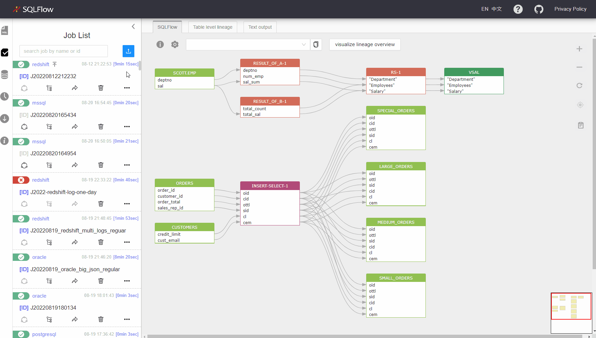
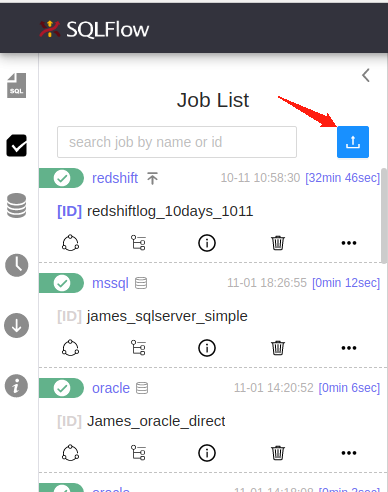

# Job Management

## Job list

<figure><figcaption></figcaption></figure>

## Create a job

<figure><figcaption></figcaption></figure>

Click the Job Creation button in the Job List Section

<figure><figcaption></figcaption></figure>

Enter the Job creation parameters&#x20;

<figure><figcaption></figcaption></figure>

Job source can be from one of the following sources

<figure><figcaption></figcaption></figure>

Give the default value for server/database/schema when there's no metadata

<figure><figcaption></figcaption></figure>

Choose the Job type when creating the Job

<figure><figcaption></figcaption></figure>

Customize the extraction/exclusion content under the `advanced` section

<figure><figcaption></figcaption></figure>

Give the configurable parameters under the `setting` section. Check [here](../getting-started/different-modes-in-gudu-sqlflow/job-mode.md#simple-job) to get more details for these parameters.

<figure><figcaption></figcaption></figure>

## Backwards in code

<figure><figcaption></figcaption></figure>

