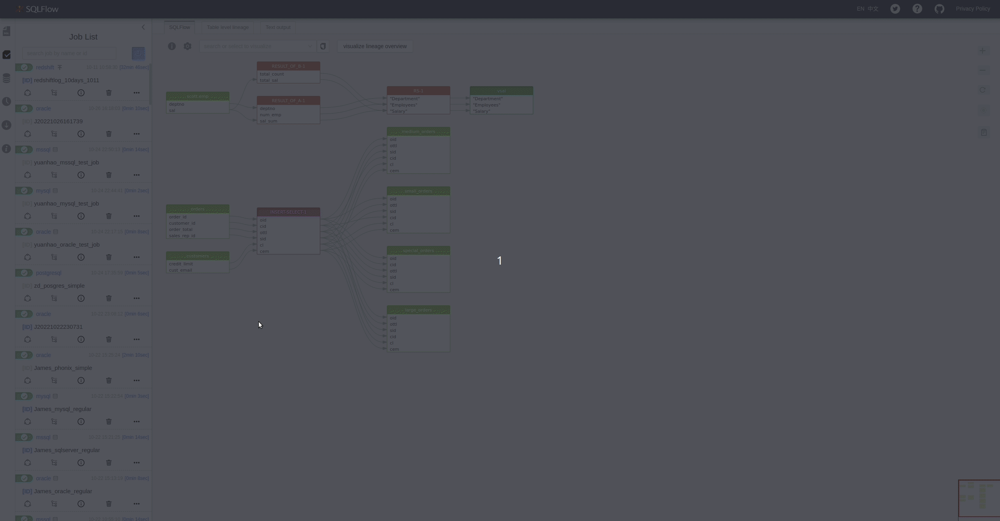
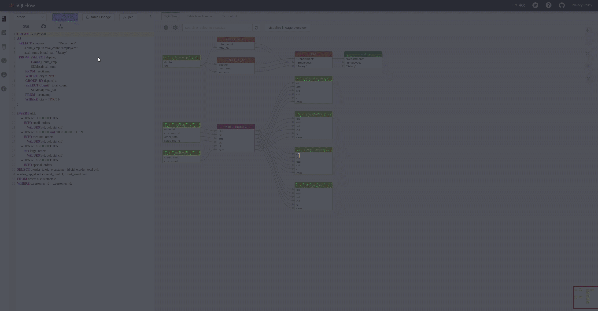
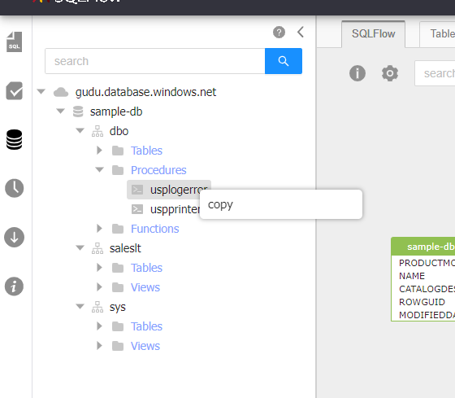
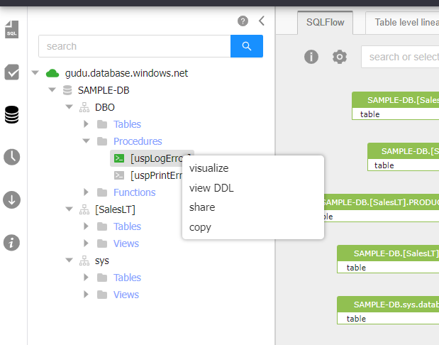

# Schema Explorer

## Schema Explorer Basic

<figure><figcaption></figcaption></figure>

Visualize SQL schema by choosing any elements

<figure><figcaption></figcaption></figure>

There are three modes(the mode field in json) to display the response returned by graph AP which are represented by three different colors:

* global: Display the selected item data lineage. (default mode. You can also select an unit and right click the_`visualize`_ / _`visualize with columns`_ to start this mode)
* summay: Only database, schema, table, view data and the number of above DB units will be returned if the number is more than 2,000. (check more details [here](../getting-started/different-modes-in-gudu-sqlflow/job-mode.md#summary-result))
* ignore record: Ignore the record set. Given a->b->c, show a->c. Choose _`to left most`_ or _`to left most with columns`_ to use this mode.

<figure><figcaption></figcaption></figure>

The green icons of ANALYTICS and ENTITY indicat that the mode is _global_;&#x20;

The black icons of DATAMART indicat that the mode is _summary_;&#x20;

The gray icons of other nodes indicat that the nodes are not visualized.

## Visualization Control

You may find following elements when right click on the database/schema/table/column elements in the schema explorer:

<figure><figcaption></figcaption></figure>

### visualize

_`visualize`_: Generate the selected db elements(could be a database/schema/table/column etc) data lineage.

<figure><figcaption></figcaption></figure>

### visualize with cloumns

In above screenshot only the selected _`customer_id`_ column related data lineage is displayed.

_`visualize with cloumns`_: Generate the selected db elements(could be a database/schema/table etc) data lineage with column details.

<figure><figcaption></figcaption></figure>

### to left most

_`to left most`_: Generate the selected db elements(could be a database/schema/table/column etc) data lineage without the record set. (given a->b->c, show a->c )

<figure><figcaption></figcaption></figure>

### to left most with columns

_`to left most with columns`_: Generate the selected db elements(could be a database/schema/table/column etc) data lineage with the column details but without the record set.

<figure><figcaption></figcaption></figure>

### copy

_`copy`_: copy the element name so that we can quickly search the elements with the similar name.

<figure><figcaption></figcaption></figure>

### to upstream/to downstream

_`to upstream`_/_`to downstream`_: When going through lineage detail for a [regular job](../getting-started/different-modes-in-gudu-sqlflow/job-mode.md#regular-job), we also have the choice to display the selected element in Upstream and Downstream analysis.(given a->b->c, Upstream: a->b, Downstream: b->c)

<figure><figcaption></figcaption></figure>

### to upstream/to downstream step by step

_`to upstream`_/_`to downstream step by step`_: Enable collaspe/expend function of the intermediate detail steps when processing _`to upstream`_/_`to downstream`_ so user can get a more clear view for the complex data lineage.

## View DDL(Data Definition Language)

<figure><figcaption></figcaption></figure>

**Note**: we currently are unable to have `visualize` and `view ddl` in stored _procedures_ for the regular jobs who fails in retrieving metadata. Check following captures:

<figure><figcaption></figcaption></figure>

While you should be able to have `visualize`/`view ddl`/`share` under stored procedures unit in other cases.

<figure><figcaption></figcaption></figure>

## Different Schema Structures&#x20;

The tree structure in schema section may differ from the database types (check [here](../../sqlflow-ingester/understanding-the-format-of-exported-data.md) to find why it can be different). Same as the database, the tree strecture also has three different cases.

### database.schema.table

For the databases which contain _database_ layer and the _schema_ layer (SQL Server for example)

<figure><figcaption></figcaption></figure>

For MSSQL, we have Database layer as well as Schema layer. The two layers will be both displayed on the schema UI.

### schema.table

For the databases which contain _database_ layer only (MYSQL for example)

<figure><figcaption></figcaption></figure>

For MYSQL, we have Database layer but we do not have Schema layer. Schema is same as Database for MYSQL. Only Database layer is displayed on the schema UI.

### database.table

For the databases which contain the schema layer only (Oracle for example)

<figure><figcaption></figcaption></figure>

For ORACLE, we have Schema layer but there is no Database layer for ORACLE. Only Schema layer is displayed on the schema UI.
