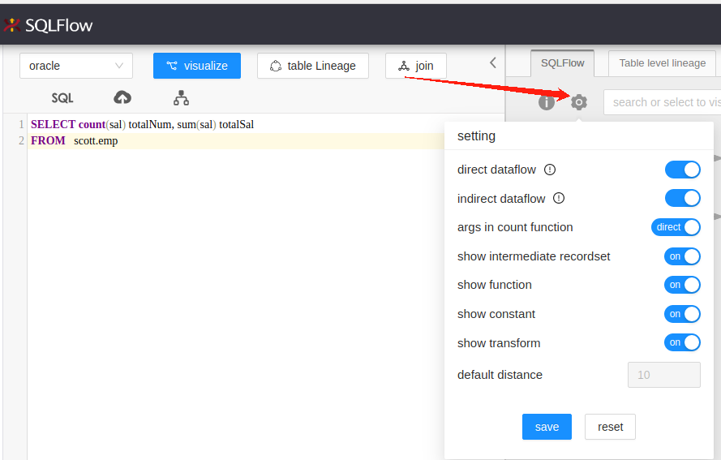

# Settings

Input different request parameters to the graph API to get different results:

| Parameter                   | Acceptable values                                                                                                                                                                                                                    |
| --------------------------- | ------------------------------------------------------------------------------------------------------------------------------------------------------------------------------------------------------------------------------------ |
| showRelationType            | <p>If direct dataflow = true then it is fdd and we will show only direct dataflow.<br>If direct dataflow = true and indirect dataflow=true, then it is fdd,fddi,fdr,frd. We will show both direct dataflow and indrect dataflow.</p> |
| dataflowOfAggregateFunction | Whether take the parameters in the COUNT function as direct or indirect dataflow                                                                                                                                                     |
| ignoreRecordSet             | true or false                                                                                                                                                                                                                        |
| ignoreFunction              | true or false                                                                                                                                                                                                                        |
| showConstantTable           | true or false                                                                                                                                                                                                                        |
| showTransform               | true or false                                                                                                                                                                                                                        |

We can observe the changes on parameters when switching different modes:

<figure><figcaption></figcaption></figure>

### Configurable parameters when creating jobs or visualizing the SQL in SQL Editor

You will be able to set the config when creating data lineage with the SQL Edior as well as giving the configurable parameters under the `setting` section during the job creation.&#x20;

Customizing parameters when visualizing your SQL:

<figure><figcaption></figcaption></figure>

Giving the configurable parameters under the `setting` section during the job creation:

<figure><figcaption></figcaption></figure>

| Parameter                   | Possible Values | Description                                                                      |
| --------------------------- | --------------- | -------------------------------------------------------------------------------- |
| direct dataflow             | On/Off          | Whether show direct dataflow or not.                                             |
| indirect dataflow           | On/Off          | Whether show indirect dataflow or not.                                           |
| dataflow of count function  | direct/indirect | Whether take the parameters in the COUNT function as direct or indirect dataflow |
| show intermediate recordset | On/Off          | Show intermediate recordset or not.                                              |
| show function               | On/Off          | Show `function` or not                                                           |
| show transform              | On/Off          | Show `transform` or not                                                          |
| show constant               | On/Off          | show `constant` or not                                                           |

Take the following sql as example:

```sql
SELECT count(sal) totalNum, sum(sal) totalSal 
FROM   scott.emp 
```

When we set all values as `On` and `direct` as the value in _dataflow of count function_ when creating the job/visualizing the SQL, we will get following data lineage

<figure><figcaption></figcaption></figure>

### Show function

<figure><figcaption></figcaption></figure>

### Show transform

<figure><figcaption></figcaption></figure>

### Export the graph

<figure><figcaption></figcaption></figure>
