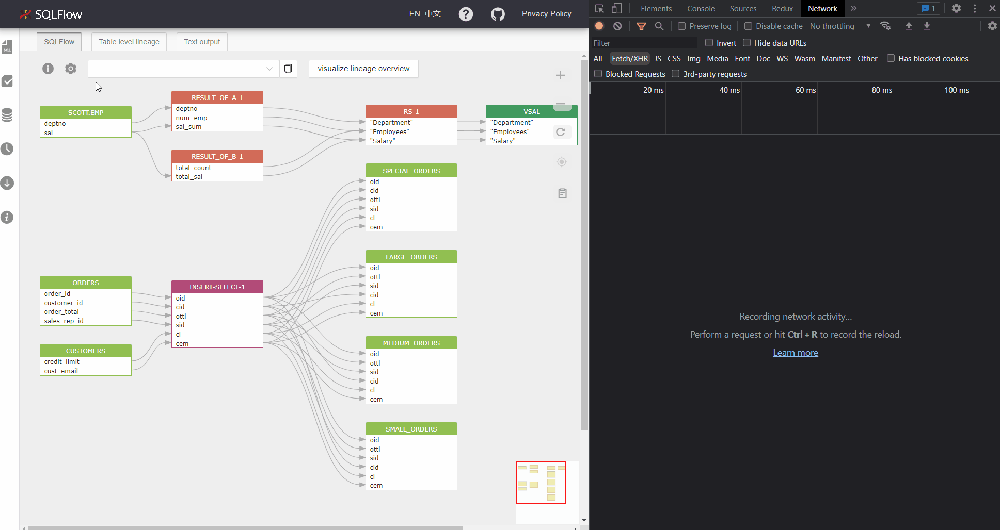
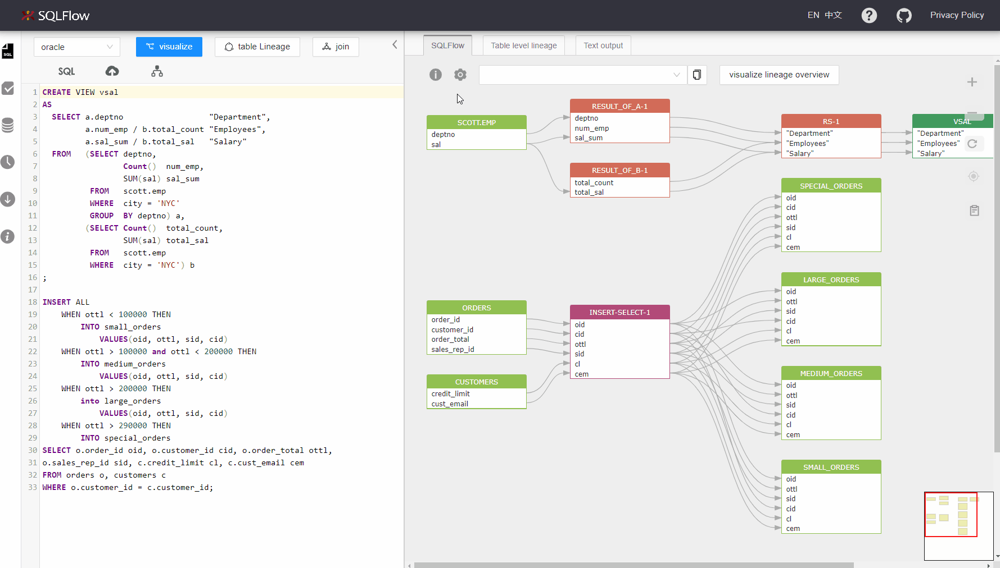
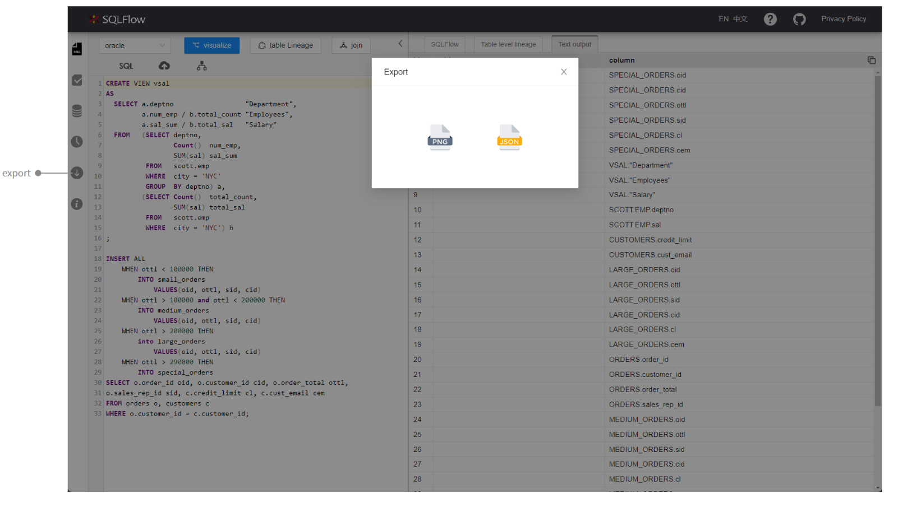

# Settings

Input different request parameters to the graph API to get different results:

| Parameter                   | Acceptable values                                                                                                                      |
| --------------------------- | -------------------------------------------------------------------------------------------------------------------------------------- |
| showRelationType            | 
if direct dataflow = true then it is fdd; if direct dataflow = true and indirect dataflow=true, then it is fdd,fddi,fdr,frd;
 |
| dataflowOfAggregateFunction | direct or indirect                                                                                                                     |
| ignoreRecordSet             | true or false                                                                                                                          |
| ignoreFunction              | true or false                                                                                                                          |
| showConstantTable           | true or false                                                                                                                          |
| showTransform               | true or false                                                                                                                          |

We can observe the changes on parameters when switching different modes:

<figure><figcaption></figcaption></figure>

### Configurable parameters when creating jobs

You can give the configurable parameters under the `setting` section during the job creation. Check [here](../getting-started/different-modes-in-gudu-sqlflow/job-mode.md#simple-job) to get more details for these parameters.

<figure><figcaption></figcaption></figure>

| Parameter                   | Possible Values | Description                                                                       |
| --------------------------- | --------------- | --------------------------------------------------------------------------------- |
| direct dataflow             | On/Off          | Whether explain the aggregate function(COUNT for an example) as a direct dataflow |
| indirect dataflow           |                 |                                                                                   |
| dataflow of count function  |                 |                                                                                   |
| show intermediate recordset |                 |                                                                                   |
| show function               |                 |                                                                                   |
| show transform              |                 |                                                                                   |
| show constant               |                 |                                                                                   |

### Show function

<figure><figcaption></figcaption></figure>

### Show transform

<figure><figcaption></figcaption></figure>

### Export the graph

<figure><figcaption></figcaption></figure>
