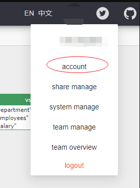
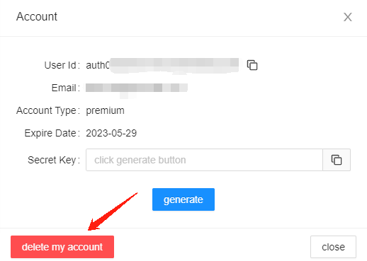

# Delete Your Account

You can always delete your account if you would like to do so.

* From the UI, click your avatar:&#x20;

<figure><figcaption></figcaption></figure>

* Click account, and chosse `delete my account`

<figure><figcaption></figcaption></figure>

**Note: your data will be deleted with your account together.**
