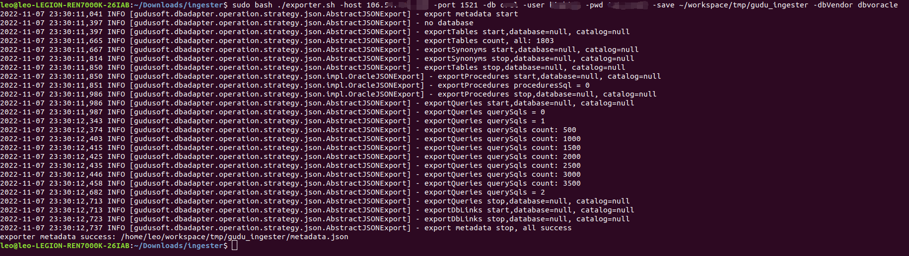
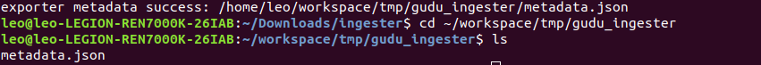
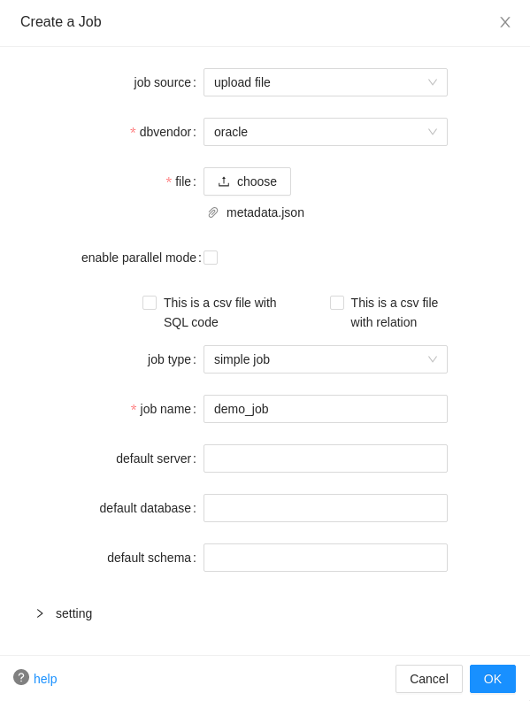
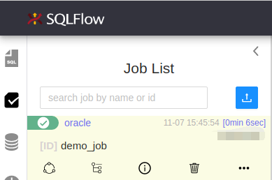

# Handling Internal Database

### Use [sqlflow-ingester](broken-reference) to export the database metadata file.

```bash
sudo bash exporter.sh 
-host 127.0.0.1 
-port 1521 
-db orcl 
-user your_username
-pwd your_password 
-save /tmp/sqlflow-ingester 
-dbVendor dbvoracle
```

You may want to check [here](../../sqlflow-ingester/introduction/sqlflow-exporter.md#parameters) for more possible inputs.

<figure><figcaption></figcaption></figure>

You will receive the message if the export is succeeded:

```
exporter metadata success: /home/leo/workspace/tmp/gudu_ingester/metadata.json
```

Check your output folder and you shall find your `metadata.json`:

<figure><figcaption></figcaption></figure>

### Create sqlflow job by [uploading that metadata file on our SQLFlow UI](../../introduction/ui/job-management/job-sources.md#upload-file).&#x20;

With the exported `metadata.json`, we are now ready to retrieve data lineage.

Open your browser and go to our [SQLFlow UI](https://sqlflow.gudusoft.com/#/), then create a Job with the `Job Source` as `upload file`:

<figure><figcaption></figcaption></figure>

Read more details on how to create the job and what do these parameters stand for [here](../../introduction/ui/job-management/#create-a-job).

You may want read more about the [job type](../../introduction/getting-started/different-modes-in-gudu-sqlflow/job-mode.md).

<figure><figcaption></figcaption></figure>

Check the lineage overview/detail once the job is finished.
